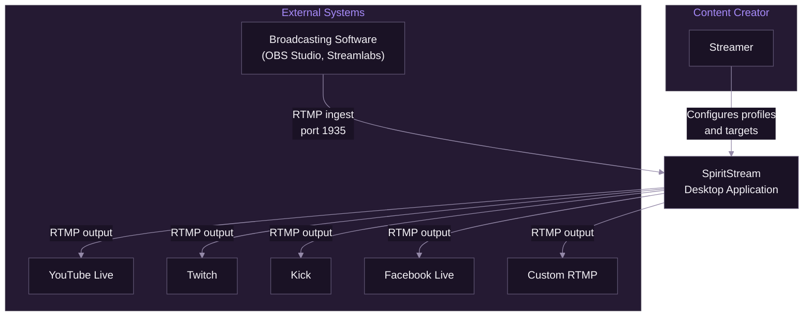
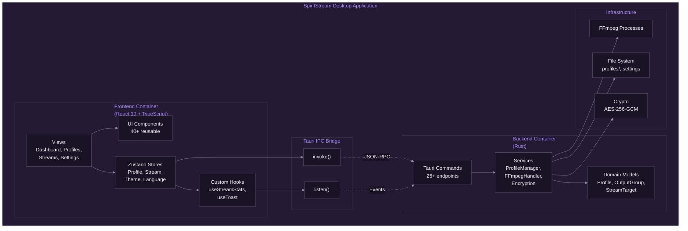
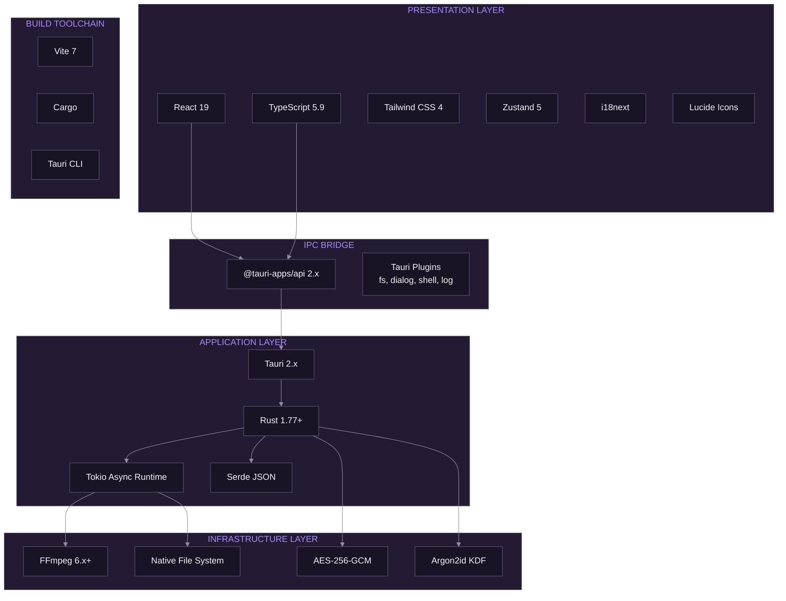

# System Overview

[Documentation](../README.md) > [Architecture](./README.md) > System Overview

---

SpiritStream is a multi-destination streaming application built with Tauri 2.x, Rust, and React. It receives a single RTMP input stream and distributes it simultaneously to multiple streaming platforms.

---

## Introduction

Live streaming has become a dominant form of content distribution, with creators often needing to broadcast simultaneously to multiple platforms to maximize audience reach. Traditional solutions require running multiple encoding instances or using cloud-based services with associated latency and costs.

SpiritStream addresses this challenge by providing a desktop application that:

1. Receives a single RTMP input stream from broadcasting software such as OBS Studio
2. Optionally re-encodes or passes through the stream to multiple output groups
3. Distributes the processed stream to multiple platform destinations simultaneously

**This document covers:**

- High-level system context and boundaries
- Container-level architecture showing major components
- Technology stack and rationale for technology choices
- Cross-cutting concerns including security and error handling

**See also:** [Component Architecture](./02-component-architecture.md), [Data Flow](./03-data-flow.md), [Security Architecture](./04-security-architecture.md)

---

## Architecture Overview

### System Context

SpiritStream operates as a desktop application that bridges broadcasting software with streaming platforms. The following diagram illustrates the system context:

*SpiritStream receives RTMP input from broadcasting software and distributes to multiple streaming platforms.*

The system has the following external actors and dependencies:

- **Content Creator** — The user who configures streaming profiles and monitors stream status
- **Broadcasting Software** — Sources the video/audio content via RTMP (e.g., OBS Studio)
- **Streaming Platforms** — Destinations receiving the output RTMP streams

### Design Principles

The architecture adheres to the following principles:

- **Separation of Concerns** — Frontend presentation logic is isolated from backend business logic through the Tauri IPC boundary
- **Security by Default** — Tauri's capability system enforces least-privilege access; sensitive data is encrypted at rest
- **Cross-Platform Compatibility** — The architecture supports Windows, macOS, and Linux with platform-specific optimizations
- **Offline-First** — All functionality works without internet connectivity (except actual streaming)
- **Minimal Resource Usage** — Tauri's native webview and Rust backend minimize memory and CPU overhead compared to Electron-based alternatives

### Architectural Style

SpiritStream employs a **layered architecture** with clear boundaries between:

- **Presentation Layer** — React components and Zustand state management
- **IPC Bridge** — Tauri's invoke/listen mechanism for frontend-backend communication
- **Application Layer** — Rust services implementing business logic
- **Infrastructure Layer** — FFmpeg processes, file system, and cryptographic operations

---

## Container Architecture

### Container Diagram

The following diagram shows the major containers (deployable units) within SpiritStream:

*Internal structure of SpiritStream showing frontend, IPC bridge, backend, and infrastructure containers.*

### Frontend Container

The frontend container comprises the React application rendered in Tauri's native webview:

| Component | Technology | Purpose |
|-----------|------------|---------|
| Views | React 19 | 8 page views (Dashboard, Profiles, etc.) |
| Components | React + Tailwind | 40+ reusable UI components |
| Stores | Zustand | 4 state stores (profile, stream, theme, language) |
| Hooks | React Hooks | Custom hooks for Tauri integration |
| Styling | Tailwind CSS 4 | Utility-first CSS with design tokens |
| i18n | i18next | 5 language translations |

Key characteristics:

- **No Node.js runtime** — The frontend runs in a native webview, not a Node.js environment
- **Type-safe IPC** — TypeScript types mirror Rust types for IPC communication
- **Reactive updates** — Zustand stores trigger component re-renders on state changes

### Backend Container

The backend container comprises Rust code compiled into the Tauri binary:

| Component | Files | Purpose |
|-----------|-------|---------|
| Commands | `src/commands/*.rs` | Tauri command handlers (IPC endpoints) |
| Services | `src/services/*.rs` | Business logic (ProfileManager, FFmpegHandler) |
| Models | `src/models/*.rs` | Data structures (Profile, OutputGroup, StreamTarget) |

Key services:

- **ProfileManager** — Profile CRUD operations with encryption support
- **FFmpegHandler** — FFmpeg process lifecycle management
- **Encryption** — AES-256-GCM encryption with Argon2id key derivation
- **SettingsManager** — Application settings persistence
- **ThemeManager** — Theme file discovery and CSS token extraction
- **FFmpegDownloader** — Platform-specific FFmpeg binary downloads

### Infrastructure Layer

The infrastructure layer handles external system interactions:

| Component | Technology | Purpose |
|-----------|------------|---------|
| FFmpeg | Child processes | Stream encoding and distribution |
| File System | `tokio::fs` | Profile and settings storage |
| Cryptography | `aes-gcm`, `argon2` | Data encryption |

---

## Technology Stack

### Stack Visualization

*Layered view of technologies used in SpiritStream.*

### Technology Rationale

| Technology | Alternative Considered | Rationale for Choice |
|------------|----------------------|---------------------|
| **Tauri** | Electron | 10x smaller bundle size, better security model, native performance |
| **Rust** | Go, C++ | Memory safety without GC, excellent FFI, Tauri native language |
| **React** | Vue, Svelte | Largest ecosystem, team familiarity, excellent TypeScript support |
| **Zustand** | Redux, Jotai | Minimal boilerplate, built-in persistence, TypeScript-first |
| **Tailwind** | CSS Modules, Styled Components | Design token support, utility-first paradigm, small bundle |
| **FFmpeg** | GStreamer, libav | Industry standard, platform support, documentation quality |
| **AES-256-GCM** | ChaCha20-Poly1305 | Hardware acceleration (AES-NI), NIST standardized |
| **Argon2id** | bcrypt, scrypt | Winner of Password Hashing Competition, GPU-resistant |

### Version Requirements

| Component | Minimum Version | Current Version |
|-----------|-----------------|-----------------|
| Rust | 1.77.2 | 1.77.2+ |
| Node.js | 18.0 | 20.x |
| Tauri | 2.0 | 2.9.x |
| React | 18.0 | 19.2 |
| FFmpeg | 5.0 | 6.x+ |

---

## Cross-Cutting Concerns

### Security Model

Security is implemented at multiple layers:

- **Tauri Capabilities** — Fine-grained permission system limiting frontend access to specific backend functions and file paths
- **Profile Encryption** — Optional AES-256-GCM encryption for profiles containing sensitive stream keys
- **Stream Key Protection** — Machine-specific encryption for stream keys even in unencrypted profiles
- **Path Traversal Prevention** — Validation of all user-supplied paths and profile names
- **CSP Headers** — Strict Content Security Policy preventing XSS attacks

See [Security Architecture](./04-security-architecture.md) for detailed implementation.

### Error Handling Strategy

Errors are handled consistently across layers:

- **Rust Backend** — Uses `Result<T, String>` for all Tauri commands; errors are user-friendly messages
- **TypeScript Frontend** — Try-catch around all `invoke()` calls; errors displayed via toast notifications
- **FFmpeg Processes** — Exit codes and stderr monitored; errors emitted as Tauri events
- **Validation** — Pre-flight validation before stream start; issues presented with specific guidance

### Logging and Monitoring

The application uses Tauri's logging plugin with levels:

| Level | Usage |
|-------|-------|
| `error` | Unrecoverable failures, security events |
| `warn` | Recoverable issues, deprecations |
| `info` | User actions, lifecycle events |
| `debug` | Detailed diagnostic information |
| `trace` | Fine-grained debugging (development only) |

Logs are written to `{APP_DATA}/logs/` and visible in the application's Logs view.

---

## Deployment Architecture

### Bundle Composition

The final application bundle includes:

| Component | Windows | macOS | Linux |
|-----------|---------|-------|-------|
| Tauri Binary | `.exe` | Universal Binary | ELF |
| Frontend Assets | Embedded | Embedded | Embedded |
| WebView | WebView2 | WebKit | WebKitGTK |
| Bundle Format | `.msi` | `.dmg` | `.AppImage`, `.deb` |

### FFmpeg Distribution

FFmpeg is not bundled with the application. Instead:

1. User is prompted to install FFmpeg if not detected
2. Auto-download option fetches platform-specific binaries
3. Custom path configuration for existing installations

This approach reduces bundle size and avoids licensing complications.

---

## Summary

SpiritStream's architecture provides a robust foundation for multi-destination streaming through:

- Clear separation between presentation and business logic via Tauri IPC
- Secure handling of sensitive credentials through encryption at rest
- Efficient stream processing via FFmpeg with relay-based distribution
- Cross-platform support with platform-specific optimizations

### Architectural Trade-offs

| Decision | Trade-off |
|----------|-----------|
| Tauri over Electron | Smaller bundle but requires native webview installation |
| FFmpeg as external process | Flexibility but requires user installation |
| Zustand over Redux | Simpler but less ecosystem tooling |
| AES-GCM over alternatives | Hardware acceleration but requires unique nonces |

### Future Considerations

- **WebRTC Support** — For lower-latency streaming protocols
- **Plugin System** — For community-contributed platform support
- **Cloud Sync** — Optional profile synchronization across devices

---

**Related:** [Component Architecture](./02-component-architecture.md) | [Data Flow](./03-data-flow.md) | [Security Architecture](./04-security-architecture.md) | [Glossary](../GLOSSARY.md)
