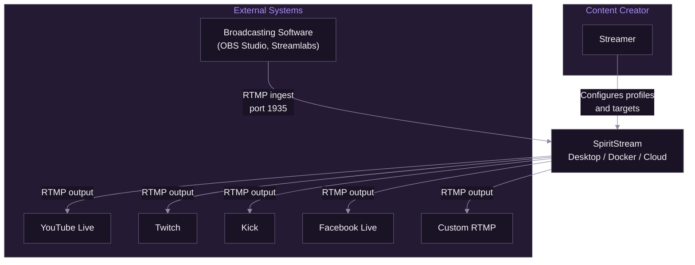
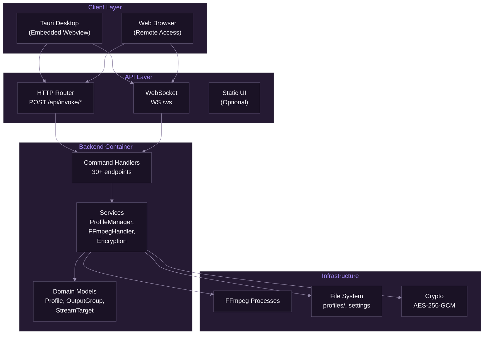
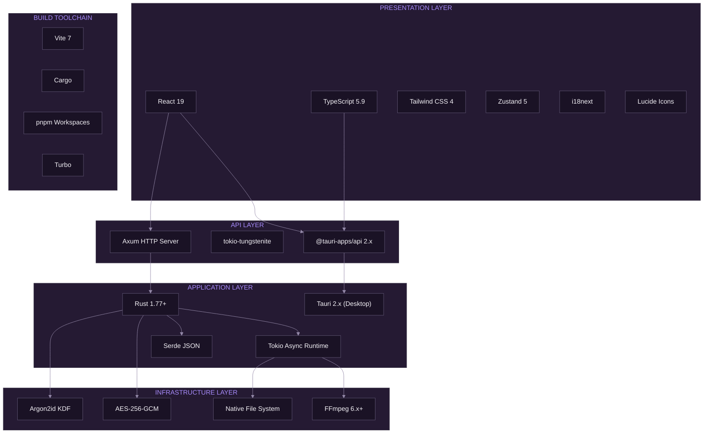

# System Overview

[Documentation](../README.md) > [Architecture](./README.md) > System Overview

---

SpiritStream is a multi-destination streaming application built with Tauri 2.x, Rust, and React. It receives a single RTMP input stream and distributes it simultaneously to multiple streaming platforms.

---

## Introduction

Live streaming has become a dominant form of content distribution, with creators often needing to broadcast simultaneously to multiple platforms to maximize audience reach. Traditional solutions require running multiple encoding instances or using cloud-based services with associated latency and costs.

SpiritStream addresses this challenge by providing a flexible application that:

1. Receives a single RTMP input stream from broadcasting software such as OBS Studio
2. Optionally re-encodes or passes through the stream to multiple output groups
3. Distributes the processed stream to multiple platform destinations simultaneously

**This document covers:**

- High-level system context and boundaries
- Deployment modes (Desktop, Docker, Cloud)
- Container-level architecture showing major components
- Technology stack and rationale for technology choices
- Cross-cutting concerns including security and error handling

**See also:** [Component Architecture](./02-component-architecture.md), [Data Flow](./03-data-flow.md), [Security Architecture](./04-security-architecture.md)

---

## Architecture Overview

### System Context

SpiritStream operates as a streaming server that bridges broadcasting software with streaming platforms. The following diagram illustrates the system context:



*SpiritStream receives RTMP input from broadcasting software and distributes to multiple streaming platforms.*

The system has the following external actors and dependencies:

- **Content Creator** — The user who configures streaming profiles and monitors stream status
- **Broadcasting Software** — Sources the video/audio content via RTMP (e.g., OBS Studio)
- **Streaming Platforms** — Destinations receiving the output RTMP streams

### Design Principles

The architecture adheres to the following principles:

- **Separation of Concerns** — Frontend presentation logic is isolated from backend business logic through the HTTP/WebSocket API
- **Security by Default** — Token-based authentication for remote access; sensitive data is encrypted at rest
- **Cross-Platform Compatibility** — The architecture supports Windows, macOS, and Linux with platform-specific optimizations
- **Offline-First** — All functionality works without internet connectivity (except actual streaming)
- **Deployment Flexibility** — The same codebase supports Desktop, Docker, and Cloud deployment modes

### Architectural Style

SpiritStream employs a **layered architecture** with clear boundaries between:

- **Presentation Layer** — React components and Zustand state management
- **API Layer** — HTTP REST endpoints and WebSocket event streaming
- **Application Layer** — Rust services implementing business logic
- **Infrastructure Layer** — FFmpeg processes, file system, and cryptographic operations

---

## Deployment Modes

SpiritStream supports three deployment modes from the same codebase:

### Desktop (Tauri)

The primary deployment mode for content creators who want local GPU acceleration and simple installation.

```
┌─────────────────────────────────────────────────────┐
│              Tauri Desktop Application              │
│  ┌───────────────┐     ┌───────────────────────┐   │
│  │ Tauri Launcher│────▶│ Host Server (Sidecar) │   │
│  └───────┬───────┘     └───────────┬───────────┘   │
│          │                         │               │
│          ▼                         ▼               │
│  ┌───────────────┐     ┌───────────────────────┐   │
│  │ Native Webview│◀───▶│ HTTP/WS API :8008     │   │
│  │ (React UI)    │     │ FFmpeg Processes      │   │
│  └───────────────┘     └───────────────────────┘   │
└─────────────────────────────────────────────────────┘
```

**Characteristics:**
- Local GPU access (NVENC, QuickSync, AMF, VideoToolbox)
- Local file storage for profiles and settings
- Single-click installation
- Automatic server lifecycle management

### Docker (Self-Hosted)

For users who want to run SpiritStream on their own servers with full control.

```
┌─────────────────────────────────────────────────────┐
│                Docker Container                      │
│  ┌───────────────────────────────────────────────┐  │
│  │         Host Server (spiritstream-server)      │  │
│  │                                                │  │
│  │  HTTP API :8008 ────────▶ ProfileManager      │  │
│  │  WebSocket :8008 ────────▶ FFmpegHandler      │  │
│  │  RTMP Ingest :1935 ──────▶ StreamTargets      │  │
│  └───────────────────────────────────────────────┘  │
│                         │                           │
│                         ▼                           │
│  ┌───────────────────────────────────────────────┐  │
│  │   Volume: /app/data (profiles, settings)      │  │
│  └───────────────────────────────────────────────┘  │
└─────────────────────────────────────────────────────┘
           │
           │ HTTP/WS
           ▼
    ┌─────────────┐
    │ Web Browser │
    │ (Remote UI) │
    └─────────────┘
```

**Characteristics:**
- GPU passthrough (NVIDIA Container Toolkit)
- Volume-mounted persistent storage
- Token-based authentication
- Remote web UI access

### Cloud (Future SaaS)

Planned managed service with multi-tenant architecture.

**Planned Characteristics:**
- Managed GPU infrastructure
- Multi-tenant profile storage
- SSO/OIDC authentication
- Usage-based billing

### Deployment Comparison

| Feature | Desktop | Docker | Cloud |
|---------|---------|--------|-------|
| GPU Access | Local | Passthrough | Managed |
| Storage | Local Files | Volumes | Cloud DB |
| Authentication | None/Optional | Token | SSO |
| Installation | Installer | `docker pull` | Sign Up |
| Updates | Auto-updater | Image Tags | Managed |
| Cost | Free | Free (OSS) | Subscription |

---

## Container Architecture

### Container Diagram

The following diagram shows the major containers (deployable units) within SpiritStream:



*Internal structure of SpiritStream showing client, API, backend, and infrastructure containers.*

### Client Layer

The client layer supports multiple access methods:

| Client | Technology | Connection |
|--------|------------|------------|
| Tauri Desktop | Native Webview | Localhost HTTP/WS |
| Web Browser | React SPA | Remote HTTP/WS |
| CLI (Future) | Rust | HTTP |

The React UI automatically detects its environment:
- **Tauri Mode**: Uses native IPC via `@tauri-apps/api`
- **HTTP Mode**: Uses fetch/WebSocket to configured backend URL

### API Layer

The HTTP/WebSocket API provides:

| Endpoint | Method | Purpose |
|----------|--------|---------|
| `/api/invoke/{command}` | POST | Execute backend commands |
| `/ws` | WS | Real-time events (stream stats, logs) |
| `/health` | GET | Health check for orchestrators |
| `/*` | GET | Static UI files (optional) |

Authentication uses Bearer token when configured:
```
Authorization: Bearer <token>
```

### Backend Container

The backend container comprises Rust code compiled into the server binary:

| Component | Files | Purpose |
|-----------|-------|---------|
| Commands | `src/commands/*.rs` | Business logic endpoints |
| Services | `src/services/*.rs` | ProfileManager, FFmpegHandler, Encryption |
| Models | `src/models/*.rs` | Profile, OutputGroup, StreamTarget |

Key services:

- **ProfileManager** — Profile CRUD operations with encryption support
- **FFmpegHandler** — FFmpeg process lifecycle management
- **Encryption** — AES-256-GCM encryption with Argon2id key derivation
- **SettingsManager** — Application settings persistence
- **ThemeManager** — Theme file discovery and CSS token extraction
- **FFmpegDownloader** — Platform-specific FFmpeg binary downloads

### Infrastructure Layer

The infrastructure layer handles external system interactions:

| Component | Technology | Purpose |
|-----------|------------|---------|
| FFmpeg | Child processes | Stream encoding and distribution |
| File System | `tokio::fs` | Profile and settings storage |
| Cryptography | `aes-gcm`, `argon2` | Data encryption |

---

## Technology Stack

### Stack Visualization



*Layered view of technologies used in SpiritStream.*

### Technology Rationale

| Technology | Alternative Considered | Rationale for Choice |
|------------|----------------------|---------------------|
| **Tauri** | Electron | 10x smaller bundle size, better security model, native performance |
| **Rust** | Go, C++ | Memory safety without GC, excellent FFI, Tauri native language |
| **Axum** | Actix-web, Warp | Tower ecosystem, ergonomic API, excellent async support |
| **React** | Vue, Svelte | Largest ecosystem, team familiarity, excellent TypeScript support |
| **Zustand** | Redux, Jotai | Minimal boilerplate, built-in persistence, TypeScript-first |
| **Tailwind** | CSS Modules, Styled Components | Design token support, utility-first paradigm, small bundle |
| **pnpm** | npm, yarn | Fast, disk-efficient, excellent workspace support |
| **FFmpeg** | GStreamer, libav | Industry standard, platform support, documentation quality |
| **AES-256-GCM** | ChaCha20-Poly1305 | Hardware acceleration (AES-NI), NIST standardized |
| **Argon2id** | bcrypt, scrypt | Winner of Password Hashing Competition, GPU-resistant |

### Version Requirements

| Component | Minimum Version | Current Version |
|-----------|-----------------|-----------------|
| Rust | 1.77.2 | 1.77.2+ |
| Node.js | 18.0 | 20.x |
| pnpm | 8.0 | 8.x |
| Tauri | 2.0 | 2.9.x |
| React | 18.0 | 19.2 |
| FFmpeg | 5.0 | 6.x+ |

---

## Cross-Cutting Concerns

### Security Model

Security is implemented at multiple layers:

- **Token Authentication** — Bearer token for HTTP API and WebSocket connections (opt-in)
- **Remote Access Control** — Localhost binding by default; remote access requires explicit configuration
- **Profile Encryption** — Optional AES-256-GCM encryption for profiles containing sensitive stream keys
- **Stream Key Protection** — Machine-specific encryption for stream keys even in unencrypted profiles
- **Path Traversal Prevention** — Validation of all user-supplied paths and profile names
- **CSP Headers** — Strict Content Security Policy preventing XSS attacks

See [Security Architecture](./04-security-architecture.md) for detailed implementation.

### HTTP/WebSocket API

The API provides the same functionality as the Tauri IPC:

```typescript
// Command invocation
POST /api/invoke/{command}
Content-Type: application/json
Authorization: Bearer <token>  // Optional

{ "param1": "value1", "param2": "value2" }

// Response format
{ "ok": true, "data": <result>, "error": null }
{ "ok": false, "data": null, "error": "Error message" }

// WebSocket events
WS /ws?token=<token>
{ "event": "stream_stats", "payload": { ... } }
{ "event": "log://log", "payload": { ... } }
```

### Error Handling Strategy

Errors are handled consistently across layers:

- **Rust Backend** — Uses `Result<T, String>` for all commands; errors are user-friendly messages
- **HTTP API** — Returns structured JSON with `ok`, `data`, and `error` fields
- **TypeScript Frontend** — Try-catch around all API calls; errors displayed via toast notifications
- **FFmpeg Processes** — Exit codes and stderr monitored; errors emitted as WebSocket events
- **Validation** — Pre-flight validation before stream start; issues presented with specific guidance

### Logging and Monitoring

The application uses structured logging with levels:

| Level | Usage |
|-------|-------|
| `error` | Unrecoverable failures, security events |
| `warn` | Recoverable issues, deprecations |
| `info` | User actions, lifecycle events |
| `debug` | Detailed diagnostic information |
| `trace` | Fine-grained debugging (development only) |

Logs are:
- Written to `{APP_DATA}/logs/`
- Visible in the application's Logs view
- Streamed via WebSocket to connected clients

---

## Deployment Architecture

### Bundle Composition

The final application bundle includes:

| Component | Windows | macOS | Linux |
|-----------|---------|-------|-------|
| Tauri Binary | `.exe` | Universal Binary | ELF |
| Server Sidecar | `.exe` | Binary | ELF |
| Frontend Assets | Embedded | Embedded | Embedded |
| WebView | WebView2 | WebKit | WebKitGTK |
| Bundle Format | `.msi` | `.dmg` | `.AppImage`, `.deb` |

### Docker Distribution

Docker images include:

| Component | Size |
|-----------|------|
| Rust Server | ~15 MB |
| FFmpeg (Optional) | ~70 MB |
| Total Image | ~50-120 MB |

### FFmpeg Distribution

FFmpeg is not bundled with the application. Instead:

1. User is prompted to install FFmpeg if not detected
2. Auto-download option fetches platform-specific binaries
3. Custom path configuration for existing installations

This approach reduces bundle size and avoids licensing complications.

---

## Summary

SpiritStream's architecture provides a robust foundation for multi-destination streaming through:

- Clear separation between presentation and business logic via HTTP/WebSocket API
- Secure handling of sensitive credentials through encryption at rest
- Efficient stream processing via FFmpeg with relay-based distribution
- Cross-platform support with multiple deployment modes (Desktop, Docker, Cloud)

### Architectural Trade-offs

| Decision | Trade-off |
|----------|-----------|
| Tauri over Electron | Smaller bundle but requires native webview installation |
| HTTP API over Tauri-only | Universal access but additional API surface to maintain |
| FFmpeg as external process | Flexibility but requires user installation |
| Zustand over Redux | Simpler but less ecosystem tooling |
| AES-GCM over alternatives | Hardware acceleration but requires unique nonces |

### Future Considerations

- **Veilid Integration** — Client-level decentralized network protocol
- **WebRTC Support** — For lower-latency streaming protocols
- **Plugin System** — For community-contributed platform support
- **Cloud Sync** — Optional profile synchronization across devices

---

**Related:** [Component Architecture](./02-component-architecture.md) | [Data Flow](./03-data-flow.md) | [Security Architecture](./04-security-architecture.md) | [Glossary](../GLOSSARY.md)
