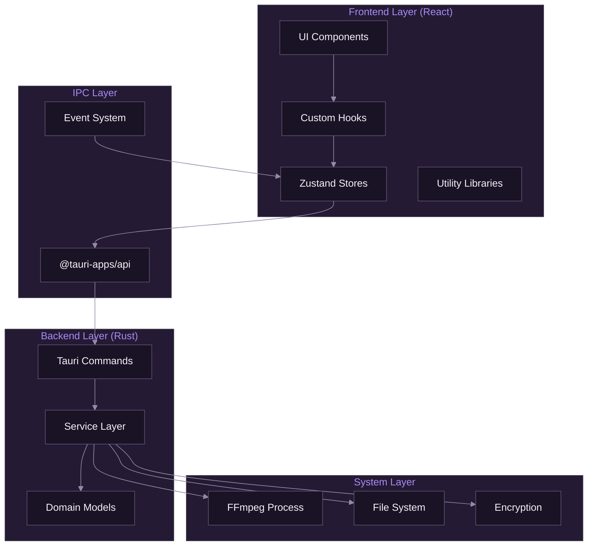
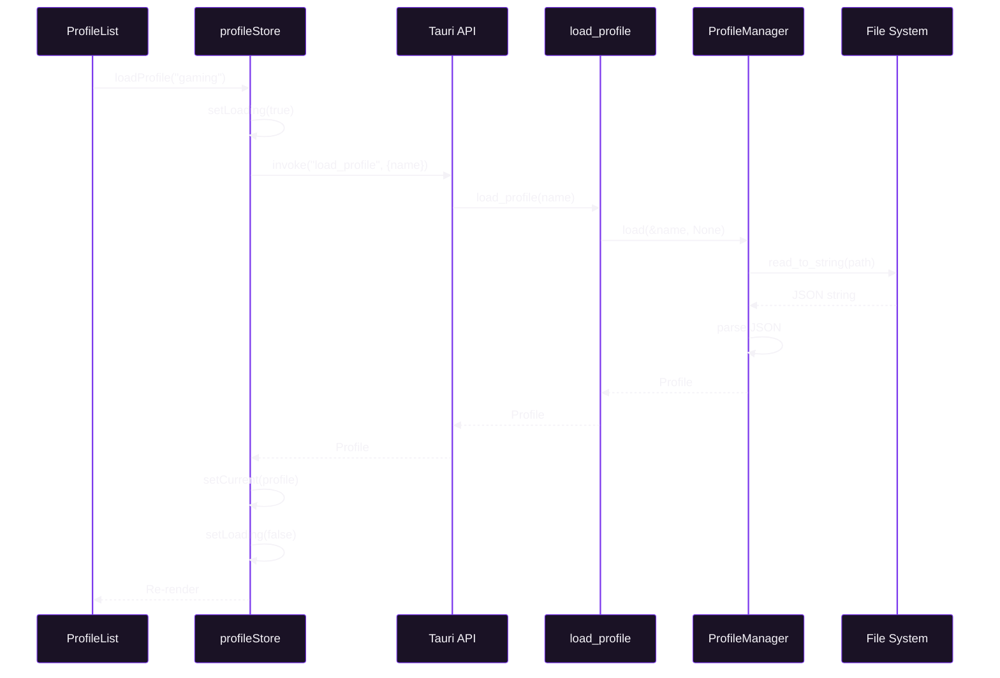
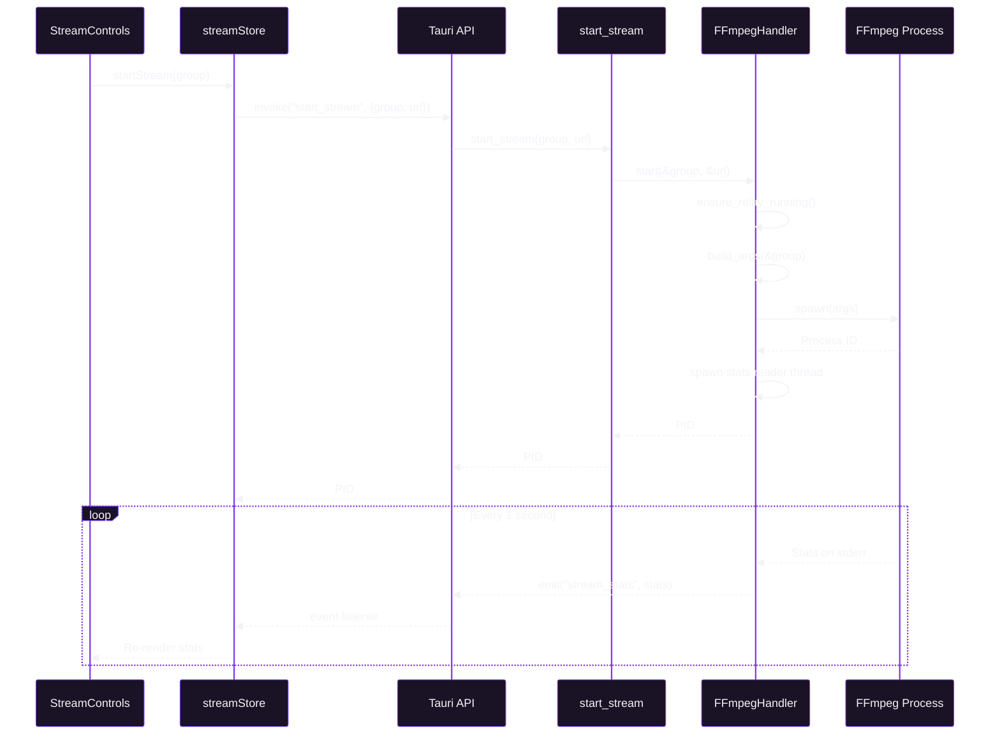

# Component Architecture

[Documentation](../README.md) > [Architecture](./README.md) > Component Architecture

---

This document describes SpiritStream's component architecture, covering the separation between Tauri backend services and React frontend components.

---

## High-Level Architecture



*Component architecture showing layers from UI to system integration.*

---

## Frontend Components

### Component Categories

| Category | Location | Purpose |
|----------|----------|---------|
| UI | `components/ui/` | Base components (Button, Card, Input) |
| Layout | `components/layout/` | App structure (Sidebar, Header) |
| Navigation | `components/navigation/` | Nav items and sections |
| Profile | `components/profile/` | Profile management |
| Stream | `components/stream/` | Streaming controls |
| Settings | `components/settings/` | Configuration UI |

### Component Hierarchy

```
App
├── ThemeProvider
│   └── I18nProvider
│       └── AppShell
│           ├── Sidebar
│           │   ├── SidebarHeader
│           │   ├── SidebarNav
│           │   │   ├── NavSection
│           │   │   │   └── NavItem[]
│           │   └── SidebarFooter
│           └── MainContent
│               ├── Header
│               └── ContentArea
│                   └── [Page Component]
```

---

## Backend Services

### Service Layer

```
src-tauri/src/services/
├── mod.rs              # Service exports
├── profile_manager.rs  # Profile CRUD
├── ffmpeg_handler.rs   # Stream processing
├── encryption.rs       # Encryption/decryption
├── settings_manager.rs # App settings
└── theme_manager.rs    # Theme persistence
```

### Service Responsibilities

| Service | Responsibility |
|---------|----------------|
| ProfileManager | Load, save, delete profiles |
| FFmpegHandler | Start, stop, monitor streams |
| Encryption | Encrypt/decrypt sensitive data |
| SettingsManager | App preferences |
| ThemeManager | Theme persistence |

---

## Data Flow

### Profile Loading



### Stream Start



---

## State Architecture

### Store Structure

```typescript
// Zustand store pattern
interface Store {
  // State
  data: T;
  loading: boolean;
  error: string | null;

  // Actions
  load: () => Promise<void>;
  save: (data: T) => Promise<void>;
  reset: () => void;
}
```

### Store Relationships

```
┌─────────────────────────────────────────┐
│              Application                │
├─────────────────────────────────────────┤
│  ┌─────────┐  ┌─────────┐  ┌─────────┐ │
│  │ profile │  │ stream  │  │ settings│ │
│  │  Store  │  │  Store  │  │  Store  │ │
│  └────┬────┘  └────┬────┘  └────┬────┘ │
│       │            │            │       │
│       └────────────┼────────────┘       │
│                    │                     │
│           ┌────────┴────────┐           │
│           │  Tauri IPC API  │           │
│           └─────────────────┘           │
└─────────────────────────────────────────┘
```

---

## Tauri Commands

### Command Registration

```rust
// src-tauri/src/main.rs
fn main() {
    tauri::Builder::default()
        .setup(|app| {
            let app_data = app.path().app_data_dir().unwrap();
            app.manage(ProfileManager::new(app_data.clone()));
            app.manage(FFmpegHandler::new());
            app.manage(SettingsManager::new(app_data));
            Ok(())
        })
        .invoke_handler(tauri::generate_handler![
            // Profile commands
            commands::profile::get_all_profiles,
            commands::profile::load_profile,
            commands::profile::save_profile,
            commands::profile::delete_profile,

            // Stream commands
            commands::stream::start_stream,
            commands::stream::stop_stream,
            commands::stream::stop_all_streams,

            // System commands
            commands::system::get_video_encoders,
            commands::system::get_settings,
            commands::system::save_settings,
        ])
        .run(tauri::generate_context!())
        .expect("error running application");
}
```

### Command Pattern

```rust
// src-tauri/src/commands/profile.rs
use tauri::State;
use crate::services::ProfileManager;
use crate::models::Profile;

#[tauri::command]
pub async fn load_profile(
    name: String,
    password: Option<String>,
    state: State<'_, ProfileManager>,
) -> Result<Profile, String> {
    state
        .load(&name, password.as_deref())
        .await
        .map_err(|e| e.to_string())
}
```

---

## Event System

### Backend Events

```rust
// Emit event from Rust
app_handle.emit("stream_stats", stats)?;
app_handle.emit("stream_ended", group_id)?;
app_handle.emit("stream_error", error_info)?;
```

### Frontend Listeners

```typescript
// Listen in React
import { listen } from '@tauri-apps/api/event';

useEffect(() => {
  const unlisten = listen<StreamStats>('stream_stats', (event) => {
    updateStats(event.payload);
  });

  return () => {
    unlisten.then((fn) => fn());
  };
}, []);
```

---

## File System Layout

### Application Data

```
$APPDATA/SpiritStream/
├── profiles/
│   ├── gaming.json
│   └── podcast.json.enc
├── settings.json
└── logs/
    └── spiritstream.log
```

### Profile Format

```json
{
  "id": "uuid",
  "name": "Gaming Stream",
  "incomingUrl": "rtmp://localhost:1935/live/stream",
  "outputGroups": [
    {
      "id": "uuid",
      "name": "Main Output",
      "video": { "codec": "copy", ... },
      "audio": { "codec": "copy", ... },
      "streamTargets": [...]
    }
  ]
}
```

---

## Dependency Injection

### Service Initialization

```rust
.setup(|app| {
    let app_data = app.path().app_data_dir().unwrap();

    // Create services
    let profile_manager = ProfileManager::new(app_data.clone());
    let ffmpeg_handler = FFmpegHandler::new();
    let settings_manager = SettingsManager::new(app_data.clone());

    // Register with Tauri's state management
    app.manage(profile_manager);
    app.manage(ffmpeg_handler);
    app.manage(settings_manager);

    Ok(())
})
```

### Accessing Services

```rust
#[tauri::command]
pub async fn my_command(
    state: State<'_, ProfileManager>,  // Injected automatically
) -> Result<(), String> {
    state.do_something().await
}
```

---

## Error Handling

### Backend Errors

```rust
#[derive(Debug, thiserror::Error)]
pub enum ProfileError {
    #[error("Profile not found: {0}")]
    NotFound(String),

    #[error("IO error: {0}")]
    Io(#[from] std::io::Error),

    #[error("Parse error: {0}")]
    Parse(#[from] serde_json::Error),
}

// Convert to String for IPC
impl From<ProfileError> for String {
    fn from(err: ProfileError) -> String {
        err.to_string()
    }
}
```

### Frontend Error Handling

```typescript
try {
  const profile = await invoke<Profile>('load_profile', { name });
  setProfile(profile);
} catch (error) {
  setError(String(error));
  toast.error(`Failed to load profile: ${error}`);
}
```

---

**Related:** [System Overview](./01-system-overview.md) | [Data Flow](./03-data-flow.md) | [Security Architecture](./04-security-architecture.md)

