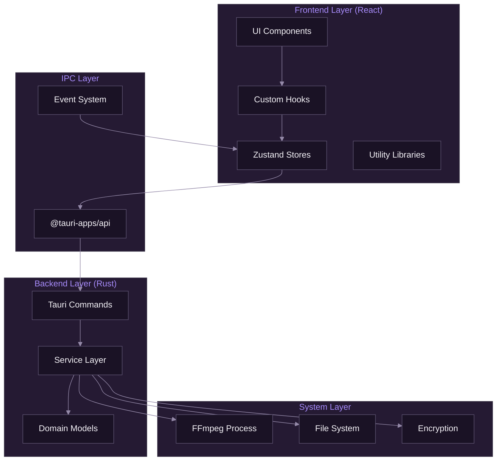
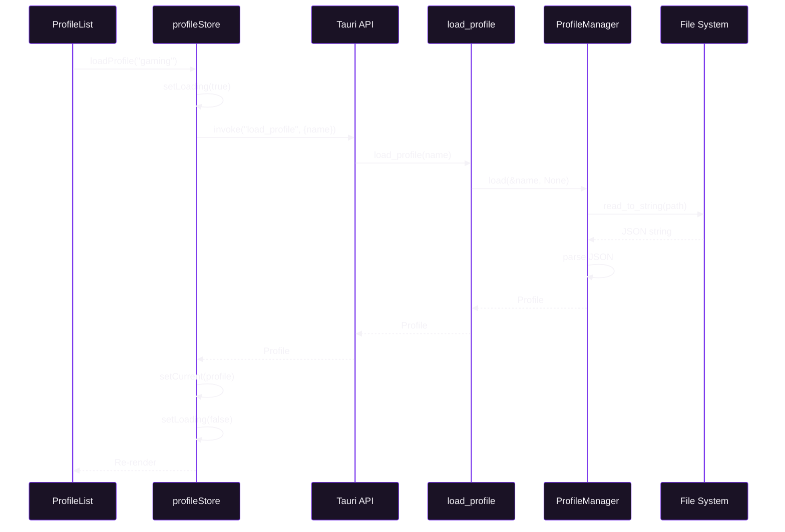
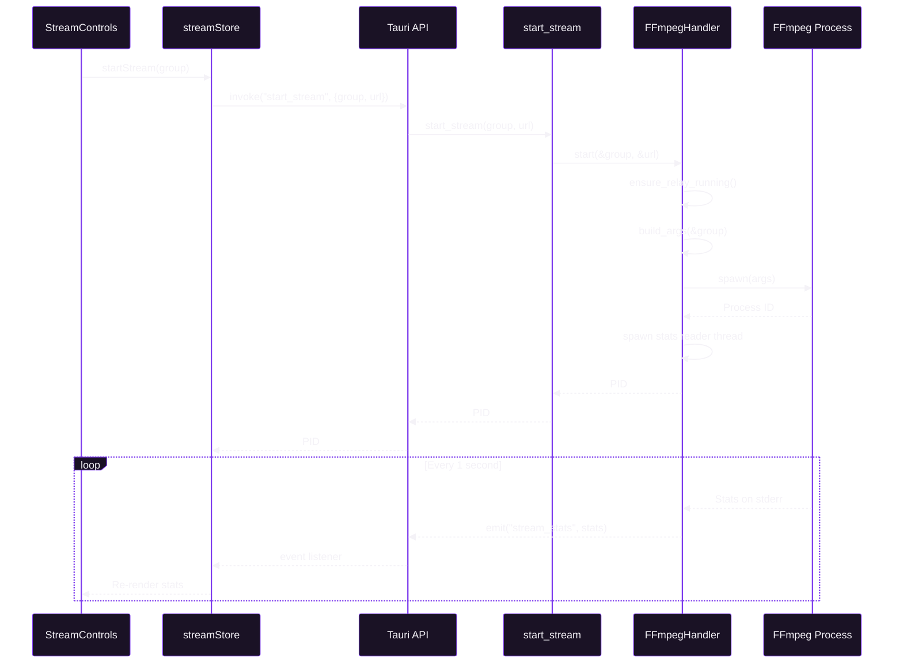

# Component Architecture

[Documentation](../README.md) > [Architecture](./README.md) > Component Architecture

---

This document describes SpiritStream's component architecture, covering the separation between Tauri backend services and React frontend components.

---

## High-Level Architecture


```mermaid
%%{init: {'theme': 'base', 'themeVariables': {
  'primaryColor': '#3D3649',
  'primaryTextColor': '#F4F2F7',
  'primaryBorderColor': '#7C3AED',
  'lineColor': '#9489A8',
  'secondaryColor': '#251A33',
  'tertiaryColor': '#1A1225',
  'background': '#0F0A14',
  'mainBkg': '#1A1225',
  'nodeBorder': '#5E5472',
  'clusterBkg': '#251A33',
  'clusterBorder': '#3D3649',
  'titleColor': '#A78BFA',
  'edgeLabelBackground': '#1A1225',
  'textColor': '#F4F2F7'
}}}%%
flowchart TB
    subgraph Frontend["Frontend Layer (React)"]
        direction TB
        UI["UI Components"]
        HOOKS["Custom Hooks"]
        STORES["Zustand Stores"]
        LIB["Utility Libraries"]
    end

    subgraph IPC["IPC Layer"]
        TAURI_API["@tauri-apps/api"]
        EVENTS["Event System"]
    end

    subgraph Backend["Backend Layer (Rust)"]
        direction TB
        COMMANDS["Tauri Commands"]
        SERVICES["Service Layer"]
        MODELS["Domain Models"]
    end

    subgraph System["System Layer"]
        FFMPEG["FFmpeg Process"]
        FS["File System"]
        CRYPTO["Encryption"]
    end

    UI --> HOOKS
    HOOKS --> STORES
    STORES --> TAURI_API
    TAURI_API --> COMMANDS
    EVENTS --> STORES
    COMMANDS --> SERVICES
    SERVICES --> MODELS
    SERVICES --> FFMPEG
    SERVICES --> FS
    SERVICES --> CRYPTO
```

*Component architecture showing layers from UI to system integration.*

---

## Frontend Components

### Component Categories

| Category | Location | Purpose |
|----------|----------|---------|
| UI | `components/ui/` | Base components (Button, Card, Input) |
| Layout | `components/layout/` | App structure (Sidebar, Header) |
| Navigation | `components/navigation/` | Nav items and sections |
| Profile | `components/profile/` | Profile management |
| Stream | `components/stream/` | Streaming controls |
| Settings | `components/settings/` | Configuration UI |

### Component Hierarchy

```
App
├── ThemeProvider
│   └── I18nProvider
│       └── AppShell
│           ├── Sidebar
│           │   ├── SidebarHeader
│           │   ├── SidebarNav
│           │   │   ├── NavSection
│           │   │   │   └── NavItem[]
│           │   └── SidebarFooter
│           └── MainContent
│               ├── Header
│               └── ContentArea
│                   └── [Page Component]
```

---

## Backend Services

### Service Layer

```
crates/core/src/services/
├── mod.rs               # Service exports
├── profile_manager.rs   # Profile CRUD
├── ffmpeg_handler.rs    # Stream processing
├── encryption.rs        # AES-256-GCM-SIV envelope
├── settings_manager.rs  # Bound-checked global settings
└── theme_manager.rs     # Theme catalog and hot-reload
```

### Service Responsibilities

| Service | Responsibility |
|---------|----------------|
| ProfileManager | Load, save, delete profiles |
| FFmpegHandler | Start, stop, monitor streams |
| Encryption | Encrypt/decrypt sensitive data |
| SettingsManager | App preferences |
| ThemeManager | Theme persistence |

---

## Data Flow

### Profile Loading


```mermaid
%%{init: {'theme': 'base', 'themeVariables': {
  'primaryColor': '#3D3649',
  'primaryTextColor': '#F4F2F7',
  'primaryBorderColor': '#7C3AED',
  'lineColor': '#9489A8',
  'secondaryColor': '#251A33',
  'tertiaryColor': '#1A1225',
  'background': '#0F0A14',
  'mainBkg': '#1A1225',
  'nodeBorder': '#5E5472',
  'clusterBkg': '#251A33',
  'clusterBorder': '#3D3649',
  'titleColor': '#A78BFA',
  'edgeLabelBackground': '#1A1225',
  'textColor': '#F4F2F7'
}}}%%
sequenceDiagram
    participant UI as ProfileList
    participant Store as profileStore
    participant Tauri as Tauri API
    participant Cmd as load_profile
    participant Svc as ProfileManager
    participant FS as File System

    UI->>Store: loadProfile("gaming")
    Store->>Store: setLoading(true)
    Store->>Tauri: invoke("load_profile", {name})

    Tauri->>Cmd: load_profile(name)
    Cmd->>Svc: load(&name, None)
    Svc->>FS: read_to_string(path)
    FS-->>Svc: JSON string
    Svc->>Svc: parse JSON
    Svc-->>Cmd: Profile
    Cmd-->>Tauri: Profile
    Tauri-->>Store: Profile

    Store->>Store: setCurrent(profile)
    Store->>Store: setLoading(false)
    Store-->>UI: Re-render
```

### Stream Start


```mermaid
%%{init: {'theme': 'base', 'themeVariables': {
  'primaryColor': '#3D3649',
  'primaryTextColor': '#F4F2F7',
  'primaryBorderColor': '#7C3AED',
  'lineColor': '#9489A8',
  'secondaryColor': '#251A33',
  'tertiaryColor': '#1A1225',
  'background': '#0F0A14',
  'mainBkg': '#1A1225',
  'nodeBorder': '#5E5472',
  'clusterBkg': '#251A33',
  'clusterBorder': '#3D3649',
  'titleColor': '#A78BFA',
  'edgeLabelBackground': '#1A1225',
  'textColor': '#F4F2F7'
}}}%%
sequenceDiagram
    participant UI as StreamControls
    participant Store as streamStore
    participant Tauri as Tauri API
    participant Cmd as start_stream
    participant FFH as FFmpegHandler
    participant FFmpeg as FFmpeg Process

    UI->>Store: startStream(group)
    Store->>Tauri: invoke("start_stream", {group, url})

    Tauri->>Cmd: start_stream(group, url)
    Cmd->>FFH: start(&group, &url)
    FFH->>FFH: ensure_relay_running()
    FFH->>FFH: build_args(&group)
    FFH->>FFmpeg: spawn(args)
    FFmpeg-->>FFH: Process ID

    FFH->>FFH: spawn stats reader thread

    FFH-->>Cmd: PID
    Cmd-->>Tauri: PID
    Tauri-->>Store: PID

    loop Every 1 second
        FFmpeg-->>FFH: Stats on stderr
        FFH-->>Tauri: emit("stream_stats", stats)
        Tauri-->>Store: event listener
        Store-->>UI: Re-render stats
    end
```

---

## State Architecture

### Store Structure

```typescript
// Zustand store pattern
interface Store {
  // State
  data: T;
  loading: boolean;
  error: string | null;

  // Actions
  load: () => Promise<void>;
  save: (data: T) => Promise<void>;
  reset: () => void;
}
```

### Store Relationships

```
┌─────────────────────────────────────────┐
│              Application                │
├─────────────────────────────────────────┤
│  ┌─────────┐  ┌─────────┐  ┌─────────┐ │
│  │ profile │  │ stream  │  │ settings│ │
│  │  Store  │  │  Store  │  │  Store  │ │
│  └────┬────┘  └────┬────┘  └────┬────┘ │
│       │            │            │       │
│       └────────────┼────────────┘       │
│                    │                     │
│           ┌────────┴────────┐           │
│           │  Tauri IPC API  │           │
│           └─────────────────┘           │
└─────────────────────────────────────────┘
```

---

## HTTP API

The Tauri `invoke()` transitional dispatch is retired. All API calls go through REST under `/api/v1/*` (Axum + utoipa) — see [`crates/transport-http/README.md`](../../crates/transport-http/README.md). The CLI is an in-process dispatch substrate that calls the same `ServiceRegistry` directly.

### Route registration (excerpt)

```rust
// crates/transport-http/src/lib.rs
let router = Router::new()
    .route("/api/v1/profiles", get(get_all_profiles).post(save_profile))
    .route("/api/v1/profiles/:name", get(load_profile).delete(delete_profile))
    .route("/api/v1/streams", post(start_stream))
    .route("/api/v1/streams/:id/stop", post(stop_stream))
    .route("/api/v1/settings", get(get_settings).put(save_settings))
    .layer(middleware::from_fn(auth_middleware))
    .layer(middleware::from_fn(csrf_middleware))
    .with_state(registry);
```

### Handler pattern

```rust
// crates/transport-http/src/handlers/profile.rs
#[utoipa::path(get, path = "/api/v1/profiles/{name}", ...)]
pub async fn load_profile(
    State(registry): State<Arc<ServiceRegistry>>,
    Path(name): Path<String>,
    Query(params): Query<LoadProfileQuery>,
) -> Result<Json<Profile>, ApiError> {
    let profile = registry
        .profiles
        .load(&name, params.password.as_deref())
        .await?;
    Ok(Json(profile))
}
```

---

## Event System

### Server-push events

`GET /api/v1/events` is a one-way WebSocket the server uses to push `stream_stats`, `stream_ended`, and `stream_error` updates. CSRF runs on upgrade.

### Frontend listeners

```typescript
// apps/web/src/hooks/useEvents.ts (excerpt)
import { useEvents } from '@/hooks/useEvents';

useEvents('stream_stats', (payload) => {
  updateStats(payload);
});
```

---

## File System Layout

### Application Data

```
$APPDATA/SpiritStream/
├── profiles/
│   ├── gaming.json
│   └── podcast.json.enc
├── settings.json
└── logs/
    └── spiritstream.log
```

### Profile Format

```json
{
  "id": "uuid",
  "name": "Gaming Stream",
  "incomingUrl": "rtmp://localhost:1935/live/stream",
  "outputGroups": [
    {
      "id": "uuid",
      "name": "Main Output",
      "video": { "codec": "copy", ... },
      "audio": { "codec": "copy", ... },
      "streamTargets": [...]
    }
  ]
}
```

---

## Dependency Injection

### Service Initialization

```rust
.setup(|app| {
    let app_data = app.path().app_data_dir().unwrap();

    // Create services
    let profile_manager = ProfileManager::new(app_data.clone());
    let ffmpeg_handler = FFmpegHandler::new();
    let settings_manager = SettingsManager::new(app_data.clone());

    // Register with Tauri's state management
    app.manage(profile_manager);
    app.manage(ffmpeg_handler);
    app.manage(settings_manager);

    Ok(())
})
```

### Accessing Services

```rust
#[tauri::command]
pub async fn my_command(
    state: State<'_, ProfileManager>,  // Injected automatically
) -> Result<(), String> {
    state.do_something().await
}
```

---

## Error Handling

### Backend Errors

```rust
#[derive(Debug, thiserror::Error)]
pub enum ProfileError {
    #[error("Profile not found: {0}")]
    NotFound(String),

    #[error("IO error: {0}")]
    Io(#[from] std::io::Error),

    #[error("Parse error: {0}")]
    Parse(#[from] serde_json::Error),
}

// Convert to String for IPC
impl From<ProfileError> for String {
    fn from(err: ProfileError) -> String {
        err.to_string()
    }
}
```

### Frontend Error Handling

```typescript
try {
  const profile = await invoke<Profile>('load_profile', { name });
  setProfile(profile);
} catch (error) {
  setError(String(error));
  toast.error(`Failed to load profile: ${error}`);
}
```

---

**Related:** [System Overview](./01-system-overview.md) | [Data Flow](./03-data-flow.md) | [Security Architecture](./04-security-architecture.md)

