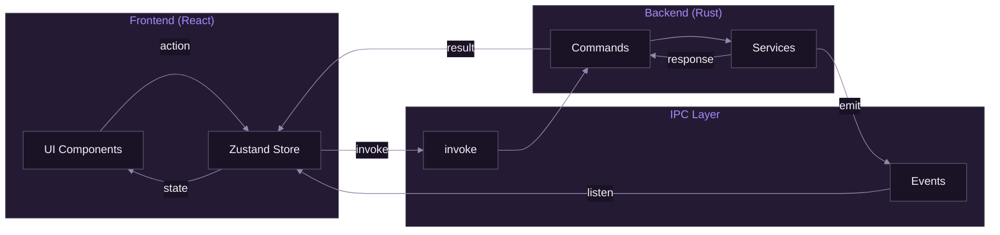
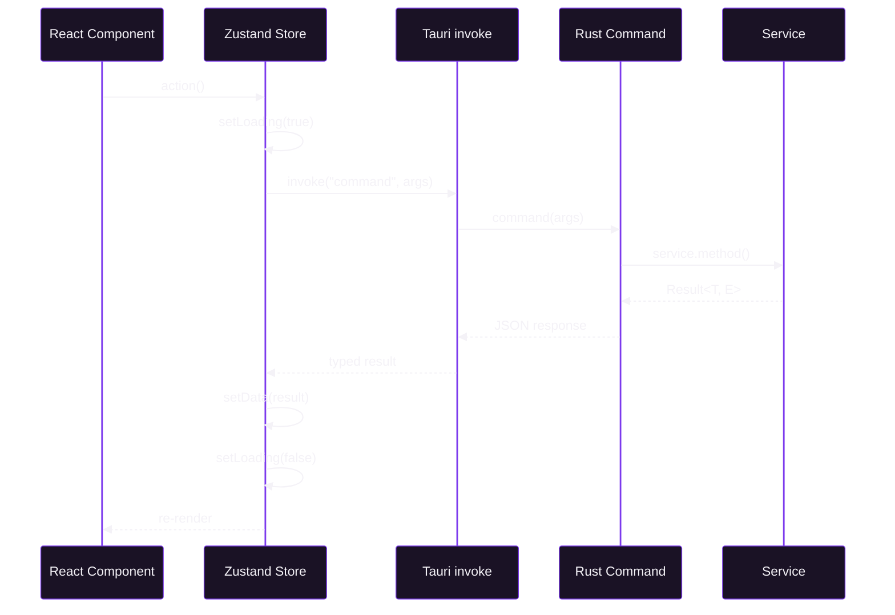
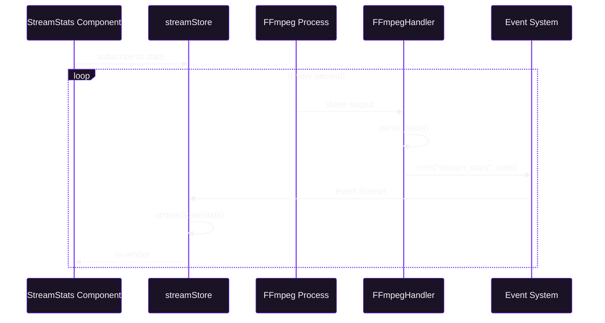
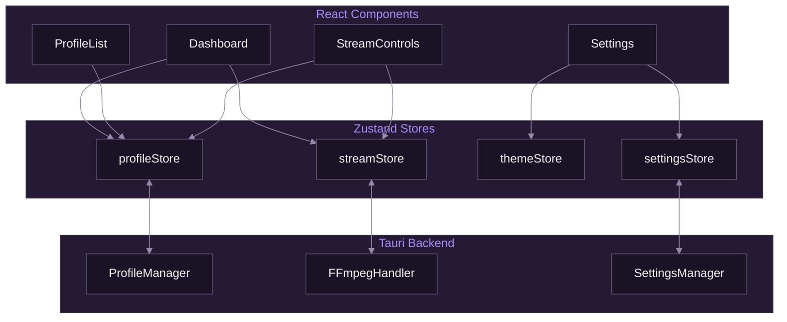
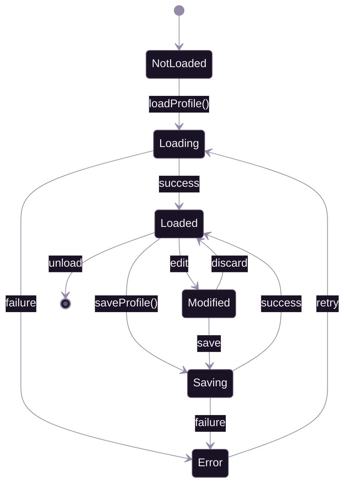
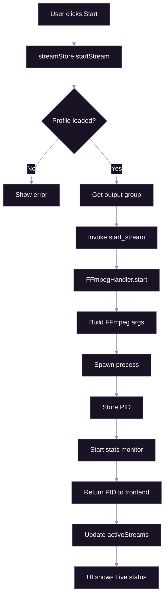
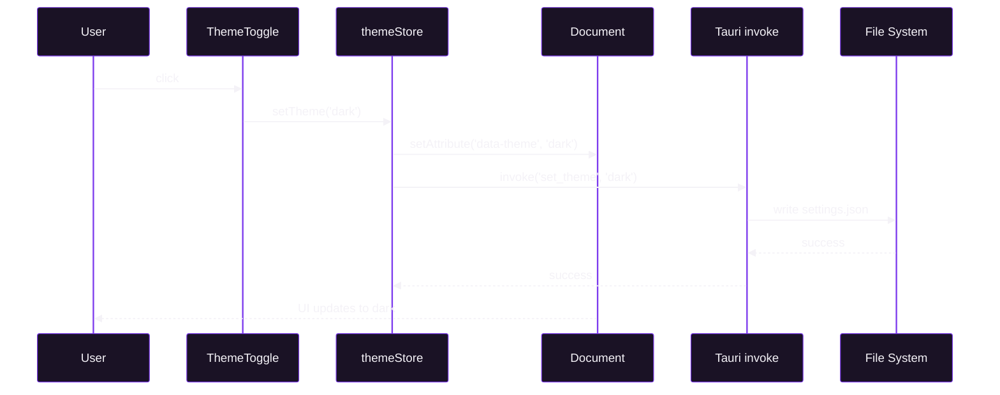
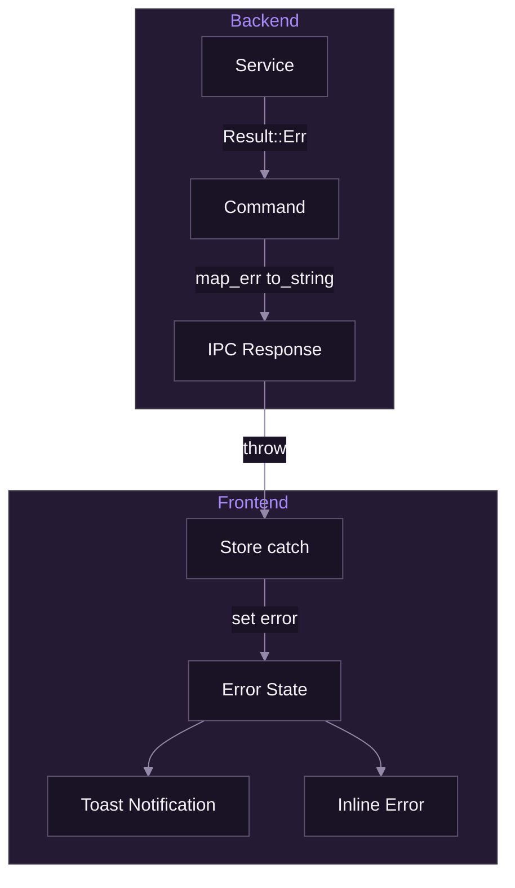

# Data Flow

[Documentation](../README.md) > [Architecture](./README.md) > Data Flow

---

This document describes how data flows through SpiritStream, from user interactions to system operations and back.

---

## Overview

SpiritStream follows a unidirectional data flow pattern where:
1. User actions trigger frontend events
2. Frontend dispatches to Zustand stores
3. Stores invoke Tauri commands
4. Rust services process requests
5. Results flow back through events/responses



*Unidirectional data flow from UI through IPC to backend and back.*

---

## Request/Response Flow

### Synchronous Commands

Most operations use the request/response pattern via `invoke`:



### Example: Loading a Profile

```typescript
// Frontend: profileStore.ts
loadProfile: async (name, password) => {
  set({ loading: true, error: null });

  try {
    const profile = await invoke<Profile>('load_profile', { name, password });
    set({ current: profile, loading: false });
  } catch (error) {
    set({ error: String(error), loading: false });
  }
}
```

```rust
// Backend: commands/profile.rs
#[tauri::command]
pub async fn load_profile(
    name: String,
    password: Option<String>,
    state: State<'_, ProfileManager>,
) -> Result<Profile, String> {
    state.load(&name, password.as_deref())
        .await
        .map_err(|e| e.to_string())
}
```

---

## Event-Driven Flow

### Streaming Statistics

Long-running operations use events for real-time updates:



### Frontend Event Listener

```typescript
// hooks/useStreamStats.ts
useEffect(() => {
  const unlisten = listen<StreamStats>('stream_stats', (event) => {
    streamStore.getState().updateStats(event.payload);
  });

  return () => {
    unlisten.then(fn => fn());
  };
}, []);
```

### Backend Event Emission

```rust
// services/ffmpeg_handler.rs
fn monitor_stream(app_handle: AppHandle, group_id: String, stderr: ChildStderr) {
    std::thread::spawn(move || {
        let reader = BufReader::new(stderr);
        for line in reader.lines().flatten() {
            if let Some(stats) = parse_ffmpeg_stats(&line) {
                let payload = StreamStats {
                    group_id: group_id.clone(),
                    ..stats
                };
                app_handle.emit("stream_stats", payload).ok();
            }
        }
    });
}
```

---

## State Management Flow

### Store Architecture



### Store Interactions

Stores can reference each other for coordinated operations:

```typescript
// streamStore.ts
startStream: async (groupId) => {
  const profile = useProfileStore.getState().current;
  if (!profile) throw new Error('No profile loaded');

  const group = profile.outputGroups.find(g => g.id === groupId);
  if (!group) throw new Error('Output group not found');

  const pid = await invoke<number>('start_stream', {
    group,
    incomingUrl: profile.incomingUrl,
  });

  set(state => ({
    activeStreams: new Map(state.activeStreams).set(groupId, pid),
  }));
}
```

---

## Profile Data Flow

### Profile Lifecycle



### Profile Save Flow

```typescript
// Full save flow with encryption
saveProfile: async (password) => {
  const profile = get().current;
  if (!profile) return;

  set({ saving: true });

  try {
    await invoke('save_profile', {
      profile,
      password: password || null,
    });

    // Refresh profile list
    const profiles = await invoke<string[]>('get_all_profiles');
    set({ profiles, saving: false, modified: false });
  } catch (error) {
    set({ error: String(error), saving: false });
  }
}
```

---

## Stream Control Flow

### Starting a Stream



### Stopping All Streams

```typescript
stopAllStreams: async () => {
  set({ stopping: true });

  try {
    await invoke('stop_all_streams');

    set({
      activeStreams: new Map(),
      stats: new Map(),
      stopping: false,
    });
  } catch (error) {
    set({ error: String(error), stopping: false });
  }
}
```

---

## Settings Flow

### Theme Change



---

## Error Flow

### Error Propagation



### Error Handling Pattern

```typescript
// Store action with error handling
deleteProfile: async (name) => {
  try {
    await invoke('delete_profile', { name });

    set(state => ({
      profiles: state.profiles.filter(p => p !== name),
      current: state.current?.name === name ? null : state.current,
    }));

    toast.success('Profile deleted');
  } catch (error) {
    toast.error(`Failed to delete profile: ${error}`);
    throw error; // Re-throw for component handling
  }
}
```

---

## Data Transformation

### Frontend to Backend

| Frontend (TypeScript) | Backend (Rust) |
|----------------------|----------------|
| `camelCase` | `snake_case` (auto-converted) |
| `string` | `String` |
| `number` | `u32`, `f64`, etc. |
| `boolean` | `bool` |
| `T \| null` | `Option<T>` |
| `T[]` | `Vec<T>` |

### Serialization

```rust
// Rust struct with serde rename
#[derive(Serialize, Deserialize)]
#[serde(rename_all = "camelCase")]
pub struct OutputGroup {
    pub id: String,
    pub stream_targets: Vec<StreamTarget>,  // Becomes streamTargets in JSON
}
```

```typescript
// TypeScript interface matches JSON
interface OutputGroup {
  id: string;
  streamTargets: StreamTarget[];  // Matches camelCase from Rust
}
```

---

## Best Practices

### Do

1. Keep stores focused on single concerns
2. Use TypeScript generics for invoke calls
3. Handle loading/error states in stores
4. Clean up event listeners in useEffect
5. Validate data at service boundaries

### Don't

1. Call invoke directly from components
2. Store non-serializable data
3. Ignore error handling
4. Create circular store dependencies
5. Bypass the store layer

---

**Related:** [System Overview](./01-system-overview.md) | [Component Architecture](./02-component-architecture.md) | [Security Architecture](./04-security-architecture.md)
