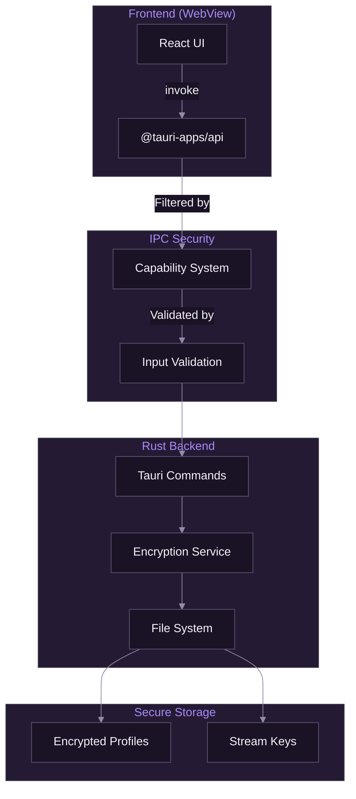
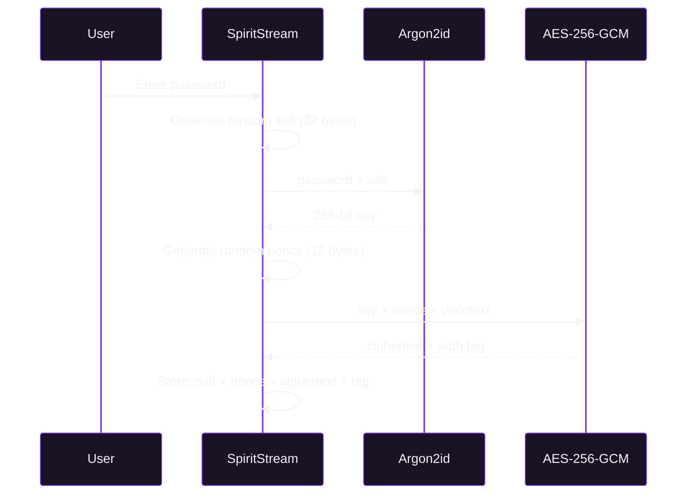

# Security Architecture

[Documentation](../README.md) > [Architecture](./README.md) > Security Architecture

---

This document describes SpiritStream's security model, including Tauri's security features, stream key encryption, IPC security, and best practices for handling sensitive data.

---

## Security Overview



*Security boundary between frontend and backend with capability-based access control.*

---

## Tauri Security Model

### Context Isolation

Unlike Electron, Tauri provides strong isolation between the frontend and backend:

| Feature | Tauri | Electron |
|---------|-------|----------|
| Node.js in renderer | No | Possible |
| Direct file system access | No | Possible |
| Native module loading | No | Possible |
| Context isolation | Always | Optional |

### Capability-Based Permissions

Tauri 2.x uses a capability system to control what the frontend can access:

```json
// apps/desktop/src-tauri/capabilities/default.json
{
  "identifier": "default",
  "description": "Default capabilities for SpiritStream",
  "windows": ["main"],
  "permissions": [
    "core:default",
    "shell:allow-spawn",
    {
      "identifier": "fs:allow-read",
      "allow": [
        { "path": "$APPDATA/profiles/*" },
        { "path": "$APPDATA/logs/*" }
      ]
    },
    {
      "identifier": "fs:allow-write",
      "allow": [
        { "path": "$APPDATA/profiles/*" },
        { "path": "$APPDATA/logs/*" }
      ]
    }
  ]
}
```

### Content Security Policy

The CSP restricts what resources the frontend can load:

```json
// apps/desktop/src-tauri/tauri.conf.json
{
  "app": {
    "security": {
      "csp": "default-src 'self'; script-src 'self'; style-src 'self' 'unsafe-inline'; img-src 'self' data:; connect-src 'self' ipc: http://ipc.localhost"
    }
  }
}
```

---

## Stream Key Encryption

### Encryption Algorithm

Stream keys are encrypted using AES-256-GCM with Argon2id key derivation:



*Stream key encryption flow using modern cryptographic primitives.*

### Implementation

```rust
// apps/desktop/src-tauri/src/services/encryption.rs
use aes_gcm::{Aes256Gcm, KeyInit, Nonce};
use argon2::{Argon2, password_hash::SaltString};

pub struct Encryption;

impl Encryption {
    pub fn encrypt(&self, plaintext: &str, password: &str) -> Result<String, Error> {
        // Generate random salt
        let salt: [u8; 32] = rand::random();

        // Derive key using Argon2id
        let mut key = [0u8; 32];
        Argon2::default()
            .hash_password_into(password.as_bytes(), &salt, &mut key)?;

        // Generate random nonce
        let nonce_bytes: [u8; 12] = rand::random();
        let nonce = Nonce::from_slice(&nonce_bytes);

        // Encrypt with AES-256-GCM
        let cipher = Aes256Gcm::new_from_slice(&key)?;
        let ciphertext = cipher.encrypt(nonce, plaintext.as_bytes())?;

        // Combine and encode
        let combined = [&salt[..], &nonce_bytes[..], &ciphertext[..]].concat();
        Ok(base64::encode(combined))
    }

    pub fn decrypt(&self, encrypted: &str, password: &str) -> Result<String, Error> {
        let data = base64::decode(encrypted)?;

        // Extract components
        let salt = &data[0..32];
        let nonce = Nonce::from_slice(&data[32..44]);
        let ciphertext = &data[44..];

        // Derive key
        let mut key = [0u8; 32];
        Argon2::default()
            .hash_password_into(password.as_bytes(), salt, &mut key)?;

        // Decrypt
        let cipher = Aes256Gcm::new_from_slice(&key)?;
        let plaintext = cipher.decrypt(nonce, ciphertext)?;

        Ok(String::from_utf8(plaintext)?)
    }
}
```

### Security Properties

| Property | Guarantee |
|----------|-----------|
| Confidentiality | AES-256 encryption |
| Integrity | GCM authentication tag |
| Key derivation | Argon2id (memory-hard) |
| Salt uniqueness | Random 32-byte salt per encryption |
| Nonce uniqueness | Random 12-byte nonce per encryption |

---

## IPC Security

### Command Validation

All Tauri commands validate their inputs:

```rust
#[tauri::command]
pub async fn save_profile(
    profile: Profile,
    password: Option<String>,
    state: State<'_, ProfileManager>,
) -> Result<(), String> {
    // Validate profile name
    if profile.name.is_empty() {
        return Err("Profile name cannot be empty".into());
    }

    // Validate profile name characters
    if !profile.name.chars().all(|c| c.is_alphanumeric() || c == '-' || c == '_') {
        return Err("Profile name contains invalid characters".into());
    }

    // Proceed with save
    state.save(&profile, password.as_deref()).await
}
```

### Path Traversal Prevention

File operations use safe path construction:

```rust
pub fn get_profile_path(&self, name: &str) -> PathBuf {
    // Sanitize the name to prevent path traversal
    let safe_name = name
        .chars()
        .filter(|c| c.is_alphanumeric() || *c == '-' || *c == '_')
        .collect::<String>();

    self.profiles_dir.join(format!("{}.json", safe_name))
}
```

### Sensitive Data Handling

Stream keys are never logged or exposed:

```rust
fn sanitize_for_logging(&self, url: &str) -> String {
    // Redact stream key from RTMP URLs
    if let Some(key_start) = url.rfind('/') {
        let base = &url[..key_start + 1];
        format!("{}****", base)
    } else {
        url.to_string()
    }
}
```

---

## File System Security

### Profile Storage

```
$APPDATA/SpiritStream/
├── profiles/           # User profiles
│   ├── gaming.json     # Unencrypted profile
│   └── private.json.enc  # Encrypted profile
├── settings.json       # App settings
└── logs/              # Application logs
    └── spiritstream.log
```

### File Permissions

On Unix systems, profile files are created with restricted permissions:

```rust
#[cfg(unix)]
fn set_file_permissions(path: &Path) -> std::io::Result<()> {
    use std::os::unix::fs::PermissionsExt;
    let perms = std::fs::Permissions::from_mode(0o600);
    std::fs::set_permissions(path, perms)
}
```

---

## Environment Variable Security

### Stream Key Resolution

Stream keys can reference environment variables for additional security:

```json
{
  "streamKey": "${TWITCH_STREAM_KEY}"
}
```

This keeps actual keys out of profile files entirely.

### Variable Resolution

```rust
fn resolve_stream_key(key: &str) -> String {
    if key.starts_with("${") && key.ends_with("}") {
        let var_name = &key[2..key.len()-1];
        std::env::var(var_name).unwrap_or_else(|_| key.to_string())
    } else {
        key.to_string()
    }
}
```

---

## Memory Security

### Sensitive Data Clearing

Passwords and decrypted keys are cleared from memory after use:

```rust
use zeroize::Zeroize;

fn decrypt_profile(encrypted: &str, password: &str) -> Result<Profile, Error> {
    let mut password_copy = password.to_string();

    // Decrypt profile
    let result = encryption.decrypt(encrypted, &password_copy);

    // Clear password from memory
    password_copy.zeroize();

    result
}
```

### Avoiding Memory Leaks

- Use `SecretString` types where available
- Clear buffers containing sensitive data
- Avoid unnecessary copies of secrets

---

## Transport Security

### RTMP vs RTMPS

| Protocol | Encryption | Use Case |
|----------|------------|----------|
| RTMP | None | Local testing |
| RTMPS | TLS 1.2+ | Production streaming |

SpiritStream passes URLs directly to FFmpeg, which handles TLS:

```bash
# RTMPS connection (encrypted)
ffmpeg -f flv rtmps://live-api-s.facebook.com:443/rtmp/key
```

---

## Security Best Practices

### For Users

1. **Use encrypted profiles** for stream keys
2. **Use environment variables** for highly sensitive keys
3. **Keep SpiritStream updated** for security patches
4. **Don't share profile files** containing stream keys

### For Developers

1. **Validate all inputs** in Tauri commands
2. **Use path sanitization** for file operations
3. **Never log sensitive data** (stream keys, passwords)
4. **Use secure random** for cryptographic operations
5. **Clear sensitive data** from memory after use

---

## Threat Model

### Protected Against

| Threat | Mitigation |
|--------|------------|
| Profile theft | AES-256-GCM encryption |
| Path traversal | Input sanitization |
| XSS attacks | Tauri's context isolation |
| Memory inspection | Zeroization of secrets |
| Log exposure | Stream key redaction |

### Not Protected Against

| Threat | Reason |
|--------|--------|
| Physical access | Encryption requires password |
| Keyloggers | OS-level attack |
| Screen capture | OS-level attack |
| Memory forensics | Requires advanced tooling |

---

## Security Audit Checklist

When reviewing SpiritStream security:

- [ ] All Tauri commands validate inputs
- [ ] File paths are sanitized
- [ ] Stream keys are never logged
- [ ] Encryption uses current algorithms
- [ ] CSP is properly configured
- [ ] Capabilities are minimal
- [ ] Sensitive data is cleared from memory

---

**Related:** [System Overview](./01-system-overview.md) | [Encryption Implementation](../02-backend/05-encryption-implementation.md) | [Services Layer](../02-backend/02-services-layer.md)

