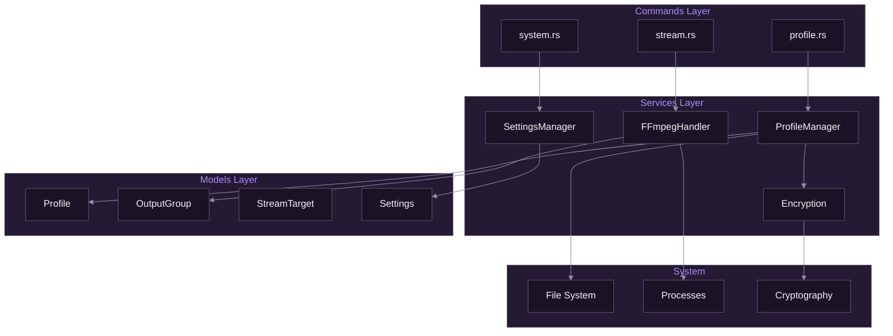

# Rust Backend Overview

[Documentation](../README.md) > [Backend](./README.md) > Rust Overview

---

This document provides an overview of SpiritStream's Rust backend, covering project structure, core patterns, and development practices.

---

## Technology Stack

| Component | Technology | Purpose |
|-----------|------------|---------|
| Framework | Tauri 2.x | Desktop app framework |
| Runtime | tokio | Async runtime |
| Serialization | serde | JSON serialization |
| Encryption | aes-gcm, argon2 | Profile encryption |
| Process | std::process | FFmpeg management |
| UUID | uuid | Unique identifiers |

---

## Project Structure

```
src-tauri/
├── src/
│   ├── main.rs              # Application entry point
│   ├── lib.rs               # Library exports
│   ├── commands/            # Tauri commands
│   │   ├── mod.rs
│   │   ├── profile.rs       # Profile CRUD
│   │   ├── stream.rs        # Stream control
│   │   └── system.rs        # System utilities
│   ├── services/            # Business logic
│   │   ├── mod.rs
│   │   ├── profile_manager.rs
│   │   ├── ffmpeg_handler.rs
│   │   ├── encryption.rs
│   │   └── settings_manager.rs
│   ├── models/              # Data structures
│   │   ├── mod.rs
│   │   ├── profile.rs
│   │   ├── output_group.rs
│   │   ├── stream_target.rs
│   │   └── settings.rs
│   └── utils/               # Utilities
│       ├── mod.rs
│       └── paths.rs
├── Cargo.toml               # Dependencies
├── tauri.conf.json          # Tauri config
├── capabilities/            # Security permissions
│   └── default.json
└── icons/                   # App icons
```

---

## Architecture Layers



*Backend architecture showing layer separation.*

---

## Entry Point

```rust
// src-tauri/src/main.rs
#![cfg_attr(not(debug_assertions), windows_subsystem = "windows")]

mod commands;
mod models;
mod services;
mod utils;

use tauri::Manager;
use services::{FFmpegHandler, ProfileManager, SettingsManager};

fn main() {
    tauri::Builder::default()
        .plugin(tauri_plugin_shell::init())
        .setup(|app| {
            // Get app data directory
            let app_data = app.path().app_data_dir()
                .expect("Failed to get app data directory");

            // Initialize services
            let profile_manager = ProfileManager::new(app_data.clone());
            let ffmpeg_handler = FFmpegHandler::new();
            let settings_manager = SettingsManager::new(app_data);

            // Register with Tauri state
            app.manage(profile_manager);
            app.manage(ffmpeg_handler);
            app.manage(settings_manager);

            Ok(())
        })
        .invoke_handler(tauri::generate_handler![
            // Profile commands
            commands::profile::get_all_profiles,
            commands::profile::load_profile,
            commands::profile::save_profile,
            commands::profile::delete_profile,
            commands::profile::is_profile_encrypted,

            // Stream commands
            commands::stream::start_stream,
            commands::stream::stop_stream,
            commands::stream::stop_all_streams,
            commands::stream::get_active_stream_count,

            // System commands
            commands::system::get_video_encoders,
            commands::system::get_settings,
            commands::system::save_settings,
            commands::system::get_theme,
            commands::system::set_theme,
        ])
        .run(tauri::generate_context!())
        .expect("Error running application");
}
```

---

## Command Pattern

Commands are the interface between frontend and backend.

### Basic Command

```rust
// src-tauri/src/commands/profile.rs
use tauri::State;
use crate::services::ProfileManager;

#[tauri::command]
pub async fn get_all_profiles(
    state: State<'_, ProfileManager>,
) -> Result<Vec<String>, String> {
    state.get_all_names()
        .await
        .map_err(|e| e.to_string())
}
```

### Command with Parameters

```rust
#[tauri::command]
pub async fn load_profile(
    name: String,
    password: Option<String>,
    state: State<'_, ProfileManager>,
) -> Result<Profile, String> {
    state.load(&name, password.as_deref())
        .await
        .map_err(|e| e.to_string())
}
```

### Command with App Handle

```rust
use tauri::AppHandle;

#[tauri::command]
pub async fn start_stream(
    group: OutputGroup,
    incoming_url: String,
    state: State<'_, FFmpegHandler>,
    app: AppHandle,
) -> Result<u32, String> {
    state.start(&group, &incoming_url, app)
        .await
        .map_err(|e| e.to_string())
}
```

---

## Service Pattern

Services contain business logic and are registered with Tauri's state management.

### Service Structure

```rust
// src-tauri/src/services/profile_manager.rs
use std::path::PathBuf;
use tokio::fs;
use crate::models::Profile;
use crate::services::Encryption;

pub struct ProfileManager {
    profiles_dir: PathBuf,
    encryption: Encryption,
}

impl ProfileManager {
    pub fn new(app_data_dir: PathBuf) -> Self {
        let profiles_dir = app_data_dir.join("profiles");
        std::fs::create_dir_all(&profiles_dir).ok();

        Self {
            profiles_dir,
            encryption: Encryption::new(),
        }
    }

    pub async fn get_all_names(&self) -> Result<Vec<String>, ProfileError> {
        let mut names = Vec::new();
        let mut entries = fs::read_dir(&self.profiles_dir).await?;

        while let Some(entry) = entries.next_entry().await? {
            let path = entry.path();
            if path.extension().map_or(false, |e| e == "json" || e == "enc") {
                if let Some(name) = path.file_stem() {
                    names.push(name.to_string_lossy().to_string());
                }
            }
        }

        Ok(names)
    }

    pub async fn load(
        &self,
        name: &str,
        password: Option<&str>,
    ) -> Result<Profile, ProfileError> {
        // Check for encrypted file first
        let enc_path = self.profiles_dir.join(format!("{}.json.enc", name));
        let json_path = self.profiles_dir.join(format!("{}.json", name));

        let (path, encrypted) = if enc_path.exists() {
            (enc_path, true)
        } else if json_path.exists() {
            (json_path, false)
        } else {
            return Err(ProfileError::NotFound(name.to_string()));
        };

        let content = fs::read_to_string(&path).await?;

        let json = if encrypted {
            let password = password.ok_or(ProfileError::PasswordRequired)?;
            self.encryption.decrypt(&content, password)?
        } else {
            content
        };

        let profile: Profile = serde_json::from_str(&json)?;
        Ok(profile)
    }

    pub async fn save(
        &self,
        profile: &Profile,
        password: Option<&str>,
    ) -> Result<(), ProfileError> {
        let json = serde_json::to_string_pretty(profile)?;

        let (path, content) = match password {
            Some(pwd) => {
                let encrypted = self.encryption.encrypt(&json, pwd)?;
                let path = self.profiles_dir.join(format!("{}.json.enc", profile.name));
                (path, encrypted)
            }
            None => {
                let path = self.profiles_dir.join(format!("{}.json", profile.name));
                (path, json)
            }
        };

        fs::write(&path, content).await?;
        Ok(())
    }
}
```

---

## Model Pattern

Models are data structures that serialize to/from JSON.

```rust
// src-tauri/src/models/profile.rs
use serde::{Deserialize, Serialize};

#[derive(Debug, Clone, Serialize, Deserialize)]
#[serde(rename_all = "camelCase")]
pub struct Profile {
    pub id: String,
    pub name: String,
    pub incoming_url: String,
    pub output_groups: Vec<OutputGroup>,
}

impl Default for Profile {
    fn default() -> Self {
        Self {
            id: uuid::Uuid::new_v4().to_string(),
            name: "New Profile".to_string(),
            incoming_url: "rtmp://localhost:1935/live/stream".to_string(),
            output_groups: vec![OutputGroup::default()],
        }
    }
}
```

### Serde Attributes

| Attribute | Purpose |
|-----------|---------|
| `#[serde(rename_all = "camelCase")]` | Convert field names to camelCase |
| `#[serde(default)]` | Use Default trait for missing fields |
| `#[serde(skip_serializing_if = "Option::is_none")]` | Skip None values |
| `#[serde(flatten)]` | Flatten nested structs |

---

## Error Handling

### Custom Error Types

```rust
use thiserror::Error;

#[derive(Debug, Error)]
pub enum ProfileError {
    #[error("Profile not found: {0}")]
    NotFound(String),

    #[error("Password required for encrypted profile")]
    PasswordRequired,

    #[error("Decryption failed")]
    DecryptionFailed,

    #[error("IO error: {0}")]
    Io(#[from] std::io::Error),

    #[error("JSON error: {0}")]
    Json(#[from] serde_json::Error),
}

// Convert to String for IPC
impl From<ProfileError> for String {
    fn from(err: ProfileError) -> String {
        err.to_string()
    }
}
```

### Result Pattern

```rust
// Command returns Result<T, String>
#[tauri::command]
pub async fn load_profile(
    name: String,
    state: State<'_, ProfileManager>,
) -> Result<Profile, String> {
    state.load(&name, None)
        .await
        .map_err(|e| e.to_string())  // Convert error to String
}
```

---

## Async Runtime

SpiritStream uses tokio for async operations.

### Async Command

```rust
#[tauri::command]
pub async fn save_profile(
    profile: Profile,
    state: State<'_, ProfileManager>,
) -> Result<(), String> {
    // Async file operations
    state.save(&profile, None).await.map_err(|e| e.to_string())
}
```

### Blocking Operations

For CPU-intensive or blocking operations:

```rust
use tokio::task;

pub async fn detect_encoders() -> Result<Vec<EncoderInfo>, String> {
    // Run blocking operation on separate thread
    task::spawn_blocking(|| {
        // This runs FFmpeg which is blocking
        run_ffmpeg_encoder_check()
    })
    .await
    .map_err(|e| e.to_string())?
}
```

---

## State Management

Tauri manages service instances through state.

### Registering State

```rust
// In main.rs setup
app.manage(ProfileManager::new(app_data.clone()));
app.manage(FFmpegHandler::new());
```

### Accessing State

```rust
#[tauri::command]
pub fn get_active_count(
    state: State<'_, FFmpegHandler>,  // Injected by Tauri
) -> usize {
    state.active_count()
}
```

### Thread-Safe State

For mutable state, use synchronization primitives:

```rust
use std::sync::Mutex;
use std::collections::HashMap;
use std::process::Child;

pub struct FFmpegHandler {
    processes: Mutex<HashMap<String, Child>>,
}

impl FFmpegHandler {
    pub fn active_count(&self) -> usize {
        self.processes.lock().unwrap().len()
    }
}
```

---

## Event Emission

Send events from backend to frontend.

```rust
use tauri::AppHandle;

pub fn emit_stats(app: &AppHandle, stats: StreamStats) -> Result<(), tauri::Error> {
    app.emit("stream_stats", stats)
}

pub fn emit_stream_ended(app: &AppHandle, group_id: &str) -> Result<(), tauri::Error> {
    app.emit("stream_ended", group_id)
}
```

---

## Dependencies (Cargo.toml)

```toml
[package]
name = "spiritstream"
version = "1.0.0"
edition = "2021"

[dependencies]
tauri = { version = "2", features = ["shell-open"] }
tauri-plugin-shell = "2"
serde = { version = "1", features = ["derive"] }
serde_json = "1"
tokio = { version = "1", features = ["full"] }
thiserror = "1"
uuid = { version = "1", features = ["v4", "serde"] }
aes-gcm = "0.10"
argon2 = "0.5"
rand = "0.8"
base64 = "0.21"

[build-dependencies]
tauri-build = "2"
```

---

## Testing

### Unit Tests

```rust
#[cfg(test)]
mod tests {
    use super::*;

    #[test]
    fn test_profile_default() {
        let profile = Profile::default();
        assert_eq!(profile.name, "New Profile");
        assert!(!profile.id.is_empty());
    }

    #[tokio::test]
    async fn test_profile_save_load() {
        let temp_dir = tempfile::tempdir().unwrap();
        let manager = ProfileManager::new(temp_dir.path().to_path_buf());

        let profile = Profile::default();
        manager.save(&profile, None).await.unwrap();

        let loaded = manager.load(&profile.name, None).await.unwrap();
        assert_eq!(loaded.id, profile.id);
    }
}
```

---

## Best Practices

### Do

1. Use `Result<T, E>` for fallible operations
2. Prefer `&str` over `String` for parameters
3. Use `#[derive]` macros appropriately
4. Document public APIs with `///`
5. Use async for I/O operations

### Don't

1. Use `unwrap()` in production code
2. Block the async runtime
3. Store secrets in plain text
4. Ignore error handling
5. Use global mutable state

---

**Related:** [Services Layer](./02-services-layer.md) | [Models Reference](./03-models-reference.md) | [Tauri Commands](./04-tauri-commands.md)
