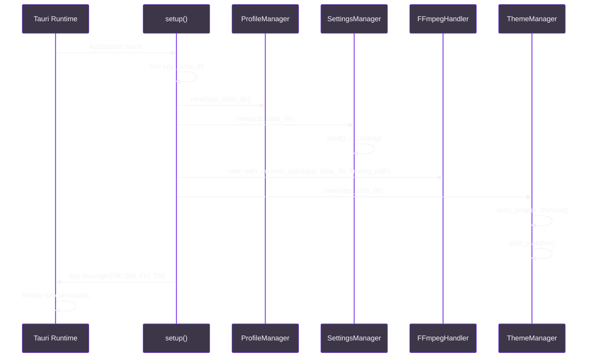
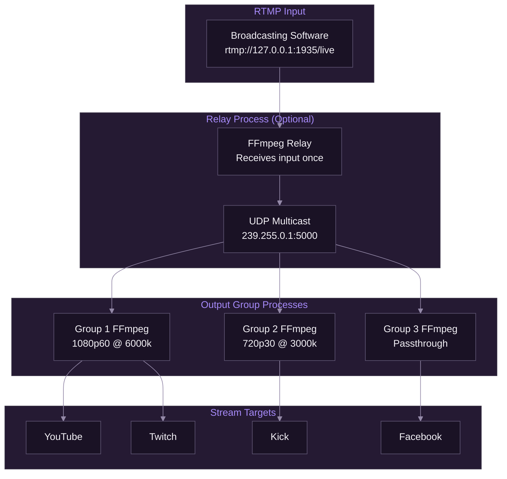
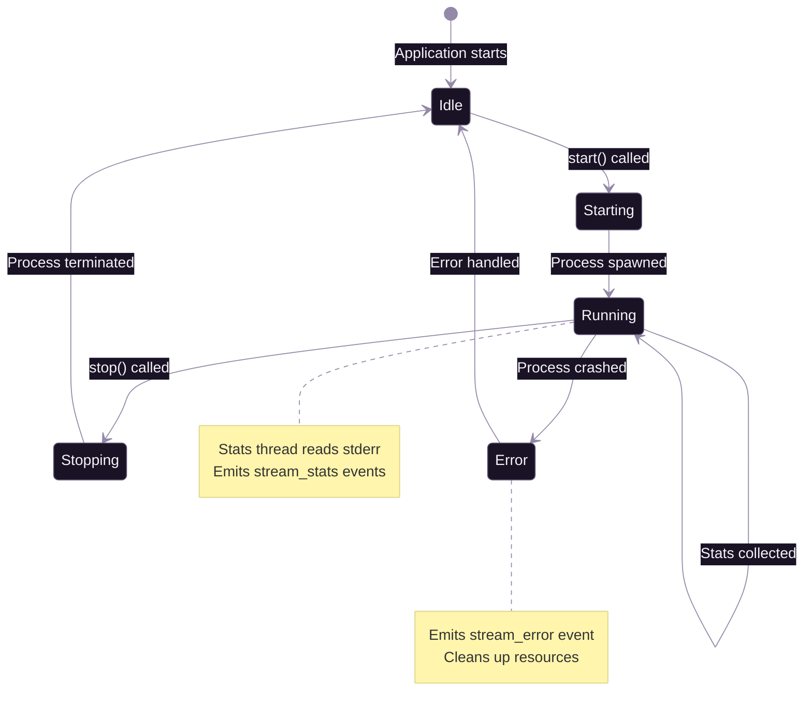
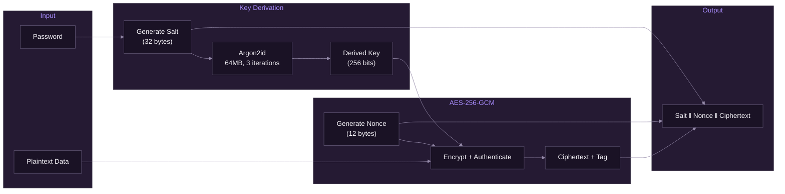

# Services Layer

[Documentation](../README.md) > [Backend](./README.md) > Services Layer

---

The service layer implements the core business logic of SpiritStream. It comprises five primary services: ProfileManager, FFmpegHandler, Encryption, SettingsManager, and ThemeManager. Each service is designed as a singleton managed by Tauri's state system, ensuring thread-safe access across concurrent command invocations.

---

## Introduction

The service layer provides a clean separation between Tauri command handlers and the underlying business logic. This separation enables:

- **Testability** — Services can be unit tested independently of the Tauri framework
- **Reusability** — Business logic is not coupled to specific IPC patterns
- **Maintainability** — Changes to business rules are localized to service implementations

**This document covers:**

1. Service architecture and initialization patterns
2. ProfileManager — Profile CRUD and encryption
3. FFmpegHandler — Stream process management
4. Encryption — Cryptographic operations
5. SettingsManager — Application settings
6. ThemeManager — Theme discovery and application

---

## Service Architecture

### Initialization Flow

Services are initialized during Tauri's `setup` phase and registered as managed state:



*Services are constructed and registered during Tauri setup.*

### Dependency Injection Pattern

Tauri commands receive services via state injection:

```rust
#[tauri::command]
pub async fn load_profile(
    name: String,
    password: Option<String>,
    state: tauri::State<'_, ProfileManager>,  // Injected
) -> Result<Profile, String> {
    state.load_with_key_decryption(&name, password.as_deref()).await
}
```

### Thread Safety

Services use `Arc<Mutex<T>>` for shared mutable state:

```rust
pub struct FFmpegHandler {
    processes: Arc<Mutex<HashMap<String, ProcessInfo>>>,
    disabled_targets: Arc<Mutex<HashSet<String>>>,
    relay: Arc<Mutex<Option<RelayProcess>>>,
    relay_refcount: Arc<AtomicUsize>,
}
```

---

## ProfileManager Service

### Responsibilities

The ProfileManager handles:

- Profile persistence (JSON and encrypted `.mgs` files)
- Stream key encryption/decryption lifecycle
- Profile name validation and path traversal prevention
- Profile summary generation for UI display

**File:** [`apps/desktop/src-tauri/src/services/profile_manager.rs`](../../apps/desktop/src-tauri/src/services/profile_manager.rs)

### Interface

```rust
pub struct ProfileManager {
    profiles_dir: PathBuf,
    app_data_dir: PathBuf,
}

impl ProfileManager {
    // Construction
    pub fn new(app_data_dir: PathBuf) -> Self;

    // Core operations
    pub async fn get_all_names(&self) -> Result<Vec<String>, String>;
    pub async fn get_all_summaries(&self) -> Result<Vec<ProfileSummary>, String>;
    pub async fn load(&self, name: &str, password: Option<&str>)
        -> Result<Profile, String>;
    pub async fn load_with_key_decryption(&self, name: &str, password: Option<&str>)
        -> Result<Profile, String>;
    pub async fn save(&self, profile: &Profile, password: Option<&str>)
        -> Result<(), String>;
    pub async fn save_with_key_encryption(&self, profile: &Profile,
        password: Option<&str>, encrypt_keys: bool) -> Result<(), String>;
    pub async fn delete(&self, name: &str) -> Result<(), String>;

    // Utilities
    pub fn is_encrypted(&self, name: &str) -> bool;
    pub async fn validate_input_conflict(&self, profile_id: &str, input: &RtmpInput)
        -> Result<(), String>;
}
```

### File Storage Format

Profiles are stored in two formats:

| Format | Extension | Structure |
|--------|-----------|-----------|
| Plaintext | `.json` | Standard JSON |
| Encrypted | `.mgs` | `MGLA` + salt(32) + nonce(12) + ciphertext |

The magic bytes `MGLA` identify encrypted profiles for quick detection without parsing.

### Security Features

**Name Validation** — Prevents path traversal via:
- Empty name rejection
- No path separators (`/`, `\\`)
- No parent directory references (`..`)
- Alphanumeric, underscore, hyphen, space only
- Maximum 100 characters

**Automatic Key Decryption** — The `load_with_key_decryption` method automatically decrypts stream keys prefixed with `ENC::`.

---

## FFmpegHandler Service

### Responsibilities

The FFmpegHandler manages:

- FFmpeg process lifecycle (spawn, monitor, terminate)
- Relay process for multi-group distribution
- Real-time statistics collection and emission
- Stream target enable/disable state
- Stream key and URL redaction in logs

**File:** [`apps/desktop/src-tauri/src/services/ffmpeg_handler.rs`](../../apps/desktop/src-tauri/src/services/ffmpeg_handler.rs)

### Architecture Overview



*Single input distributed to multiple independent output groups.*

### Interface

```rust
pub struct FFmpegHandler {
    ffmpeg_path: String,
    processes: Arc<Mutex<HashMap<String, ProcessInfo>>>,
    stopping_groups: Arc<Mutex<HashSet<String>>>,
    disabled_targets: Arc<Mutex<HashSet<String>>>,
    relay: Arc<Mutex<Option<RelayProcess>>>,
    relay_refcount: Arc<AtomicUsize>,
    platform_registry: PlatformRegistry,
}

impl FFmpegHandler {
    pub fn new_with_custom_path(app_data_dir: PathBuf, custom_path: Option<String>)
        -> Self;

    // Stream control
    pub fn start(&self, group: &OutputGroup, incoming_url: &str, app: &AppHandle)
        -> Result<u32, String>;
    pub fn stop(&self, group_id: &str) -> Result<(), String>;
    pub fn stop_all(&self) -> Result<(), String>;
    pub fn restart_group(&self, group_id: &str, group: &OutputGroup,
        incoming_url: &str, app: &AppHandle) -> Result<u32, String>;

    // Status queries
    pub fn active_count(&self) -> usize;
    pub fn is_streaming(&self, group_id: &str) -> bool;
    pub fn get_active_group_ids(&self) -> Vec<String>;

    // Target management
    pub fn enable_target(&self, target_id: &str);
    pub fn disable_target(&self, target_id: &str);
    pub fn is_target_disabled(&self, target_id: &str) -> bool;
}
```

### Process Lifecycle



*State machine for output group processes.*

### Statistics Collection

A dedicated thread monitors FFmpeg stderr and parses progress lines:

```
frame=  120 fps=60.0 q=28.0 size=    1024kB time=00:00:02.00 bitrate=4194.3kbits/s
```

Parsed fields:
- `frame` — Total frames encoded
- `fps` — Current frame rate
- `size` — Output size in bytes
- `time` — Encoding duration
- `bitrate` — Current bitrate

Statistics are emitted via Tauri events every second.

### Relay Reference Counting

The relay uses atomic reference counting to manage its lifecycle:

1) When first output group starts → Create relay, refcount = 1
2) When additional group starts → Increment refcount
3) When group stops → Decrement refcount
4) When refcount = 0 → Terminate relay

This prevents race conditions during rapid start/stop sequences.

---

## Encryption Service

### Responsibilities

The Encryption service provides:

- Profile-level encryption (password-protected)
- Stream key encryption (machine-specific)
- Secure key derivation via Argon2id
- Random salt and nonce generation

**File:** [`apps/desktop/src-tauri/src/services/encryption.rs`](../../apps/desktop/src-tauri/src/services/encryption.rs)

### Cryptographic Scheme

| Component | Algorithm | Parameters |
|-----------|-----------|------------|
| Encryption | AES-256-GCM | 256-bit key, 12-byte nonce |
| Key Derivation | Argon2id | Memory: 64MB, Iterations: 3, Parallelism: 4 |
| Salt | Random | 32 bytes |
| Nonce | Random | 12 bytes |

### Interface

```rust
pub struct Encryption;

impl Encryption {
    // Profile encryption (password-based)
    pub fn encrypt(data: &[u8], password: &str) -> Result<Vec<u8>, String>;
    pub fn decrypt(encrypted: &[u8], password: &str) -> Result<Vec<u8>, String>;

    // Stream key encryption (machine-based)
    pub fn encrypt_stream_key(key: &str, app_data_dir: &Path) -> Result<String, String>;
    pub fn decrypt_stream_key(encrypted: &str, app_data_dir: &Path)
        -> Result<String, String>;
}
```

### Encryption Flow



*AES-256-GCM encryption with Argon2id key derivation.*

### Stream Key Encryption

Stream keys use machine-specific encryption:

1) A 32-byte key is stored in `{APP_DATA}/.stream_key`
2) This key is generated once per installation
3) Encrypted keys are prefixed with `ENC::`
4) Only the originating machine can decrypt

This provides protection against profile file theft, backup exposure, and cloud sync leakage.

---

## SettingsManager Service

### Responsibilities

The SettingsManager handles:

- Application settings persistence
- Settings caching for performance
- Data export and destruction

**File:** [`apps/desktop/src-tauri/src/services/settings_manager.rs`](../../apps/desktop/src-tauri/src/services/settings_manager.rs)

### Interface

```rust
pub struct SettingsManager {
    settings_path: PathBuf,
    cache: RwLock<Option<Settings>>,
}

impl SettingsManager {
    pub fn new(app_data_dir: PathBuf) -> Self;
    pub fn load(&self) -> Result<Settings, String>;
    pub fn save(&self, settings: &Settings) -> Result<(), String>;
    pub fn get_profiles_path(&self) -> PathBuf;
    pub fn export_data(&self, export_path: &PathBuf) -> Result<(), String>;
    pub fn clear_data(&self) -> Result<(), String>;
}
```

### Settings Model

```rust
pub struct Settings {
    pub language: String,           // "en", "es", "fr", "de", "ja"
    pub start_minimized: bool,
    pub show_notifications: bool,
    pub ffmpeg_path: String,        // Custom FFmpeg path
    pub auto_download_ffmpeg: bool,
    pub encrypt_stream_keys: bool,  // Machine-specific encryption
    pub theme_id: String,           // "spirit-dark", "spirit-light"
    pub last_profile: Option<String>,
}
```

---

## ThemeManager Service

### Responsibilities

The ThemeManager handles:

- Theme file discovery (`.jsonc` files)
- CSS token extraction from theme files
- File system watcher for hot-reload
- Project theme synchronization

**File:** [`apps/desktop/src-tauri/src/services/theme_manager.rs`](../../apps/desktop/src-tauri/src/services/theme_manager.rs)

### Interface

```rust
pub struct ThemeManager {
    themes_dir: PathBuf,
    themes: RwLock<HashMap<String, ThemeMetadata>>,
    watcher: Mutex<Option<RecommendedWatcher>>,
}

impl ThemeManager {
    pub fn new(app_data_dir: PathBuf) -> Self;
    pub fn sync_project_themes(&self, app: Option<&AppHandle>);
    pub fn start_watcher(&self, app: AppHandle);
    pub fn list_themes(&self) -> Vec<ThemeMetadata>;
    pub fn get_tokens(&self, theme_id: &str) -> Option<ThemeTokens>;
    pub fn install_theme(&self, source_path: &Path) -> Result<ThemeMetadata, String>;
}
```

---

## Error Handling Patterns

### Result<T, String> Convention

All service methods return `Result<T, String>` where the error string is user-friendly:

```rust
pub async fn load(&self, name: &str, password: Option<&str>) -> Result<Profile, String> {
    let path = self.profiles_dir.join(format!("{}.json", name));

    let content = fs::read_to_string(&path)
        .await
        .map_err(|e| format!("Failed to read profile: {}", e))?;

    serde_json::from_str(&content)
        .map_err(|e| format!("Invalid profile format: {}", e))
}
```

### Mutex Poisoning Recovery

Services handle poisoned mutexes gracefully:

```rust
let mut processes = self.processes.lock()
    .unwrap_or_else(|poisoned| {
        log::warn!("Recovering from poisoned mutex");
        poisoned.into_inner()
    });
```

### Validation Patterns

Input validation occurs before operations:

```rust
fn validate_profile_name(name: &str) -> Result<(), String> {
    if name.is_empty() {
        return Err("Profile name cannot be empty".to_string());
    }
    if name.contains('/') || name.contains('\\') || name.contains("..") {
        return Err("Profile name contains invalid characters".to_string());
    }
    if name.len() > 100 {
        return Err("Profile name too long (max 100 characters)".to_string());
    }
    Ok(())
}
```

---

## Summary

The service layer provides a robust foundation for SpiritStream's functionality:

- **ProfileManager** — Secure profile persistence with encryption
- **FFmpegHandler** — Efficient multi-stream process management
- **Encryption** — Industry-standard AES-256-GCM implementation
- **SettingsManager** — Reliable settings persistence
- **ThemeManager** — Dynamic theme support with hot-reload

### Implementation Considerations

- Services are stateless beyond their managed state
- All I/O operations are async for non-blocking execution
- Error messages are designed for end-user consumption
- Security is enforced at the service layer, not just commands

---

**Related:** [Rust Overview](./01-rust-overview.md) | [Models Reference](./03-models-reference.md) | [Encryption Implementation](./05-encryption-implementation.md)

