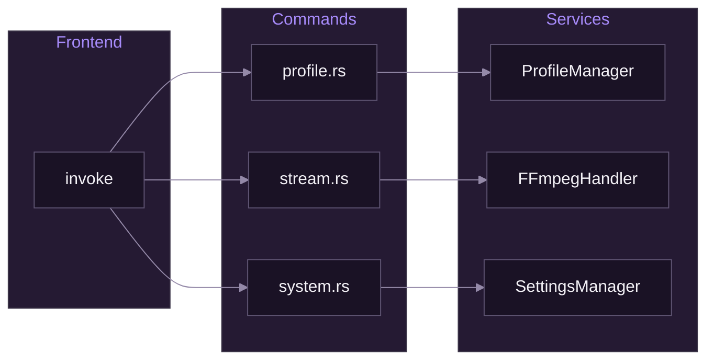

# Tauri Commands

[Documentation](../README.md) > [Backend](./README.md) > Tauri Commands

---

This document covers the implementation of Tauri commands in SpiritStream's Rust backend.

## Design Philosophy

Commands follow the **thin controller pattern**: they handle IPC concerns (parameter conversion, error formatting, state access) but delegate all business logic to service classes. This keeps commands focused, testable, and prevents business rules from scattering across the codebase.

**Why this matters:**
- Services can be unit tested without Tauri runtime
- Business logic stays in one place (easier to understand and maintain)
- Commands remain simple wrappers that are easy to audit for security

---

## Command Architecture

Commands are the bridge between the React frontend and Rust backend. When the frontend calls `invoke('load_profile', { name: 'Gaming' })`, Tauri serializes the arguments to JSON, routes them to the matching Rust function, executes it, and serializes the result back to JavaScript. This happens over IPC (inter-process communication) between the webview and the native process.

The key insight is that **commands never talk directly to each other**—they all go through services. This creates a clean dependency graph where the frontend depends on commands, commands depend on services, and services handle the actual work:



---

## Command Structure

Commands are organized by domain rather than by operation type. This means all profile-related commands live in `profile.rs`, not "all read operations in `queries.rs`". The domain-based organization makes it easy to find related functionality and keeps files focused.

### File Organization

```
src-tauri/src/commands/
├── mod.rs          # Module exports
├── profile.rs      # Profile CRUD commands
├── stream.rs       # Stream control commands
└── system.rs       # System utility commands
```

### Module Exports

```rust
// commands/mod.rs
pub mod profile;
pub mod stream;
pub mod system;

pub use profile::*;
pub use stream::*;
pub use system::*;
```

---

## Command Definition

Every command follows the same pattern: accept parameters (including injected state), call a service method, and convert errors to strings. The `#[tauri::command]` macro handles the serialization magic—it automatically deserializes JSON arguments into Rust types and serializes the return value back to JSON.

There are three common patterns depending on what the command needs:

### Basic Command

The simplest form—just state injection and a service call. Use this when the frontend doesn't need to pass any data:

```rust
use tauri::State;
use crate::services::ProfileManager;

#[tauri::command]
pub async fn get_all_profiles(
    state: State<'_, ProfileManager>,
) -> Result<Vec<String>, String> {
    state.get_all_names()
        .await
        .map_err(|e| e.to_string())
}
```

### Command with Parameters

When the frontend needs to send data, add parameters before the `State`. Tauri matches parameter names to JSON keys, so the frontend call `invoke('load_profile', { name: 'Gaming', password: null })` maps directly to these parameters. Use `Option<T>` for optional parameters:

```rust
#[tauri::command]
pub async fn load_profile(
    name: String,
    password: Option<String>,
    state: State<'_, ProfileManager>,
) -> Result<Profile, String> {
    state.load(&name, password.as_deref())
        .await
        .map_err(|e| e.to_string())
}
```

### Command with AppHandle

Some commands need access to the Tauri application itself—for example, to emit events back to the frontend or access app paths. Inject `AppHandle` alongside state. The `AppHandle` is cloneable, so services can hold onto it for sending status updates during long-running operations:

```rust
use tauri::AppHandle;

#[tauri::command]
pub async fn start_stream(
    group: OutputGroup,
    incoming_url: String,
    state: State<'_, FFmpegHandler>,
    app: AppHandle,
) -> Result<u32, String> {
    state.start(&group, &incoming_url, app)
        .await
        .map_err(|e| e.to_string())
}
```

---

## Registration

Commands must be explicitly registered with Tauri before the frontend can call them. This happens in two phases: first, services are created and managed (making them available for injection), then commands are registered with `generate_handler!`. Forgetting to register a command is a common mistake—the frontend call will fail with "command not found."

### In main.rs

```rust
fn main() {
    tauri::Builder::default()
        .setup(|app| {
            // Initialize services
            let app_data = app.path().app_data_dir().unwrap();
            app.manage(ProfileManager::new(app_data.clone()));
            app.manage(FFmpegHandler::new());
            app.manage(SettingsManager::new(app_data));
            Ok(())
        })
        .invoke_handler(tauri::generate_handler![
            // Profile commands
            commands::profile::get_all_profiles,
            commands::profile::load_profile,
            commands::profile::save_profile,
            commands::profile::delete_profile,
            commands::profile::is_profile_encrypted,

            // Stream commands
            commands::stream::start_stream,
            commands::stream::stop_stream,
            commands::stream::stop_all_streams,
            commands::stream::get_active_stream_count,
            commands::stream::is_group_streaming,

            // System commands
            commands::system::get_video_encoders,
            commands::system::get_settings,
            commands::system::save_settings,
            commands::system::get_theme,
            commands::system::set_theme,
        ])
        .run(tauri::generate_context!())
        .expect("error running application");
}
```

---

## Profile Commands

Profile commands handle CRUD operations for streaming configurations. Profiles are stored as JSON files (optionally encrypted) in the app data directory. The commands handle the IPC layer while `ProfileManager` handles file operations and encryption.

Note the consistent error handling pattern: every command converts service errors to strings with `.map_err(|e| e.to_string())`. This ensures the frontend always receives a usable error message.

### get_all_profiles

Returns the names of all saved profiles (not the full profile data—that would be expensive for large profile counts):

```rust
#[tauri::command]
pub async fn get_all_profiles(
    state: State<'_, ProfileManager>,
) -> Result<Vec<String>, String> {
    state.get_all_names().await.map_err(|e| e.to_string())
}
```

### load_profile

Loads a profile by name, optionally decrypting it. The `password.as_deref()` pattern converts `Option<String>` to `Option<&str>`, which is more flexible for the service to work with:

```rust
#[tauri::command]
pub async fn load_profile(
    name: String,
    password: Option<String>,
    state: State<'_, ProfileManager>,
) -> Result<Profile, String> {
    state.load(&name, password.as_deref())
        .await
        .map_err(|e| e.to_string())
}
```

### save_profile

Saves a profile, optionally encrypting it. If a password is provided, the profile is encrypted before writing to disk:

```rust
#[tauri::command]
pub async fn save_profile(
    profile: Profile,
    password: Option<String>,
    state: State<'_, ProfileManager>,
) -> Result<(), String> {
    state.save(&profile, password.as_deref())
        .await
        .map_err(|e| e.to_string())
}
```

### delete_profile

```rust
#[tauri::command]
pub async fn delete_profile(
    name: String,
    state: State<'_, ProfileManager>,
) -> Result<(), String> {
    state.delete(&name).await.map_err(|e| e.to_string())
}
```

### is_profile_encrypted

```rust
#[tauri::command]
pub async fn is_profile_encrypted(
    name: String,
    state: State<'_, ProfileManager>,
) -> Result<bool, String> {
    state.is_encrypted(&name).await.map_err(|e| e.to_string())
}
```

---

## Stream Commands

Stream commands control FFmpeg processes. Each output group gets its own FFmpeg instance, which encodes the input once and pushes to all targets in that group. The `FFmpegHandler` service maintains a map of running processes, so we can start, stop, and query individual streams.

Stream commands are more complex than profile commands because they manage long-running processes. The `start_stream` command spawns a child process that runs until explicitly stopped or until it encounters an error.

### start_stream

Starts an FFmpeg process for an output group. Notice the input validation before calling the service—this is the command's responsibility, not the service's:

```rust
#[tauri::command]
pub async fn start_stream(
    group: OutputGroup,
    incoming_url: String,
    state: State<'_, FFmpegHandler>,
    app: AppHandle,
) -> Result<u32, String> {
    // Validate inputs
    if group.stream_targets.is_empty() {
        return Err("No stream targets configured".to_string());
    }

    // Start the stream
    state.start(&group, &incoming_url, app)
        .await
        .map_err(|e| e.to_string())
}
```

### stop_stream

Stops a specific output group's FFmpeg process. The service sends SIGTERM to gracefully stop FFmpeg, allowing it to finalize the stream cleanly:

```rust
#[tauri::command]
pub async fn stop_stream(
    group_id: String,
    state: State<'_, FFmpegHandler>,
) -> Result<(), String> {
    state.stop(&group_id).map_err(|e| e.to_string())
}
```

### stop_all_streams

Emergency stop for all active streams. Used when the user clicks "Stop All" or when the application is shutting down:

```rust
#[tauri::command]
pub async fn stop_all_streams(
    state: State<'_, FFmpegHandler>,
) -> Result<(), String> {
    state.stop_all().map_err(|e| e.to_string())
}
```

### get_active_stream_count

Returns the number of currently running FFmpeg processes. Note this is a **sync** command (no `async`)—it just reads a counter, so there's no I/O to await:

```rust
#[tauri::command]
pub fn get_active_stream_count(
    state: State<'_, FFmpegHandler>,
) -> usize {
    state.active_count()
}
```

### is_group_streaming

Checks if a specific output group is currently streaming. Useful for UI state—showing "Live" badges, enabling/disabling buttons, etc.:

```rust
#[tauri::command]
pub fn is_group_streaming(
    group_id: String,
    state: State<'_, FFmpegHandler>,
) -> bool {
    state.is_streaming(&group_id)
}
```

---

## System Commands

System commands handle app-wide settings and capabilities that aren't tied to a specific profile. The most important is `get_video_encoders`, which probes the system for available hardware encoders—this determines what options appear in the encoder dropdown.

### get_video_encoders

Queries FFmpeg for available video encoders, returning info about each (name, type, whether it's hardware-accelerated). This is called once when the app starts and cached by the frontend:

```rust
#[tauri::command]
pub async fn get_video_encoders(
    state: State<'_, FFmpegHandler>,
) -> Result<Vec<EncoderInfo>, String> {
    state.detect_video_encoders()
        .await
        .map_err(|e| e.to_string())
}
```

### get_settings

```rust
#[tauri::command]
pub async fn get_settings(
    state: State<'_, SettingsManager>,
) -> Result<Settings, String> {
    state.load().await.map_err(|e| e.to_string())
}
```

### save_settings

```rust
#[tauri::command]
pub async fn save_settings(
    settings: Settings,
    state: State<'_, SettingsManager>,
) -> Result<(), String> {
    state.save(&settings).await.map_err(|e| e.to_string())
}
```

### get_theme / set_theme

```rust
#[tauri::command]
pub fn get_theme(
    state: State<'_, SettingsManager>,
) -> String {
    state.get_theme()
}

#[tauri::command]
pub async fn set_theme(
    theme: String,
    state: State<'_, SettingsManager>,
) -> Result<(), String> {
    state.set_theme(&theme).await.map_err(|e| e.to_string())
}
```

---

## Error Handling

Error handling in Tauri commands has one constraint: **errors must serialize to JSON**. Custom error types don't automatically serialize, so the simplest approach is converting everything to `String`. This loses some type information but keeps the IPC boundary clean.

### Result Pattern

All commands return `Result<T, String>`. The frontend receives either the success value or an error message it can display directly:

```rust
#[tauri::command]
pub async fn load_profile(
    name: String,
    state: State<'_, ProfileManager>,
) -> Result<Profile, String> {
    state.load(&name, None)
        .await
        .map_err(|e| e.to_string())  // Convert to String for IPC
}
```

### Custom Errors

For more structured error handling internally, define an error enum with `thiserror`. The `#[error("...")]` attribute provides human-readable messages, and `impl From<CommandError> for String` lets you use `?` to propagate errors that automatically convert:

```rust
use thiserror::Error;

#[derive(Debug, Error)]
pub enum CommandError {
    #[error("Profile not found: {0}")]
    ProfileNotFound(String),

    #[error("Permission denied")]
    PermissionDenied,

    #[error("Internal error: {0}")]
    Internal(String),
}

impl From<CommandError> for String {
    fn from(err: CommandError) -> String {
        err.to_string()
    }
}
```

---

## Async vs Sync

The async/sync decision is straightforward: **use async when the operation might block**, and sync when it's just reading memory. Getting this wrong causes problems—a sync command that does I/O will block Tauri's IPC thread, freezing all commands until it completes.

### When to Use Async

Any operation that touches the filesystem, network, or spawns processes should be async. Tauri runs async commands on a threadpool, keeping the IPC thread responsive:

```rust
// Async: File I/O, network operations
#[tauri::command]
pub async fn load_profile(
    name: String,
    state: State<'_, ProfileManager>,
) -> Result<Profile, String> {
    // File read is async
    state.load(&name, None).await.map_err(|e| e.to_string())
}
```

### When to Use Sync

Pure in-memory operations—reading a cached value, checking a flag, simple calculations—can be sync. These complete instantly with no blocking:

```rust
// Sync: Quick in-memory operations
#[tauri::command]
pub fn get_active_stream_count(
    state: State<'_, FFmpegHandler>,
) -> usize {
    // Just reading a counter
    state.active_count()
}
```

---

## State Access

Tauri's state system is dependency injection—services are registered once at startup and automatically provided to commands that request them. The `State<'_, T>` wrapper gives you a reference to the managed instance.

### Single State

Most commands need just one service. The state parameter can appear anywhere in the signature, but by convention comes last:

```rust
#[tauri::command]
pub async fn get_profiles(
    state: State<'_, ProfileManager>,
) -> Result<Vec<String>, String> {
    state.get_all_names().await.map_err(|e| e.to_string())
}
```

### Multiple States

Commands that orchestrate across domains can inject multiple services. This is useful for compound operations but keep it simple—if a command needs 4+ services, consider creating a dedicated orchestration service:

```rust
#[tauri::command]
pub async fn start_profile_stream(
    profile_name: String,
    profile_state: State<'_, ProfileManager>,
    stream_state: State<'_, FFmpegHandler>,
    app: AppHandle,
) -> Result<(), String> {
    let profile = profile_state.load(&profile_name, None).await?;

    for group in &profile.output_groups {
        stream_state.start(group, &profile.incoming_url, app.clone()).await?;
    }

    Ok(())
}
```

---

## Input Validation

Commands are the security boundary—they validate input before it reaches services. This keeps services focused on business logic rather than defensive checking. Validate early and return clear error messages.

### Validate in Command

Check constraints at the command level. Services assume valid input:

```rust
#[tauri::command]
pub async fn save_profile(
    profile: Profile,
    state: State<'_, ProfileManager>,
) -> Result<(), String> {
    // Validate profile name
    if profile.name.is_empty() {
        return Err("Profile name cannot be empty".to_string());
    }

    if profile.name.len() > 64 {
        return Err("Profile name too long".to_string());
    }

    // Validate URL
    if !profile.incoming_url.starts_with("rtmp://") {
        return Err("Invalid RTMP URL".to_string());
    }

    state.save(&profile, None).await.map_err(|e| e.to_string())
}
```

---

## Testing Commands

Because commands are thin wrappers, most testing happens at the service layer. Command tests verify the wiring—that validation works, that errors convert properly, and that the right service methods get called.

### Unit Test

Test validation logic and error handling in isolation:

```rust
#[cfg(test)]
mod tests {
    use super::*;

    #[tokio::test]
    async fn test_validate_profile() {
        let profile = Profile {
            name: "".to_string(),
            ..Default::default()
        };

        // Test validation logic
        assert!(profile.name.is_empty());
    }
}
```

### Integration Test

Tauri provides a mock runtime for testing commands end-to-end with real state. This tests the full command path without spawning an actual application window:

```rust
#[cfg(test)]
mod integration_tests {
    use tauri::test::{mock_builder, MockRuntime};

    #[tokio::test]
    async fn test_get_all_profiles() {
        let app = mock_builder().build().unwrap();
        let state = app.state::<ProfileManager>();

        let result = get_all_profiles(state).await;
        assert!(result.is_ok());
    }
}
```

---

## Best Practices

These guidelines keep commands consistent and maintainable across the codebase.

### Do

1. **Return `Result<T, String>` for fallible operations** — The frontend expects either success data or an error message
2. **Use async for I/O operations** — File reads, network calls, and process spawning should never block
3. **Validate inputs at command level** — Commands are the security boundary; services trust their input
4. **Keep commands thin** — A command longer than 20 lines probably has business logic that belongs in a service
5. **Document commands with `///`** — Rust doc comments generate API documentation and IDE hints

### Don't

1. **Put business logic in commands** — If you're writing `if/else` chains or loops, move it to a service
2. **Use `unwrap()` in production** — It panics on `None`/`Err`, crashing the app instead of returning an error
3. **Return non-serializable types** — Tauri can't send `File` handles or mutex guards over IPC
4. **Block async context with sync I/O** — `std::fs::read` in an async command blocks the entire thread pool
5. **Expose internal error details** — Stack traces and internal paths leak implementation details; map to user-friendly messages

---

**Related:** [Rust Overview](./01-rust-overview.md) | [Services Layer](./02-services-layer.md) | [Commands API](../05-api-reference/01-commands-api.md)

