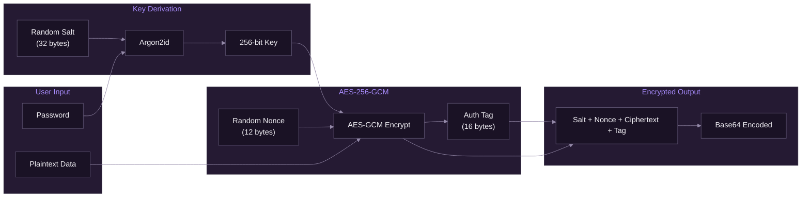

# Encryption Implementation

[Documentation](../README.md) > [Backend](./README.md) > Encryption Implementation

---

This document details SpiritStream's encryption system used for protecting stream keys and sensitive profile data.

## Threat Model

Before diving into implementation, it's important to understand what we're protecting against:

**What we protect:**
- Stream keys (credentials that let anyone broadcast to your channels)
- RTMP URLs (may contain API tokens)
- Profile data when exported or synced

**What we defend against:**
- Someone accessing your profile files (malware, shared computer, cloud sync exposure)
- Casual inspection (stream key visible in JSON file)
- Data breach of backup/sync services

**What we don't defend against:**
- A determined attacker with access to your running computer (they could keylog your password)
- Memory forensics on a running system
- Weak passwords (user responsibility)

The encryption is designed to be "good enough" for the streaming use case—making it impractical for casual attackers while remaining fast enough for normal app usage.

---

## Overview

SpiritStream uses industry-standard encryption to protect sensitive data. These algorithms were chosen for their security track record, performance, and availability in well-audited Rust crates:

| Component | Algorithm |
|-----------|-----------|
| Symmetric Encryption | AES-256-GCM |
| Key Derivation | Argon2id |
| Random Generation | OS CSPRNG |



*Encryption pipeline from password to encrypted output.*

---

## Implementation

The implementation uses pure-Rust crates from the RustCrypto project, which undergo regular security audits. We avoid OpenSSL bindings to keep the build simple and cross-platform.

### Rust Dependencies

Each dependency serves a specific purpose:

```toml
# Cargo.toml
[dependencies]
aes-gcm = "0.10"    # AES-256-GCM authenticated encryption
argon2 = "0.5"      # Memory-hard password hashing (key derivation)
rand = "0.8"        # Cryptographically secure random number generation
base64 = "0.21"     # Encoding encrypted data as text for JSON storage
zeroize = "1.6"     # Securely clear sensitive data from memory
```

### Encryption Service

```rust
// src-tauri/src/services/encryption.rs
use aes_gcm::{
    aead::{Aead, KeyInit},
    Aes256Gcm, Nonce,
};
use argon2::{Argon2, Algorithm, Params, Version};
use rand::RngCore;
use zeroize::Zeroize;

pub struct Encryption;

impl Encryption {
    /// Encrypt plaintext using password-derived key
    pub fn encrypt(&self, plaintext: &str, password: &str) -> Result<String, EncryptionError> {
        // 1. Generate random salt
        let mut salt = [0u8; 32];
        rand::thread_rng().fill_bytes(&mut salt);

        // 2. Derive key using Argon2id
        let key = self.derive_key(password, &salt)?;

        // 3. Generate random nonce
        let mut nonce_bytes = [0u8; 12];
        rand::thread_rng().fill_bytes(&mut nonce_bytes);
        let nonce = Nonce::from_slice(&nonce_bytes);

        // 4. Encrypt with AES-256-GCM
        let cipher = Aes256Gcm::new_from_slice(&key)
            .map_err(|_| EncryptionError::CipherInit)?;

        let ciphertext = cipher
            .encrypt(nonce, plaintext.as_bytes())
            .map_err(|_| EncryptionError::Encryption)?;

        // 5. Combine: salt (32) + nonce (12) + ciphertext (variable)
        let mut combined = Vec::with_capacity(44 + ciphertext.len());
        combined.extend_from_slice(&salt);
        combined.extend_from_slice(&nonce_bytes);
        combined.extend_from_slice(&ciphertext);

        Ok(base64::encode(&combined))
    }

    /// Decrypt ciphertext using password-derived key
    pub fn decrypt(&self, encrypted: &str, password: &str) -> Result<String, EncryptionError> {
        let data = base64::decode(encrypted)
            .map_err(|_| EncryptionError::InvalidFormat)?;

        if data.len() < 44 {
            return Err(EncryptionError::InvalidFormat);
        }

        // 1. Extract components
        let salt = &data[0..32];
        let nonce = Nonce::from_slice(&data[32..44]);
        let ciphertext = &data[44..];

        // 2. Derive key
        let key = self.derive_key(password, salt)?;

        // 3. Decrypt
        let cipher = Aes256Gcm::new_from_slice(&key)
            .map_err(|_| EncryptionError::CipherInit)?;

        let plaintext = cipher
            .decrypt(nonce, ciphertext)
            .map_err(|_| EncryptionError::Decryption)?;

        String::from_utf8(plaintext)
            .map_err(|_| EncryptionError::InvalidUtf8)
    }

    /// Derive a 256-bit key using Argon2id
    fn derive_key(&self, password: &str, salt: &[u8]) -> Result<[u8; 32], EncryptionError> {
        let params = Params::new(
            65536,  // 64 MiB memory
            3,      // 3 iterations
            4,      // 4 parallel lanes
            Some(32)
        ).map_err(|_| EncryptionError::KeyDerivation)?;

        let argon2 = Argon2::new(
            Algorithm::Argon2id,
            Version::V0x13,
            params
        );

        let mut key = [0u8; 32];
        argon2
            .hash_password_into(password.as_bytes(), salt, &mut key)
            .map_err(|_| EncryptionError::KeyDerivation)?;

        Ok(key)
    }
}
```

---

## Key Derivation

Users provide passwords, but AES needs a 256-bit key. Key derivation functions (KDFs) bridge this gap by converting arbitrary-length passwords into fixed-size keys. We use Argon2id because it's specifically designed to be slow and memory-intensive—making brute-force attacks expensive.

### Argon2id Parameters

These parameters balance security against performance. Higher values are more secure but make encryption/decryption slower:

| Parameter | Value | Purpose |
|-----------|-------|---------|
| Memory | 64 MiB | Forces attacker to use lots of RAM per guess, killing GPU parallelism |
| Iterations | 3 | Number of times to run the algorithm; more = slower |
| Parallelism | 4 | Uses 4 CPU threads; matches typical desktop core counts |
| Output length | 32 bytes | Exactly the key size AES-256 needs |

**Why these values?** The 64 MiB memory cost means an attacker can't try millions of passwords per second on a GPU (GPUs have limited memory per core). Three iterations with 4-way parallelism takes ~200ms on a typical desktop—noticeable but acceptable for a "load profile" action that happens occasionally.

### Why Argon2id?

Argon2id combines:
- **Argon2i**: Side-channel resistance (data-independent memory access)
- **Argon2d**: GPU resistance (data-dependent memory access)

This provides the best protection against various attack vectors.

---

## AES-256-GCM

AES-256-GCM is the go-to choice for modern authenticated encryption. "Authenticated" means it doesn't just hide the data—it also detects tampering. If someone modifies even one byte of the ciphertext, decryption fails rather than producing garbage output. This prevents subtle attacks where an attacker manipulates encrypted data without needing to decrypt it.

### Properties

| Property | Description |
|----------|-------------|
| Key size | 256 bits |
| Nonce size | 96 bits (12 bytes) |
| Tag size | 128 bits (16 bytes) |
| Mode | Galois/Counter Mode |

### Security Guarantees

- **Confidentiality**: Encryption hides plaintext content
- **Integrity**: Authentication tag detects tampering
- **Authenticity**: Only key holder can create valid ciphertext

### Nonce Requirements

**Critical**: Reusing a nonce with the same key is catastrophic—it completely breaks GCM's security, allowing attackers to recover plaintext. This is the most common mistake in AES-GCM implementations.

SpiritStream ensures unique nonces by:
1. **Generating a new random salt per encryption** → This means a new key, so nonce uniqueness requirements reset
2. **Generating a new random nonce per encryption** → Even with the same password, output differs
3. **Never storing keys** → Keys exist only in memory during encrypt/decrypt operations

This "random salt + random nonce" approach is stateless and safe even if the same profile is encrypted repeatedly.

---

## Data Format

The encrypted output must be self-contained—everything needed for decryption (except the password) is stored together. This means the salt and nonce are prepended to the ciphertext, not stored separately.

### Encrypted Profile Format

The binary format packs everything into a single blob. The fixed-size prefix (44 bytes) makes parsing straightforward:

```
[salt: 32 bytes][nonce: 12 bytes][ciphertext: variable][tag: 16 bytes]
```

Base64 encoded for storage:

```json
{
  "encrypted": "base64-encoded-blob",
  "version": 1
}
```

### Versioning

The encryption format includes versioning for future algorithm changes:

```rust
pub struct EncryptedData {
    pub version: u32,
    pub encrypted: String,
}

impl EncryptedData {
    pub fn new(encrypted: String) -> Self {
        Self {
            version: 1,
            encrypted,
        }
    }
}
```

---

## Profile Encryption

### Encrypting a Profile

```rust
pub async fn save_encrypted(
    &self,
    profile: &Profile,
    password: &str,
) -> Result<(), ProfileError> {
    // Serialize profile to JSON
    let json = serde_json::to_string_pretty(profile)?;

    // Encrypt
    let encrypted = self.encryption.encrypt(&json, password)?;

    // Wrap with version
    let data = EncryptedData::new(encrypted);

    // Save to file
    let path = self.get_profile_path(&profile.name);
    let content = serde_json::to_string_pretty(&data)?;
    fs::write(&path, content).await?;

    Ok(())
}
```

### Decrypting a Profile

```rust
pub async fn load_encrypted(
    &self,
    name: &str,
    password: &str,
) -> Result<Profile, ProfileError> {
    let path = self.get_profile_path(name);
    let content = fs::read_to_string(&path).await?;

    // Parse wrapper
    let data: EncryptedData = serde_json::from_str(&content)?;

    // Check version
    if data.version != 1 {
        return Err(ProfileError::UnsupportedVersion);
    }

    // Decrypt
    let json = self.encryption.decrypt(&data.encrypted, password)?;

    // Deserialize
    let profile: Profile = serde_json::from_str(&json)?;

    Ok(profile)
}
```

---

## Stream Key Protection

Beyond file encryption, stream keys need careful handling at runtime. A key might exist in memory while building the FFmpeg command, and we want to minimize its exposure window.

### In-Memory Protection

The `zeroize` crate overwrites sensitive data with zeros when we're done with it. This isn't bulletproof (the compiler might optimize it away, the key might exist in other memory locations), but it reduces the window of exposure:

```rust
use zeroize::Zeroize;

pub fn process_stream_key(key: &str) -> String {
    let mut key_copy = key.to_string();

    // Use the key
    let result = build_rtmp_url(&key_copy);

    // Clear from memory
    key_copy.zeroize();

    result
}
```

### Environment Variable Resolution

Some users prefer not to store stream keys in profile files at all—even encrypted. For these security-conscious users, SpiritStream supports environment variable references. Instead of storing `abc123` as the stream key, users can store `${TWITCH_STREAM_KEY}` and set the actual key in their shell environment or a secrets manager.

This pattern is common in deployment scenarios where credentials rotate frequently or are managed by external systems. The resolution happens at stream-start time, not when the profile loads, so the actual key never touches the profile file.

```rust
fn resolve_key(key: &str) -> String {
    if key.starts_with("${") && key.ends_with("}") {
        let var_name = &key[2..key.len() - 1];
        std::env::var(var_name).unwrap_or_else(|_| key.to_string())
    } else {
        key.to_string()
    }
}
```

---

## Error Handling

Encryption errors require careful design. The error types must be specific enough for developers to debug issues, but the user-facing messages must not leak information that could help an attacker. For example, "wrong password" vs "corrupted data" tells an attacker whether they're guessing valid ciphertext—so we combine them into a single ambiguous message.

### Error Types

The internal error enum distinguishes failure modes for logging and debugging:

```rust
#[derive(Debug, thiserror::Error)]
pub enum EncryptionError {
    #[error("Invalid encrypted data format")]
    InvalidFormat,

    #[error("Failed to initialize cipher")]
    CipherInit,

    #[error("Encryption failed")]
    Encryption,

    #[error("Decryption failed - wrong password or corrupted data")]
    Decryption,

    #[error("Key derivation failed")]
    KeyDerivation,

    #[error("Invalid UTF-8 in decrypted data")]
    InvalidUtf8,
}
```

### User-Facing Messages

User-facing error messages are deliberately vague. The `Decryption` error could mean wrong password, tampered ciphertext, or truncated data—but we tell the user the same thing regardless. This prevents information leakage while still being helpful enough that users know what to try (re-enter password, restore from backup).

```rust
impl EncryptionError {
    pub fn user_message(&self) -> &str {
        match self {
            Self::Decryption => "Incorrect password or corrupted profile",
            Self::InvalidFormat => "Profile file is corrupted",
            _ => "An encryption error occurred",
        }
    }
}
```

---

## Security Considerations

### Password Strength

The encryption is only as strong as the password. Recommendations:
- Minimum 12 characters
- Mix of letters, numbers, symbols
- Avoid common words

### Side-Channel Attacks

The implementation uses:
- Constant-time comparison for authentication
- Memory-hard key derivation (Argon2id)
- Secure random number generation

### Key Storage

Keys are never stored - only derived from passwords. The password itself is:
- Never logged
- Never written to disk
- Cleared from memory after use

---

## Testing

Cryptographic code is especially important to test because failures are silent—encryption that "works" but uses a constant IV, for example, produces output that looks encrypted but isn't secure. These tests verify both correctness (roundtrip) and security properties (uniqueness, rejection of wrong passwords).

### Unit Tests

The test suite covers three critical properties:

1. **Roundtrip correctness**: Encrypt then decrypt returns the original plaintext
2. **Password sensitivity**: Wrong password produces an error, not garbage
3. **Randomness**: Same input encrypted twice produces different output (proving we use random salt/nonce)

```rust
#[cfg(test)]
mod tests {
    use super::*;

    #[test]
    fn test_encrypt_decrypt_roundtrip() {
        let encryption = Encryption;
        let plaintext = "sensitive stream key data";
        let password = "test_password_123";

        let encrypted = encryption.encrypt(plaintext, password).unwrap();
        let decrypted = encryption.decrypt(&encrypted, password).unwrap();

        assert_eq!(plaintext, decrypted);
    }

    #[test]
    fn test_wrong_password_fails() {
        let encryption = Encryption;
        let plaintext = "sensitive data";
        let password = "correct_password";
        let wrong_password = "wrong_password";

        let encrypted = encryption.encrypt(plaintext, password).unwrap();
        let result = encryption.decrypt(&encrypted, wrong_password);

        assert!(result.is_err());
    }

    #[test]
    fn test_unique_outputs() {
        let encryption = Encryption;
        let plaintext = "same data";
        let password = "password";

        let encrypted1 = encryption.encrypt(plaintext, password).unwrap();
        let encrypted2 = encryption.encrypt(plaintext, password).unwrap();

        // Each encryption should produce different output (random salt/nonce)
        assert_ne!(encrypted1, encrypted2);
    }
}
```

---

## Migration

Cryptographic best practices evolve. Argon2id parameters that seem strong today may be insufficient in five years as hardware improves. The versioned format (see Data Format above) allows future SpiritStream versions to upgrade encryption without breaking existing profiles.

### Upgrading Encryption

When the encryption algorithm or parameters change, existing profiles need migration. The process is decrypt-with-old, encrypt-with-new. This requires the user's password (we can't upgrade without it), so migrations typically happen on profile load—if we detect an old version, we decrypt it and immediately re-encrypt with current parameters.

```rust
pub fn migrate_profile(
    encrypted: &str,
    old_password: &str,
    new_password: &str,
) -> Result<String, EncryptionError> {
    // Decrypt with old format
    let plaintext = self.decrypt_v1(encrypted, old_password)?;

    // Re-encrypt with new format
    self.encrypt_v2(&plaintext, new_password)
}
```

---

**Related:** [Security Architecture](../01-architecture/04-security-architecture.md) | [Services Layer](./02-services-layer.md) | [Models Reference](./03-models-reference.md)

