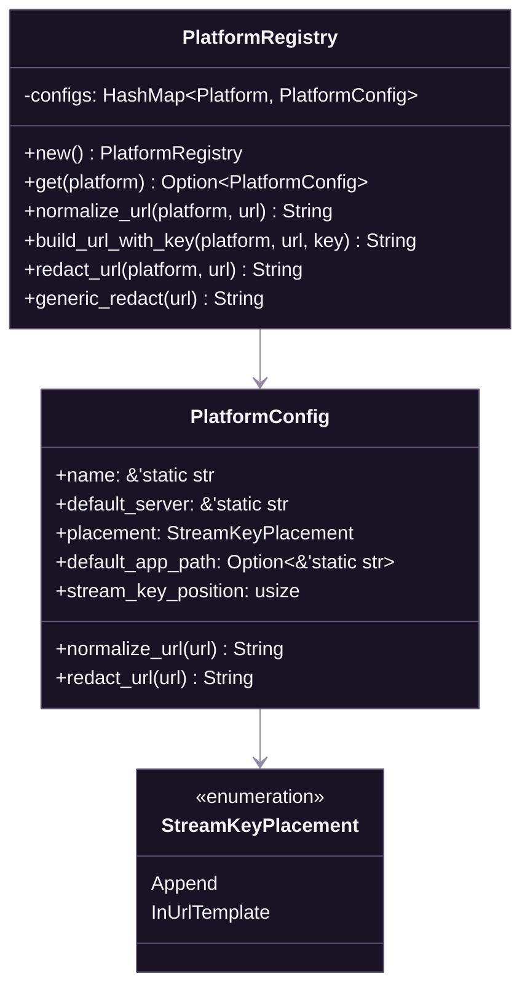

# Platform Registry (Backend)

[Documentation](../README.md) > [Backend](./README.md) > Platform Registry

---

This document covers the Rust implementation of SpiritStream's platform registry service, which provides runtime configuration for 80+ streaming platforms.

## Overview

The `PlatformRegistry` service loads platform configurations from JSON at compile time and provides methods for URL building, normalization, and stream key redaction in logs.



---

## Core Types

### StreamKeyPlacement

Defines how stream keys are embedded in RTMP URLs:

```rust
#[derive(Debug, Clone, Copy, PartialEq)]
pub enum StreamKeyPlacement {
    /// Append stream key to URL path (e.g., rtmp://server/app/{key})
    Append,
    /// Replace {stream_key} template in URL (e.g., rtmp://server/{stream_key}/live)
    InUrlTemplate,
}
```

| Variant | Description | Example Platforms |
|---------|-------------|-------------------|
| `Append` | Key appended to URL path | YouTube, Twitch, Kick, Facebook |
| `InUrlTemplate` | Key replaces `{stream_key}` placeholder | Restream, custom relay services |

### PlatformConfig

Per-platform configuration loaded from JSON:

```rust
#[derive(Debug, Clone)]
pub struct PlatformConfig {
    /// Display name (e.g., "YouTube - RTMPS")
    pub name: &'static str,

    /// Default RTMP server URL (may contain {stream_key} template)
    pub default_server: &'static str,

    /// Stream key placement strategy
    pub placement: StreamKeyPlacement,

    /// Default app path for URL normalization (e.g., "app", "live2")
    pub default_app_path: Option<&'static str>,

    /// Position of stream key in URL path (for log redaction)
    /// 0 = no masking, 2 = /app/KEY (most common)
    pub stream_key_position: usize,
}
```

### PlatformRegistry

Central registry managing all platform configurations:

```rust
pub struct PlatformRegistry {
    configs: HashMap<Platform, PlatformConfig>,
}
```

---

## Initialization

The registry loads platform data from `data/streaming-platforms.json` at compile time using `include_str!`:

```rust
impl PlatformRegistry {
    pub fn new() -> Self {
        let mut configs = HashMap::new();

        // Embed JSON at compile time
        let json_content = include_str!("../../../data/streaming-platforms.json");

        // Parse and filter RTMP/RTMPS platforms
        let data: serde_json::Value = serde_json::from_str(json_content)
            .expect("Failed to parse streaming-platforms.json");

        let services = data["services"]
            .as_array()
            .expect("Expected 'services' array in JSON");

        for service in services {
            // Only include RTMP/RTMPS with valid placement
            let default_url = service["defaultUrl"].as_str().unwrap();
            if !default_url.starts_with("rtmp://") && !default_url.starts_with("rtmps://") {
                continue;
            }

            // Deserialize Platform enum variant from name
            let name = service["name"].as_str().unwrap();
            let platform: Platform = serde_json::from_str(&format!("\"{}\"", name))
                .unwrap_or_else(|_| panic!("Unknown platform: {}", name));

            // Build config...
            configs.insert(platform, PlatformConfig { /* ... */ });
        }

        Self { configs }
    }
}
```

The `Platform` enum itself is auto-generated at build time by `build.rs`. See [Build-Time Code Generation](#build-time-code-generation).

---

## Key Methods

### get()

Retrieve configuration for a specific platform:

```rust
pub fn get(&self, platform: &Platform) -> Option<&PlatformConfig> {
    self.configs.get(platform)
}
```

### build_url_with_key()

Construct the final RTMP URL with stream key based on the platform's placement strategy:

```rust
pub fn build_url_with_key(
    &self,
    platform: &Platform,
    base_url: &str,
    stream_key: &str
) -> String {
    if let Some(config) = self.get(platform) {
        match config.placement {
            StreamKeyPlacement::Append => {
                // rtmp://server/app + /key
                format!("{}/{}", base_url.trim_end_matches('/'), stream_key)
            }
            StreamKeyPlacement::InUrlTemplate => {
                // Replace {stream_key} placeholder
                base_url.replace("{stream_key}", stream_key)
            }
        }
    } else {
        // Fallback: assume append mode
        format!("{}/{}", base_url.trim_end_matches('/'), stream_key)
    }
}
```

**Example usage:**

```rust
let registry = PlatformRegistry::new();

// Append mode (Twitch)
let url = registry.build_url_with_key(
    &Platform::Twitch,
    "rtmp://live.twitch.tv/app",
    "live_abc123"
);
// Result: "rtmp://live.twitch.tv/app/live_abc123"

// Template mode (Restream)
let url = registry.build_url_with_key(
    &Platform::Restream,
    "rtmp://live.restream.io/{stream_key}/live",
    "my_key"
);
// Result: "rtmp://live.restream.io/my_key/live"
```

### normalize_url()

Ensure URLs have required path segments for platforms that need them:

```rust
pub fn normalize_url(&self, platform: &Platform, url: &str) -> String {
    self.get(platform)
        .map(|config| config.normalize_url(url))
        .unwrap_or_else(|| url.to_string())
}
```

The `PlatformConfig::normalize_url()` method adds the `default_app_path` if missing:

```rust
impl PlatformConfig {
    pub fn normalize_url(&self, url: &str) -> String {
        let Some(app_path) = self.default_app_path else {
            return url.to_string();
        };

        // Parse URL and ensure app_path is present
        // e.g., for Kick: ensure "/app" is in the path
        // ...
    }
}
```

### redact_url()

Mask stream keys in URLs for safe logging:

```rust
pub fn redact_url(&self, platform: &Platform, url: &str) -> String {
    self.get(platform)
        .map(|config| config.redact_url(url))
        .unwrap_or_else(|| Self::generic_redact(url))
}
```

**Redaction strategies by placement type:**

| Placement | Strategy | Example |
|-----------|----------|---------|
| `Append` | Mask path segment at `stream_key_position` | `rtmp://server/app/***` |
| `InUrlTemplate` | Find and mask the template replacement | `rtmp://server/***/live` |

**Example:**

```rust
let registry = PlatformRegistry::new();

let safe_url = registry.redact_url(
    &Platform::Twitch,
    "rtmp://live.twitch.tv/app/live_secret_key_123"
);
// Result: "rtmp://live.twitch.tv/app/***"
```

### generic_redact()

Static method for redacting URLs when platform context is unavailable:

```rust
pub fn generic_redact(url: &str) -> String {
    // Only redact RTMP(S) URLs
    if !(url.starts_with("rtmp://") || url.starts_with("rtmps://")) {
        return url.to_string();
    }

    // Mask the last path segment
    // rtmp://host/path1/path2/KEY → rtmp://host/path1/***
}
```

---

## Build-Time Code Generation

The `Platform` enum is auto-generated from JSON by `build.rs`:

```rust
// build.rs
fn main() {
    // Read streaming-platforms.json
    let json = std::fs::read_to_string("../data/streaming-platforms.json")
        .expect("Failed to read platforms JSON");

    let data: serde_json::Value = serde_json::from_str(&json).unwrap();
    let services = data["services"].as_array().unwrap();

    // Generate enum variants
    let mut variants = Vec::new();
    for service in services {
        let name = service["name"].as_str().unwrap();
        // Filter to RTMP/RTMPS only
        let url = service["defaultUrl"].as_str().unwrap();
        if url.starts_with("rtmp://") || url.starts_with("rtmps://") {
            variants.push(format!("    {},", name));
        }
    }

    // Write generated_platforms.rs
    let output = format!(
        r#"// Auto-generated by build.rs - DO NOT EDIT
use serde::{{Deserialize, Serialize}};

#[derive(Debug, Clone, Copy, PartialEq, Eq, Hash, Serialize, Deserialize, Default)]
pub enum Platform {{
    #[default]
    Custom,
{}
}}
"#,
        variants.join("\n")
    );

    std::fs::write("src/models/generated_platforms.rs", output).unwrap();
}
```

This generates ~80 enum variants matching the JSON platform names.

---

## JSON Schema

The `data/streaming-platforms.json` file follows this schema:

```json
{
  "services": [
    {
      "name": "YouTubeRtmps",
      "displayName": "YouTube - RTMPS",
      "defaultUrl": "rtmps://a.rtmps.youtube.com:443/live2",
      "streamKeyPlacement": "append",
      "abbreviation": "YT",
      "color": "#FF0000",
      "faviconPath": "icons/youtube.svg"
    }
  ]
}
```

| Field | Required | Type | Description |
|-------|----------|------|-------------|
| `name` | Yes | String | Unique identifier, becomes enum variant |
| `displayName` | Yes | String | Human-readable name for UI |
| `defaultUrl` | Yes | String | Default RTMP(S) server URL |
| `streamKeyPlacement` | Yes | `"append"` or `"in_url_template"` | Key embedding strategy |
| `abbreviation` | No | String | 1-3 letter code for compact UI |
| `color` | No | String | Hex color for platform icon |
| `faviconPath` | No | String | Path to platform icon SVG |

---

## Integration with FFmpeg Handler

The `FFmpegHandler` uses `PlatformRegistry` when building tee muxer output:

```rust
// services/ffmpeg_handler.rs
fn build_tee_output(
    registry: &PlatformRegistry,
    targets: &[StreamTarget]
) -> String {
    targets
        .iter()
        .map(|target| {
            let url = registry.build_url_with_key(
                &target.service,
                &target.url,
                &target.stream_key
            );
            format!("[f=flv:onfail=ignore]{}", url)
        })
        .collect::<Vec<_>>()
        .join("|")
}
```

For logging, URLs are redacted before output:

```rust
fn log_stream_start(registry: &PlatformRegistry, target: &StreamTarget) {
    let safe_url = registry.redact_url(&target.service, &full_url);
    info!("Starting stream to: {}", safe_url);
    // Logs: "Starting stream to: rtmp://live.twitch.tv/app/***"
}
```

---

## Testing

```rust
#[cfg(test)]
mod tests {
    use super::*;

    #[test]
    fn test_registry_loads_from_json() {
        let registry = PlatformRegistry::new();
        assert!(!registry.configs.is_empty());
    }

    #[test]
    fn test_generic_redaction() {
        let url = "rtmp://custom-server.com/stream/my_key";
        let redacted = PlatformRegistry::generic_redact(url);
        assert_eq!(redacted, "rtmp://custom-server.com/stream/***");
    }

    #[test]
    fn test_append_url_building() {
        let registry = PlatformRegistry::new();
        let url = registry.build_url_with_key(
            &Platform::Custom,
            "rtmp://server/app",
            "key123"
        );
        assert_eq!(url, "rtmp://server/app/key123");
    }
}
```

---

## Error Handling

The registry panics at startup if JSON is malformed (fail-fast). Runtime methods return sensible fallbacks:

| Method | Fallback Behavior |
|--------|-------------------|
| `get()` | Returns `None` for unknown platforms |
| `build_url_with_key()` | Uses append mode if platform unknown |
| `redact_url()` | Uses generic redaction if platform unknown |
| `normalize_url()` | Returns URL unchanged if platform unknown |

---

**Related:** [Platform Registry (Streaming)](../04-streaming/05-platform-registry.md) | [Models Reference](./03-models-reference.md) | [FFmpeg Handler](./04-ffmpeg-handler.md)

