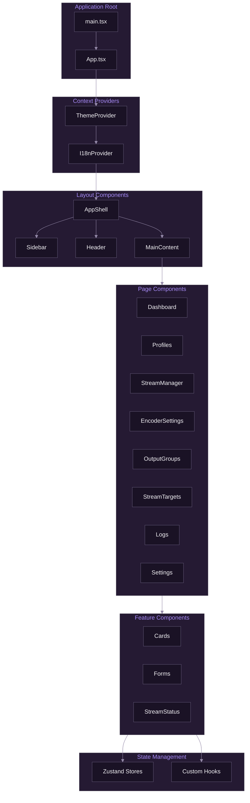

# React Architecture

[Documentation](../README.md) > [Frontend](./README.md) > React Architecture

---

This document describes SpiritStream's React frontend architecture, including component organization, routing, state management integration, and best practices for building new features.

---

## Architecture Overview



*Component hierarchy showing providers, layout, pages, and state management integration.*

---

## Directory Structure

```
apps/web/src/
├── components/
│   ├── ui/                 # Base UI components
│   │   ├── Button.tsx
│   │   ├── Card.tsx
│   │   ├── Input.tsx
│   │   ├── Select.tsx
│   │   ├── Modal.tsx
│   │   └── index.ts
│   ├── layout/             # Layout components
│   │   ├── AppShell.tsx
│   │   ├── Sidebar.tsx
│   │   ├── Header.tsx
│   │   └── MainContent.tsx
│   ├── navigation/         # Navigation components
│   │   ├── NavItem.tsx
│   │   └── NavSection.tsx
│   ├── profile/            # Profile features
│   │   ├── ProfileCard.tsx
│   │   ├── ProfileForm.tsx
│   │   └── ProfileList.tsx
│   ├── stream/             # Streaming features
│   │   ├── StreamCard.tsx
│   │   ├── StreamStatus.tsx
│   │   ├── OutputGroup.tsx
│   │   └── PlatformIcon.tsx
│   └── settings/           # Settings features
│       ├── EncoderForm.tsx
│       └── ThemeToggle.tsx
├── hooks/                  # Custom hooks
│   ├── useProfile.ts
│   ├── useStream.ts
│   ├── useTauri.ts
│   └── useTheme.ts
├── stores/                 # Zustand stores
│   ├── profileStore.ts
│   ├── streamStore.ts
│   ├── themeStore.ts
│   └── languageStore.ts
├── lib/                    # Utilities
│   ├── tauri.ts           # Tauri API wrapper
│   ├── utils.ts           # Helper functions
│   └── cn.ts              # Class name utility
├── types/                  # TypeScript types
│   ├── profile.ts
│   ├── stream.ts
│   └── api.ts
├── styles/                 # Global styles
│   ├── globals.css
│   └── tokens.css
├── locales/               # i18n translations
│   ├── en.json
│   └── es.json
├── App.tsx                # Root component
└── main.tsx               # Entry point
```

---

## Component Patterns

### Functional Components

All components use functional patterns with hooks:

```typescript
// components/profile/ProfileCard.tsx
import { cn } from '@/lib/cn';
import { Profile } from '@/types/profile';

interface ProfileCardProps {
  profile: Profile;
  isActive?: boolean;
  onSelect?: (id: string) => void;
  onEdit?: (id: string) => void;
}

export function ProfileCard({
  profile,
  isActive = false,
  onSelect,
  onEdit,
}: ProfileCardProps) {
  return (
    <div
      className={cn(
        'rounded-xl border-2 p-4 cursor-pointer transition-all',
        isActive
          ? 'border-primary bg-primary-muted'
          : 'border-border hover:border-primary/50'
      )}
      onClick={() => onSelect?.(profile.id)}
    >
      <h3 className="font-semibold">{profile.name}</h3>
      <p className="text-sm text-muted">{profile.resolution}</p>
    </div>
  );
}
```

### Component Composition

Complex components are built from smaller primitives:

```typescript
// components/ui/Card.tsx
export function Card({ children, className }: CardProps) {
  return (
    <div className={cn('bg-surface rounded-xl border', className)}>
      {children}
    </div>
  );
}

export function CardHeader({ title, description, actions }: CardHeaderProps) {
  return (
    <div className="p-4 border-b flex items-center justify-between">
      <div>
        <h3 className="font-semibold">{title}</h3>
        {description && <p className="text-sm text-muted">{description}</p>}
      </div>
      {actions}
    </div>
  );
}

export function CardBody({ children }: CardBodyProps) {
  return <div className="p-4">{children}</div>;
}
```

### Props Interface Pattern

Define props interfaces above components:

```typescript
interface ButtonProps extends React.ButtonHTMLAttributes<HTMLButtonElement> {
  variant?: 'primary' | 'secondary' | 'ghost' | 'destructive';
  size?: 'sm' | 'md' | 'lg';
  loading?: boolean;
}

export function Button({
  variant = 'primary',
  size = 'md',
  loading,
  children,
  ...props
}: ButtonProps) {
  // Implementation
}
```

---

## State Management Integration

### Zustand Store Usage

Components access stores via hooks:

```typescript
// Using the profile store
import { useProfileStore } from '@/stores/profileStore';

export function ProfileList() {
  const { profiles, current, loadProfile, isLoading } = useProfileStore();

  return (
    <div>
      {profiles.map((profile) => (
        <ProfileCard
          key={profile.id}
          profile={profile}
          isActive={current?.id === profile.id}
          onSelect={loadProfile}
        />
      ))}
    </div>
  );
}
```

### Selective Subscriptions

Use selectors to prevent unnecessary re-renders:

```typescript
// Only re-render when isStreaming changes
const isStreaming = useStreamStore((state) => state.isStreaming);

// Get multiple values with shallow comparison
const { stats, uptime } = useStreamStore(
  (state) => ({ stats: state.stats, uptime: state.uptime }),
  shallow
);
```

---

## Custom Hooks

### useTauri Hook

Wraps Tauri API calls with loading and error state:

```typescript
// hooks/useTauri.ts
import { invoke } from '@tauri-apps/api/core';
import { useState, useCallback } from 'react';

export function useTauri<T, A extends unknown[]>(
  command: string
) {
  const [data, setData] = useState<T | null>(null);
  const [loading, setLoading] = useState(false);
  const [error, setError] = useState<string | null>(null);

  const execute = useCallback(async (...args: A) => {
    setLoading(true);
    setError(null);
    try {
      const result = await invoke<T>(command, ...args);
      setData(result);
      return result;
    } catch (err) {
      setError(String(err));
      throw err;
    } finally {
      setLoading(false);
    }
  }, [command]);

  return { data, loading, error, execute };
}
```

### useProfile Hook

Profile-specific operations:

```typescript
// hooks/useProfile.ts
export function useProfile(profileId?: string) {
  const store = useProfileStore();

  const profile = profileId
    ? store.profiles.find((p) => p.id === profileId)
    : store.current;

  const save = useCallback(async (updates: Partial<Profile>) => {
    if (!profile) return;
    await store.updateProfile(profile.id, updates);
  }, [profile, store]);

  return { profile, save, isLoading: store.loading };
}
```

---

## Layout System

### AppShell Component

The main layout wrapper:

```typescript
// components/layout/AppShell.tsx
export function AppShell({ children }: { children: React.ReactNode }) {
  return (
    <div className="flex min-h-screen bg-base">
      <Sidebar />
      <main className="flex-1 ml-sidebar flex flex-col">
        {children}
      </main>
    </div>
  );
}
```

### Page Layout Pattern

Each page follows a consistent structure:

```typescript
// pages/Dashboard.tsx
export function Dashboard() {
  return (
    <>
      <Header title="Dashboard" />
      <ContentArea>
        <StatsRow />
        <Grid cols={2}>
          <ActiveProfileCard />
          <QuickActionsCard />
        </Grid>
        <StreamTargetsGrid />
      </ContentArea>
    </>
  );
}
```

---

## Navigation

### View-Based Navigation

SpiritStream uses view-based navigation (not React Router):

```typescript
// App.tsx
type View =
  | 'dashboard'
  | 'profiles'
  | 'streams'
  | 'encoder'
  | 'outputs'
  | 'targets'
  | 'logs'
  | 'settings';

export function App() {
  const [view, setView] = useState<View>('dashboard');

  return (
    <AppShell>
      <Sidebar currentView={view} onViewChange={setView} />
      <MainContent>
        {view === 'dashboard' && <Dashboard />}
        {view === 'profiles' && <Profiles />}
        {view === 'streams' && <StreamManager />}
        {/* ... other views */}
      </MainContent>
    </AppShell>
  );
}
```

### Sidebar Navigation

```typescript
// components/layout/Sidebar.tsx
export function Sidebar({ currentView, onViewChange }: SidebarProps) {
  return (
    <aside className="w-sidebar fixed inset-y-0 left-0 bg-surface border-r">
      <SidebarHeader />
      <nav className="px-3 py-4">
        <NavSection title="Main">
          <NavItem
            icon={<LayoutDashboard />}
            label="Dashboard"
            active={currentView === 'dashboard'}
            onClick={() => onViewChange('dashboard')}
          />
          {/* ... other items */}
        </NavSection>
      </nav>
      <SidebarFooter />
    </aside>
  );
}
```

---

## Event Handling

### Tauri Event Listeners

Listen to backend events:

```typescript
import { listen } from '@tauri-apps/api/event';
import { useEffect } from 'react';

export function useStreamEvents() {
  const updateStats = useStreamStore((state) => state.updateStats);

  useEffect(() => {
    const unlisten = listen<StreamStats>('stream_stats', (event) => {
      updateStats(event.payload);
    });

    return () => {
      unlisten.then((fn) => fn());
    };
  }, [updateStats]);
}
```

### Form Handling

```typescript
import { useState, FormEvent } from 'react';

export function ProfileForm({ onSubmit }: ProfileFormProps) {
  const [name, setName] = useState('');
  const [resolution, setResolution] = useState('1920x1080');

  const handleSubmit = (e: FormEvent) => {
    e.preventDefault();
    onSubmit({ name, resolution });
  };

  return (
    <form onSubmit={handleSubmit}>
      <Input
        label="Profile Name"
        value={name}
        onChange={(e) => setName(e.target.value)}
      />
      <Select
        label="Resolution"
        value={resolution}
        onChange={(e) => setResolution(e.target.value)}
        options={resolutionOptions}
      />
      <Button type="submit">Save</Button>
    </form>
  );
}
```

---

## Styling

### Tailwind CSS Integration

Components use Tailwind classes with design tokens:

```typescript
<div className="bg-surface border border-border rounded-xl p-4 shadow-sm">
  <h3 className="text-primary font-semibold">Title</h3>
  <p className="text-muted text-sm">Description</p>
</div>
```

### Class Name Utility

The `cn` utility merges classes safely:

```typescript
// lib/cn.ts
import { clsx, ClassValue } from 'clsx';
import { twMerge } from 'tailwind-merge';

export function cn(...inputs: ClassValue[]) {
  return twMerge(clsx(inputs));
}

// Usage
<div className={cn(
  'base-styles',
  isActive && 'active-styles',
  className
)} />
```

---

## Performance

### Memoization

Use `memo` for expensive components:

```typescript
import { memo } from 'react';

export const StreamCard = memo(function StreamCard({
  target,
  stats,
}: StreamCardProps) {
  return (
    <Card>
      <CardBody>
        {/* ... */}
      </CardBody>
    </Card>
  );
});
```

### Lazy Loading

For large components or pages:

```typescript
import { lazy, Suspense } from 'react';

const Settings = lazy(() => import('./pages/Settings'));

function App() {
  return (
    <Suspense fallback={<LoadingSpinner />}>
      {view === 'settings' && <Settings />}
    </Suspense>
  );
}
```

---

## Testing

### Component Testing

```typescript
import { render, screen, fireEvent } from '@testing-library/react';
import { ProfileCard } from './ProfileCard';

describe('ProfileCard', () => {
  const mockProfile = {
    id: '1',
    name: 'Test Profile',
    resolution: '1080p60',
  };

  it('renders profile name', () => {
    render(<ProfileCard profile={mockProfile} />);
    expect(screen.getByText('Test Profile')).toBeInTheDocument();
  });

  it('calls onSelect when clicked', () => {
    const onSelect = vi.fn();
    render(<ProfileCard profile={mockProfile} onSelect={onSelect} />);
    fireEvent.click(screen.getByRole('button'));
    expect(onSelect).toHaveBeenCalledWith('1');
  });
});
```

---

## Best Practices

### Do

- Use functional components with hooks
- Define prop interfaces explicitly
- Use TypeScript strict mode
- Memoize expensive computations
- Use Zustand selectors for subscriptions

### Don't

- Use class components
- Mutate state directly
- Put business logic in components
- Overuse useEffect
- Create deeply nested component trees

---

**Related:** [State Management](./02-state-management.md) | [Component Library](./03-component-library.md) | [Tauri Integration](./04-tauri-integration.md)
