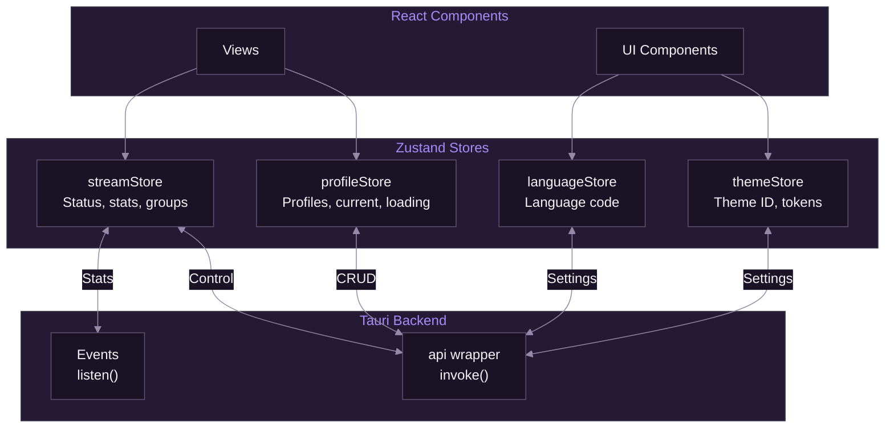
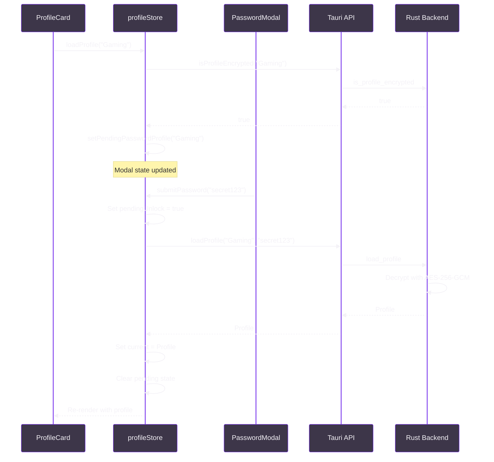
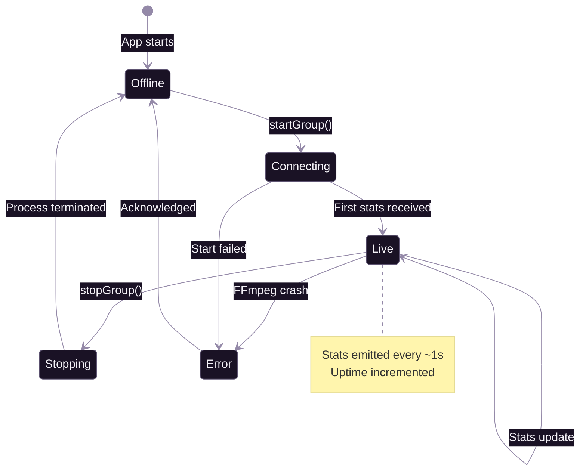

# State Management

[Documentation](../README.md) > [Frontend](./README.md) > State Management

---

SpiritStream uses Zustand for lightweight, TypeScript-first state management. Four stores handle distinct concerns: profiles, streaming, theming, and internationalization.

---

## Introduction

SpiritStream requires centralized state management for:

- Profile data and selection state
- Real-time streaming status and statistics
- Theme persistence across sessions
- Language preferences for internationalization

Zustand was selected over alternatives (Redux, Jotai) for its:

- Minimal boilerplate and bundle size
- Built-in persistence middleware
- Excellent TypeScript support
- Direct async action support

**This document covers:**

- Store architecture and design patterns
- Profile store with encryption workflow
- Stream store with event-driven updates
- Theme and language stores
- Integration patterns with React components

---

## Store Architecture

### Overview



*Four stores manage distinct application concerns.*

### Common Patterns

All stores follow consistent patterns:

- **State + Actions** — State properties and action methods in the same object
- **Async Actions** — Direct `async/await` support without middleware
- **Error Handling** — Try-catch with state-based error tracking
- **Auto-Save** — Mutations trigger automatic persistence

### File Locations

| Store | File | Lines |
|-------|------|-------|
| profileStore | `stores/profileStore.ts` | ~250 |
| streamStore | `stores/streamStore.ts` | ~200 |
| themeStore | `stores/themeStore.ts` | ~150 |
| languageStore | `stores/languageStore.ts` | ~50 |

---

## Profile Store

The profileStore manages:

- Profile list loading and caching
- Current profile selection and modification
- Encrypted profile password handling
- Output group and stream target mutations
- Auto-save on modifications

**File:** [`src-frontend/stores/profileStore.ts`](../../src-frontend/stores/profileStore.ts)

### State Interface

```typescript
interface ProfileState {
  // State
  profiles: ProfileSummary[];        // All profile summaries
  current: Profile | null;           // Currently loaded profile
  loading: boolean;                  // Loading indicator
  error: string | null;              // Error message

  // Password modal state
  pendingPasswordProfile: string | null;  // Profile awaiting password
  passwordError: string | null;           // Password validation error
  pendingUnlock: boolean;                 // Unlock in progress

  // Async actions
  loadProfiles: () => Promise<void>;
  loadProfile: (name: string, password?: string) => Promise<void>;
  saveProfile: (password?: string) => Promise<void>;
  deleteProfile: (name: string) => Promise<void>;
  createProfile: (name: string) => Promise<void>;
  isProfileEncrypted: (name: string) => Promise<boolean>;

  // Password modal actions
  setPendingPasswordProfile: (name: string | null) => void;
  submitPassword: (password: string) => Promise<void>;
  cancelPasswordPrompt: () => void;
  unlockProfile: (name: string) => void;

  // Profile mutations (auto-save)
  updateProfile: (updates: Partial<Profile>) => Promise<void>;
  addOutputGroup: (group: OutputGroup) => Promise<void>;
  updateOutputGroup: (groupId: string, updates: Partial<OutputGroup>) => Promise<void>;
  removeOutputGroup: (groupId: string) => Promise<void>;
  addStreamTarget: (groupId: string, target: StreamTarget) => Promise<void>;
  updateStreamTarget: (groupId: string, targetId: string, updates: Partial<StreamTarget>) => Promise<void>;
  removeStreamTarget: (groupId: string, targetId: string) => Promise<void>;
  moveStreamTarget: (fromGroupId: string, toGroupId: string, targetId: string) => Promise<void>;
}
```

### Profile Load Flow with Password



*Encrypted profiles trigger password modal before loading.*

### Auto-Save Pattern

Mutations automatically save the profile:

```typescript
updateOutputGroup: async (groupId, updates) => {
  const { current } = get();
  if (!current) return;

  // Update state optimistically
  set({
    current: {
      ...current,
      outputGroups: current.outputGroups.map(g =>
        g.id === groupId ? { ...g, ...updates } : g
      ),
    },
  });

  // Persist to backend
  await get().saveProfile();
},
```

### Profile Summary Generation

The store creates summaries from full profiles for the list view:

```typescript
const createSummary = (profile: Profile): ProfileSummary => {
  const firstGroup = profile.outputGroups[0];
  const video = firstGroup?.video;

  return {
    id: profile.id,
    name: profile.name,
    resolution: video ? formatResolution(video) : 'Passthrough',
    bitrate: video ? parseBitrateToKbps(video.bitrate) : 0,
    targetCount: profile.outputGroups.reduce(
      (sum, g) => sum + g.streamTargets.length, 0
    ),
    services: extractPlatforms(profile),
    isEncrypted: profile.encrypted,
  };
};
```

---

## Stream Store

The streamStore manages:

- Global streaming state (on/off)
- Per-group streaming status
- Real-time statistics from FFmpeg
- Stream target enable/disable state
- Uptime tracking

**File:** [`src-frontend/stores/streamStore.ts`](../../src-frontend/stores/streamStore.ts)

### State Interface

```typescript
interface StreamState {
  // State
  isStreaming: boolean;                    // Any group streaming
  activeGroups: Set<string>;               // Group IDs currently streaming
  enabledTargets: Set<string>;             // Enabled target IDs
  stats: StreamStats;                      // Aggregated statistics
  groupStats: Record<string, GroupStats>;  // Per-group statistics
  uptime: number;                          // Seconds since stream start
  globalStatus: StreamStatusType;          // Overall status
  error: string | null;
  activeStreamCount: number;

  // Control actions
  startGroup: (group: OutputGroup, incomingUrl: string) => Promise<void>;
  stopGroup: (groupId: string) => Promise<void>;
  startAllGroups: (groups: OutputGroup[], incomingUrl: string) => Promise<void>;
  stopAllGroups: () => Promise<void>;
  toggleTargetLive: (targetId: string, enabled: boolean, group: OutputGroup, incomingUrl: string) => Promise<void>;

  // Backend sync
  syncWithBackend: () => Promise<void>;
  isGroupStreamingBackend: (groupId: string) => Promise<boolean>;

  // Stats updates (called by event listeners)
  updateStats: (groupId: string, ffmpegStats: FFmpegStats) => void;
  setStreamEnded: (groupId: string) => void;
  setStreamError: (groupId: string, error: string) => void;
  incrementUptime: () => void;
}
```

### Stream State Machine



*Streaming states and transitions.*

### Real-Time Statistics Flow

Statistics are updated via Tauri event listeners in the `useStreamStats` hook:

```typescript
// In useStreamStats.ts
useEffect(() => {
  const setupListeners = async () => {
    await listen<StreamStatsEvent>('stream_stats', (event) => {
      updateStats(event.payload.group_id, {
        frame: event.payload.frame,
        fps: event.payload.fps,
        bitrate: event.payload.bitrate,
        size: event.payload.size,
        time: event.payload.time,
      });
    });

    await listen<StreamEndedEvent>('stream_ended', (event) => {
      setStreamEnded(event.payload.group_id);
    });

    await listen<StreamErrorEvent>('stream_error', (event) => {
      setStreamError(event.payload.group_id, event.payload.error);
    });
  };

  setupListeners();
}, []);
```

### Bitrate Calculation

The store calculates instantaneous bitrate from FFmpeg's cumulative size:

```typescript
updateStats: (groupId, ffmpegStats) => {
  const now = Date.now();
  const prev = get().groupStats[groupId];

  if (prev && prev.lastUpdate) {
    const deltaBytes = ffmpegStats.size - prev.lastSize;
    const deltaSeconds = (now - prev.lastUpdate) / 1000;

    if (deltaSeconds > 0) {
      const instantKbps = (deltaBytes * 8) / 1000 / deltaSeconds;
      // Use instantaneous bitrate for display
    }
  }

  set({
    groupStats: {
      ...get().groupStats,
      [groupId]: {
        fps: ffmpegStats.fps,
        bitrate: calculatedBitrate,
        lastSize: ffmpegStats.size,
        lastUpdate: now,
      },
    },
  });
},
```

---

## Theme Store

The themeStore manages:

- Current theme selection and persistence
- Available themes list
- Custom theme token application
- Theme mode (light/dark)

**File:** [`src-frontend/stores/themeStore.ts`](../../src-frontend/stores/themeStore.ts)

### State Interface

```typescript
interface ThemeState {
  currentThemeId: string;                  // Active theme ID
  themes: ThemeSummary[];                  // Available themes
  currentTokens?: Record<string, string>;  // Custom token overrides
  currentMode: ThemeMode;                  // 'light' | 'dark'

  setTheme: (themeId: string) => Promise<void>;
  refreshThemes: () => Promise<void>;
}
```

### Persistence

The theme store uses Zustand's persist middleware:

```typescript
export const useThemeStore = create<ThemeState>()(
  persist(
    (set, get) => ({
      currentThemeId: 'spirit-dark',
      themes: [],
      currentMode: 'dark',

      setTheme: async (themeId) => {
        const tokens = await api.theme.getTokens(themeId);
        const mode = themeId.includes('light') ? 'light' : 'dark';

        applyTheme(themeId, mode, tokens);
        set({ currentThemeId: themeId, currentTokens: tokens, currentMode: mode });
      },
      // ...
    }),
    {
      name: 'spiritstream-theme',
      partialize: (state) => ({ currentThemeId: state.currentThemeId }),
    }
  )
);
```

### Theme Application

Themes are applied via DOM attributes:

```typescript
function applyTheme(themeId: string, mode: ThemeMode, tokens?: Record<string, string>) {
  document.documentElement.setAttribute('data-theme', mode);
  document.documentElement.setAttribute('data-theme-id', themeId);

  // Inject custom tokens if provided
  if (tokens) {
    const style = document.getElementById('custom-theme-tokens') ||
      document.createElement('style');
    style.id = 'custom-theme-tokens';
    style.textContent = `:root[data-theme-id="${themeId}"] { ${
      Object.entries(tokens).map(([k, v]) => `${k}: ${v};`).join(' ')
    } }`;
    document.head.appendChild(style);
  }
}
```

---

## Language Store

The languageStore manages:

- Current language selection
- i18next language switching
- Settings synchronization

**File:** [`src-frontend/stores/languageStore.ts`](../../src-frontend/stores/languageStore.ts)

### State Interface

```typescript
type Language = 'en' | 'es' | 'fr' | 'de' | 'ja';

interface LanguageStore {
  language: Language;
  setLanguage: (lang: Language) => void;
  initFromSettings: (lang: string) => void;
}
```

### Integration with i18next

```typescript
export const useLanguageStore = create<LanguageStore>((set) => ({
  language: 'en',

  setLanguage: (lang) => {
    i18n.changeLanguage(lang);
    set({ language: lang });
    // Also save to settings
    api.settings.get().then(settings => {
      api.settings.save({ ...settings, language: lang });
    });
  },

  initFromSettings: (lang) => {
    const validLang = ['en', 'es', 'fr', 'de', 'ja'].includes(lang)
      ? lang as Language
      : 'en';
    i18n.changeLanguage(validLang);
    set({ language: validLang });
  },
}));
```

---

## Integration Patterns

### Component Subscription

Components subscribe to stores using hooks:

```typescript
function ProfileCard({ profileId }: Props) {
  // Subscribe to specific state
  const profile = useProfileStore(state =>
    state.profiles.find(p => p.id === profileId)
  );
  const loadProfile = useProfileStore(state => state.loadProfile);

  const handleClick = () => loadProfile(profile.name);

  return <Card onClick={handleClick}>...</Card>;
}
```

### Selective Subscriptions

Avoid re-renders by selecting specific state:

```typescript
// Good: Only re-renders when isStreaming changes
const isStreaming = useStreamStore(state => state.isStreaming);

// Bad: Re-renders on any state change
const store = useStreamStore();
const isStreaming = store.isStreaming;
```

### Cross-Store Communication

Stores can read from each other when needed:

```typescript
// In streamStore
startAllGroups: async (groups, incomingUrl) => {
  // Access profile store to check settings
  const settings = await api.settings.get();

  for (const group of groups) {
    await get().startGroup(group, incomingUrl);
  }
},
```

### Initialization Pattern

The `useInitialize` hook orchestrates store initialization:

```typescript
export function useInitialize() {
  const loadProfiles = useProfileStore(state => state.loadProfiles);
  const refreshThemes = useThemeStore(state => state.refreshThemes);
  const syncWithBackend = useStreamStore(state => state.syncWithBackend);

  useEffect(() => {
    const init = async () => {
      await Promise.all([
        loadProfiles(),
        refreshThemes(),
        syncWithBackend(),
      ]);

      // Restore last profile
      const settings = await api.settings.get();
      if (settings.lastProfile) {
        await loadProfile(settings.lastProfile);
      }
    };

    init();
  }, []);
}
```

---

## Summary

SpiritStream's state management provides:

- **Centralized State** — All application state in four focused stores
- **Type Safety** — Full TypeScript coverage for state and actions
- **Async Integration** — Seamless Tauri command integration
- **Persistence** — Automatic theme and settings persistence
- **Real-Time Updates** — Event-driven streaming statistics

### Best Practices

- Use selective subscriptions to minimize re-renders
- Keep stores focused on single concerns
- Use the api wrapper for all Tauri commands
- Handle errors in actions, not components
- Use auto-save for profile mutations

---

**Related:** [React Architecture](./01-react-architecture.md) | [Component Library](./03-component-library.md) | [Tauri Integration](./04-tauri-integration.md)

