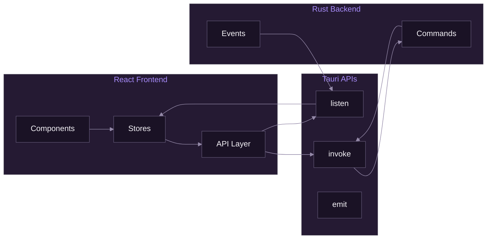

# Tauri Integration

[Documentation](../README.md) > [Frontend](./README.md) > Tauri Integration

---

This document covers how the React frontend integrates with the Tauri backend, including IPC communication, event handling, and type safety.

---

## Overview

The frontend communicates with the Rust backend through Tauri's IPC system:



*IPC communication flow between frontend and backend.*

---

## Tauri API Package

Install the Tauri API package:

```bash
pnpm add @tauri-apps/api
```

### Core Imports

```typescript
// Command invocation
import { invoke } from '@tauri-apps/api/core';

// Event handling
import { listen, emit } from '@tauri-apps/api/event';

// Window management
import { getCurrentWindow } from '@tauri-apps/api/window';

// File dialogs
import { open, save } from '@tauri-apps/plugin-dialog';

// Clipboard
import { writeText, readText } from '@tauri-apps/plugin-clipboard-manager';
```

---

## Command Invocation

### Basic invoke

```typescript
import { invoke } from '@tauri-apps/api/core';

// Simple command
const profiles = await invoke<string[]>('get_all_profiles');

// Command with parameters
const profile = await invoke<Profile>('load_profile', {
  name: 'gaming',
  password: null,
});
```

### Type-Safe API Wrapper

Create a typed API layer for better developer experience:

```typescript
// src-frontend/lib/api.ts
import { invoke } from '@tauri-apps/api/core';
import type {
  Profile,
  OutputGroup,
  Settings,
  EncoderInfo,
  StreamStats,
} from '@/types';

export const api = {
  // Profile commands
  profile: {
    getAll: () => invoke<string[]>('get_all_profiles'),

    load: (name: string, password?: string) =>
      invoke<Profile>('load_profile', { name, password: password ?? null }),

    save: (profile: Profile, password?: string) =>
      invoke<void>('save_profile', { profile, password: password ?? null }),

    delete: (name: string) =>
      invoke<void>('delete_profile', { name }),

    isEncrypted: (name: string) =>
      invoke<boolean>('is_profile_encrypted', { name }),
  },

  // Stream commands
  stream: {
    start: (group: OutputGroup, incomingUrl: string) =>
      invoke<number>('start_stream', { group, incomingUrl }),

    stop: (groupId: string) =>
      invoke<void>('stop_stream', { groupId }),

    stopAll: () =>
      invoke<void>('stop_all_streams'),

    getActiveCount: () =>
      invoke<number>('get_active_stream_count'),

    isGroupStreaming: (groupId: string) =>
      invoke<boolean>('is_group_streaming', { groupId }),
  },

  // System commands
  system: {
    getVideoEncoders: () =>
      invoke<EncoderInfo[]>('get_video_encoders'),

    getSettings: () =>
      invoke<Settings>('get_settings'),

    saveSettings: (settings: Settings) =>
      invoke<void>('save_settings', { settings }),

    getTheme: () =>
      invoke<string>('get_theme'),

    setTheme: (theme: string) =>
      invoke<void>('set_theme', { theme }),
  },
};
```

### Using the API

```typescript
// In a Zustand store
import { api } from '@/lib/api';

export const useProfileStore = create<ProfileState>((set) => ({
  profiles: [],
  current: null,
  loading: false,

  loadProfiles: async () => {
    set({ loading: true });
    const profiles = await api.profile.getAll();
    set({ profiles, loading: false });
  },

  loadProfile: async (name, password) => {
    set({ loading: true });
    try {
      const profile = await api.profile.load(name, password);
      set({ current: profile, loading: false });
    } catch (error) {
      set({ loading: false });
      throw error;
    }
  },
}));
```

---

## Event Handling

### Listening to Events

```typescript
import { listen, UnlistenFn } from '@tauri-apps/api/event';

// Listen for stream statistics
const unlisten = await listen<StreamStats>('stream_stats', (event) => {
  console.log('Stats:', event.payload);
});

// Clean up when done
unlisten();
```

### React Hook for Events

```typescript
// src-frontend/hooks/useTauriEvent.ts
import { useEffect } from 'react';
import { listen, UnlistenFn } from '@tauri-apps/api/event';

export function useTauriEvent<T>(
  event: string,
  handler: (payload: T) => void
) {
  useEffect(() => {
    let unlisten: UnlistenFn | undefined;

    listen<T>(event, (e) => handler(e.payload))
      .then((fn) => {
        unlisten = fn;
      });

    return () => {
      unlisten?.();
    };
  }, [event, handler]);
}
```

### Using the Hook

```typescript
// In a component
import { useTauriEvent } from '@/hooks/useTauriEvent';
import { useStreamStore } from '@/stores/streamStore';

function StreamMonitor() {
  const updateStats = useStreamStore((s) => s.updateStats);

  useTauriEvent<StreamStats>('stream_stats', (stats) => {
    updateStats(stats);
  });

  useTauriEvent<string>('stream_ended', (groupId) => {
    console.log(`Stream ${groupId} ended`);
  });

  useTauriEvent<StreamError>('stream_error', (error) => {
    toast.error(`Stream error: ${error.message}`);
  });

  return <StatsDisplay />;
}
```

### Event Types

```typescript
// src-frontend/types/events.ts
export interface StreamStats {
  groupId: string;
  frame: number;
  fps: number;
  bitrate: number;
  speed: number;
  size: number;
  time: number;
  droppedFrames: number;
  dupFrames: number;
}

export interface StreamError {
  groupId: string;
  message: string;
  code?: number;
}

export type TauriEvent =
  | { type: 'stream_stats'; payload: StreamStats }
  | { type: 'stream_ended'; payload: string }
  | { type: 'stream_error'; payload: StreamError }
  | { type: 'ffmpeg_download_progress'; payload: number };
```

---

## Store Integration

### Pattern: Store with Tauri

```typescript
// src-frontend/stores/streamStore.ts
import { create } from 'zustand';
import { listen } from '@tauri-apps/api/event';
import { api } from '@/lib/api';
import type { OutputGroup, StreamStats } from '@/types';

interface StreamState {
  // State
  activeStreams: Map<string, number>; // groupId -> pid
  stats: Map<string, StreamStats>;
  isStreaming: boolean;

  // Actions
  startStream: (group: OutputGroup, incomingUrl: string) => Promise<void>;
  stopStream: (groupId: string) => Promise<void>;
  stopAllStreams: () => Promise<void>;
  updateStats: (stats: StreamStats) => void;

  // Event setup
  initEventListeners: () => Promise<() => void>;
}

export const useStreamStore = create<StreamState>((set, get) => ({
  activeStreams: new Map(),
  stats: new Map(),
  isStreaming: false,

  startStream: async (group, incomingUrl) => {
    const pid = await api.stream.start(group, incomingUrl);

    set((state) => {
      const activeStreams = new Map(state.activeStreams);
      activeStreams.set(group.id, pid);
      return { activeStreams, isStreaming: true };
    });
  },

  stopStream: async (groupId) => {
    await api.stream.stop(groupId);

    set((state) => {
      const activeStreams = new Map(state.activeStreams);
      activeStreams.delete(groupId);
      return {
        activeStreams,
        isStreaming: activeStreams.size > 0,
      };
    });
  },

  stopAllStreams: async () => {
    await api.stream.stopAll();
    set({ activeStreams: new Map(), stats: new Map(), isStreaming: false });
  },

  updateStats: (stats) => {
    set((state) => {
      const newStats = new Map(state.stats);
      newStats.set(stats.groupId, stats);
      return { stats: newStats };
    });
  },

  initEventListeners: async () => {
    const unlistenStats = await listen<StreamStats>('stream_stats', (e) => {
      get().updateStats(e.payload);
    });

    const unlistenEnded = await listen<string>('stream_ended', (e) => {
      set((state) => {
        const activeStreams = new Map(state.activeStreams);
        activeStreams.delete(e.payload);
        return {
          activeStreams,
          isStreaming: activeStreams.size > 0,
        };
      });
    });

    // Return cleanup function
    return () => {
      unlistenStats();
      unlistenEnded();
    };
  },
}));
```

### Initializing Event Listeners

```typescript
// src-frontend/App.tsx
import { useEffect } from 'react';
import { useStreamStore } from '@/stores/streamStore';

function App() {
  const initEventListeners = useStreamStore((s) => s.initEventListeners);

  useEffect(() => {
    let cleanup: (() => void) | undefined;

    initEventListeners().then((fn) => {
      cleanup = fn;
    });

    return () => {
      cleanup?.();
    };
  }, [initEventListeners]);

  return <AppShell />;
}
```

---

## Window Management

### Get Current Window

```typescript
import { getCurrentWindow } from '@tauri-apps/api/window';

const appWindow = getCurrentWindow();

// Minimize
await appWindow.minimize();

// Maximize/restore
if (await appWindow.isMaximized()) {
  await appWindow.unmaximize();
} else {
  await appWindow.maximize();
}

// Close
await appWindow.close();
```

### Window Events

```typescript
import { getCurrentWindow } from '@tauri-apps/api/window';

const appWindow = getCurrentWindow();

// Listen for close request
await appWindow.onCloseRequested(async (event) => {
  const confirmed = await confirm('Are you sure you want to quit?');
  if (!confirmed) {
    event.preventDefault();
  }
});
```

---

## Dialogs

### File Open Dialog

```typescript
import { open } from '@tauri-apps/plugin-dialog';

async function selectProfile() {
  const selected = await open({
    multiple: false,
    filters: [{
      name: 'Profile',
      extensions: ['json', 'enc']
    }]
  });

  if (selected) {
    console.log('Selected:', selected);
  }
}
```

### Save Dialog

```typescript
import { save } from '@tauri-apps/plugin-dialog';

async function exportProfile() {
  const path = await save({
    defaultPath: 'profile.json',
    filters: [{
      name: 'JSON',
      extensions: ['json']
    }]
  });

  if (path) {
    await api.profile.export(path);
  }
}
```

### Folder Selection

```typescript
import { open } from '@tauri-apps/plugin-dialog';

async function selectFolder() {
  const folder = await open({
    directory: true,
    multiple: false,
  });

  if (folder) {
    console.log('Selected folder:', folder);
  }
}
```

---

## Clipboard

```typescript
import {
  writeText,
  readText,
} from '@tauri-apps/plugin-clipboard-manager';

// Copy to clipboard
async function copyStreamKey(key: string) {
  await writeText(key);
  toast.success('Stream key copied to clipboard');
}

// Read from clipboard
async function pasteStreamKey() {
  const text = await readText();
  return text;
}
```

---

## Type Safety

### Shared Types

Keep TypeScript types in sync with Rust structs:

```typescript
// src-frontend/types/models.ts
export interface Profile {
  id: string;
  name: string;
  incomingUrl: string;
  outputGroups: OutputGroup[];
}

export interface OutputGroup {
  id: string;
  name: string;
  video: VideoSettings;
  audio: AudioSettings;
  container: ContainerSettings;
  streamTargets: StreamTarget[];
}

export interface VideoSettings {
  codec: string;
  width: number;
  height: number;
  bitrate: number;
  fps: number;
  preset?: string;
  profile?: string;
  keyframeInterval?: number;
}

export interface AudioSettings {
  codec: string;
  bitrate: number;
  sampleRate: number;
  channels: number;
}

export interface StreamTarget {
  id: string;
  platform: string;
  name: string;
  url: string;
  streamKey: string;
}
```

### Generic invoke Wrapper

```typescript
// Type-safe invoke with validation
async function safeInvoke<T>(
  command: string,
  args?: Record<string, unknown>
): Promise<T> {
  try {
    return await invoke<T>(command, args);
  } catch (error) {
    console.error(`Command ${command} failed:`, error);
    throw new Error(String(error));
  }
}
```

---

## Error Handling

### Try-Catch Pattern

```typescript
async function loadProfile(name: string) {
  try {
    const profile = await api.profile.load(name);
    return profile;
  } catch (error) {
    if (String(error).includes('Password required')) {
      // Show password dialog
      const password = await promptPassword();
      return api.profile.load(name, password);
    }
    throw error;
  }
}
```

### Error Boundary Integration

```typescript
// Custom hook with error handling
function useProfile(name: string) {
  const [profile, setProfile] = useState<Profile | null>(null);
  const [error, setError] = useState<string | null>(null);
  const [loading, setLoading] = useState(true);

  useEffect(() => {
    api.profile.load(name)
      .then(setProfile)
      .catch((e) => setError(String(e)))
      .finally(() => setLoading(false));
  }, [name]);

  return { profile, error, loading };
}
```

---

## Development vs Production

### Checking Environment

```typescript
// Check if running in Tauri
const isTauri = '__TAURI__' in window;

// Mock API for web development
const api = isTauri
  ? realTauriApi
  : mockApi;
```

### Development Mocks

```typescript
// src-frontend/lib/api.mock.ts
export const mockApi = {
  profile: {
    getAll: async () => ['gaming', 'podcast'],
    load: async (name: string) => ({
      id: '1',
      name,
      incomingUrl: 'rtmp://localhost:1935/live',
      outputGroups: [],
    }),
    save: async () => {},
    delete: async () => {},
  },
  // ... other mocks
};
```

---

## Best Practices

### Do

1. Use typed API wrappers
2. Clean up event listeners
3. Handle errors at store level
4. Initialize listeners in App component
5. Use Tauri plugins for system features

### Don't

1. Call invoke directly in components
2. Forget to unlisten events
3. Ignore TypeScript types
4. Block UI during long operations
5. Store sensitive data in frontend state

---

**Related:** [React Architecture](./01-react-architecture.md) | [State Management](./02-state-management.md) | [Commands API](../05-api-reference/01-commands-api.md)

