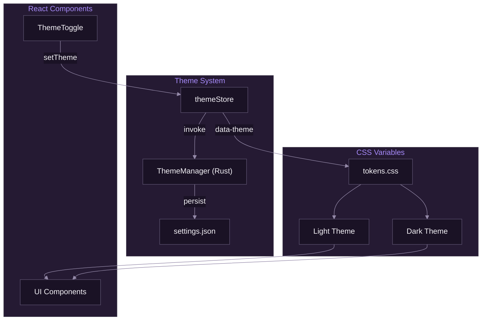

# Theming and i18n

[Documentation](../README.md) > [Frontend](./README.md) > Theming and i18n

---

This document covers SpiritStream's theming system and internationalization (i18n) implementation. It explains how to customize the UI appearance and add new language translations.

---

## Theming Overview

SpiritStream uses CSS custom properties (variables) for theming, enabling runtime theme switching without rebuilding.



*Theme system architecture showing state flow and CSS variable application.*

---

## CSS Variables

### Token Definition

```css
/* apps/web/src/styles/tokens.css */
:root {
  /* Primary Colors */
  --primary: #7C3AED;
  --primary-hover: #6D28D9;
  --primary-subtle: #EDE9FE;
  --primary-muted: #F5F3FF;

  /* Secondary Colors */
  --secondary: #C026D3;
  --secondary-hover: #A21CAF;

  /* Accent Colors */
  --accent: #DB2777;
  --accent-hover: #BE185D;

  /* Backgrounds */
  --bg-base: #FAFAFA;
  --bg-surface: #FFFFFF;
  --bg-elevated: #FFFFFF;
  --bg-muted: #F4F2F7;
  --bg-sunken: #EFECF3;

  /* Text */
  --text-primary: #1F1A29;
  --text-secondary: #5E5472;
  --text-tertiary: #756A8A;
  --text-muted: #9489A8;

  /* Borders */
  --border-default: #E9E5EF;
  --border-muted: #F4F2F7;
  --border-strong: #D8D1E2;
  --border-interactive: #7C3AED;

  /* Shadows */
  --shadow-sm: 0 1px 3px rgba(31, 26, 41, 0.08);
  --shadow-md: 0 4px 6px rgba(31, 26, 41, 0.1);
  --shadow-lg: 0 10px 20px rgba(31, 26, 41, 0.12);

  /* Status Colors */
  --status-live: #10B981;
  --status-live-bg: #ECFDF5;
  --status-offline: #9489A8;
  --status-offline-bg: #F4F2F7;
  --status-error: #EF4444;
  --status-error-bg: #FEF2F2;
}
```

### Dark Theme Override

```css
[data-theme="dark"] {
  /* Primary Colors */
  --primary: #A78BFA;
  --primary-hover: #C4B5FD;
  --primary-subtle: #2E1A4A;
  --primary-muted: #1E1433;

  /* Secondary Colors */
  --secondary: #E879F9;
  --secondary-hover: #F0ABFC;

  /* Accent Colors */
  --accent: #F472B6;
  --accent-hover: #F9A8D4;

  /* Backgrounds */
  --bg-base: #0F0A14;
  --bg-surface: #1A1225;
  --bg-elevated: #251A33;
  --bg-muted: #1A1225;
  --bg-sunken: #0A0710;

  /* Text */
  --text-primary: #F4F2F7;
  --text-secondary: #D8D1E2;
  --text-tertiary: #B8AECA;
  --text-muted: #9489A8;

  /* Borders */
  --border-default: #3D3649;
  --border-muted: #2D2838;
  --border-strong: #5E5472;
  --border-interactive: #A78BFA;

  /* Shadows */
  --shadow-sm: 0 1px 3px rgba(0, 0, 0, 0.4);
  --shadow-md: 0 4px 6px rgba(0, 0, 0, 0.5);
  --shadow-lg: 0 10px 20px rgba(0, 0, 0, 0.5);

  /* Status Colors */
  --status-live: #34D399;
  --status-live-bg: #052E16;
  --status-offline: #756A8A;
  --status-offline-bg: #1A1225;
  --status-error: #F87171;
  --status-error-bg: #450A0A;
}
```

---

## Theme Store

```typescript
// apps/web/src/stores/themeStore.ts
import { create } from 'zustand';
import { invoke } from '@tauri-apps/api/core';

type Theme = 'light' | 'dark' | 'system';

interface ThemeState {
  theme: Theme;
  resolved: 'light' | 'dark';
  setTheme: (theme: Theme) => Promise<void>;
  toggleTheme: () => void;
  initTheme: () => Promise<void>;
}

export const useThemeStore = create<ThemeState>((set, get) => ({
  theme: 'system',
  resolved: 'light',

  setTheme: async (theme) => {
    // Save to backend
    await invoke('set_theme', { theme });

    // Resolve system preference
    const resolved = theme === 'system'
      ? (window.matchMedia('(prefers-color-scheme: dark)').matches ? 'dark' : 'light')
      : theme;

    // Apply to DOM
    document.documentElement.setAttribute('data-theme', resolved);

    set({ theme, resolved });
  },

  toggleTheme: () => {
    const { resolved, setTheme } = get();
    setTheme(resolved === 'light' ? 'dark' : 'light');
  },

  initTheme: async () => {
    const theme = await invoke<string>('get_theme') as Theme;
    get().setTheme(theme);
  },
}));
```

---

## Theme Toggle Component

```typescript
// apps/web/src/components/settings/ThemeToggle.tsx
import { useThemeStore } from '@/stores/themeStore';
import { Sun, Moon, Monitor } from 'lucide-react';

export function ThemeToggle() {
  const { theme, setTheme } = useThemeStore();

  return (
    <div className="flex items-center gap-2 p-1 bg-muted rounded-lg">
      <ThemeButton
        icon={<Sun className="w-4 h-4" />}
        active={theme === 'light'}
        onClick={() => setTheme('light')}
        label="Light"
      />
      <ThemeButton
        icon={<Monitor className="w-4 h-4" />}
        active={theme === 'system'}
        onClick={() => setTheme('system')}
        label="System"
      />
      <ThemeButton
        icon={<Moon className="w-4 h-4" />}
        active={theme === 'dark'}
        onClick={() => setTheme('dark')}
        label="Dark"
      />
    </div>
  );
}

function ThemeButton({ icon, active, onClick, label }) {
  return (
    <button
      onClick={onClick}
      className={cn(
        'p-2 rounded-md transition-colors',
        active
          ? 'bg-surface text-primary shadow-sm'
          : 'text-muted hover:text-primary'
      )}
      title={label}
    >
      {icon}
    </button>
  );
}
```

---

## Using Theme Variables

### In Components

```typescript
<div className="bg-surface border-default text-primary">
  <h1 className="text-primary">Heading</h1>
  <p className="text-secondary">Description</p>
</div>
```

### In CSS

```css
.custom-component {
  background: var(--bg-surface);
  border: 1px solid var(--border-default);
  color: var(--text-primary);
}

.custom-component:hover {
  border-color: var(--border-interactive);
}
```

---

## Internationalization (i18n)

### Overview

SpiritStream uses a custom i18n system with JSON translation files.

```
apps/web/src/
├── locales/
│   ├── en.json      # English (default)
│   ├── es.json      # Spanish
│   ├── de.json      # German
│   └── ja.json      # Japanese
├── stores/
│   └── languageStore.ts
└── hooks/
    └── useTranslation.ts
```

---

## Translation Files

### English (en.json)

```json
{
  "app": {
    "name": "SpiritStream",
    "tagline": "Multi-destination streaming"
  },
  "nav": {
    "dashboard": "Dashboard",
    "profiles": "Profiles",
    "streams": "Stream Manager",
    "encoder": "Encoder Settings",
    "outputs": "Output Groups",
    "targets": "Stream Targets",
    "logs": "Logs",
    "settings": "Settings"
  },
  "dashboard": {
    "title": "Dashboard",
    "activeStreams": "Active Streams",
    "totalBitrate": "Total Bitrate",
    "droppedFrames": "Dropped Frames",
    "uptime": "Uptime",
    "quickActions": "Quick Actions",
    "newProfile": "New Profile",
    "importProfile": "Import Profile",
    "addTarget": "Add Target",
    "testStream": "Test Stream"
  },
  "stream": {
    "start": "Start Stream",
    "stop": "Stop Stream",
    "live": "Live",
    "offline": "Offline",
    "connecting": "Connecting",
    "error": "Error"
  },
  "common": {
    "save": "Save",
    "cancel": "Cancel",
    "delete": "Delete",
    "edit": "Edit",
    "duplicate": "Duplicate",
    "close": "Close"
  }
}
```

### Spanish (es.json)

```json
{
  "app": {
    "name": "SpiritStream",
    "tagline": "Transmisión multi-destino"
  },
  "nav": {
    "dashboard": "Panel",
    "profiles": "Perfiles",
    "streams": "Gestor de Streams",
    "encoder": "Configuración de Codificador",
    "outputs": "Grupos de Salida",
    "targets": "Destinos de Stream",
    "logs": "Registros",
    "settings": "Configuración"
  },
  "dashboard": {
    "title": "Panel",
    "activeStreams": "Streams Activos",
    "totalBitrate": "Bitrate Total",
    "droppedFrames": "Frames Perdidos",
    "uptime": "Tiempo Activo"
  },
  "stream": {
    "start": "Iniciar Stream",
    "stop": "Detener Stream",
    "live": "En Vivo",
    "offline": "Desconectado"
  },
  "common": {
    "save": "Guardar",
    "cancel": "Cancelar",
    "delete": "Eliminar",
    "edit": "Editar"
  }
}
```

---

## Language Store

```typescript
// apps/web/src/stores/languageStore.ts
import { create } from 'zustand';
import { invoke } from '@tauri-apps/api/core';

// Import all locale files
import en from '@/locales/en.json';
import es from '@/locales/es.json';
import de from '@/locales/de.json';

const locales = { en, es, de };

interface LanguageState {
  language: string;
  translations: Record<string, any>;
  setLanguage: (lang: string) => Promise<void>;
  t: (key: string, params?: Record<string, string>) => string;
  initLanguage: () => Promise<void>;
}

export const useLanguageStore = create<LanguageState>((set, get) => ({
  language: 'en',
  translations: en,

  setLanguage: async (lang) => {
    if (locales[lang]) {
      await invoke('set_setting', { key: 'language', value: lang });
      set({ language: lang, translations: locales[lang] });
    }
  },

  t: (key, params) => {
    const { translations } = get();
    const keys = key.split('.');
    let value = translations;

    for (const k of keys) {
      value = value?.[k];
      if (value === undefined) return key;
    }

    if (typeof value !== 'string') return key;

    // Replace parameters
    if (params) {
      return value.replace(/\{(\w+)\}/g, (_, k) => params[k] ?? `{${k}}`);
    }

    return value;
  },

  initLanguage: async () => {
    const lang = await invoke<string>('get_setting', { key: 'language' });
    if (locales[lang]) {
      set({ language: lang, translations: locales[lang] });
    }
  },
}));
```

---

## Translation Hook

```typescript
// apps/web/src/hooks/useTranslation.ts
import { useLanguageStore } from '@/stores/languageStore';

export function useTranslation() {
  const { t, language } = useLanguageStore();
  return { t, language };
}

// Usage in components
function Dashboard() {
  const { t } = useTranslation();

  return (
    <div>
      <h1>{t('dashboard.title')}</h1>
      <StatBox label={t('dashboard.activeStreams')} value={3} />
    </div>
  );
}
```

---

## Adding a New Language

1. **Create translation file:**

```json
// apps/web/src/locales/fr.json
{
  "app": {
    "name": "SpiritStream",
    "tagline": "Streaming multi-destination"
  },
  "nav": {
    "dashboard": "Tableau de bord",
    "profiles": "Profils"
  }
}
```

2. **Import in language store:**

```typescript
import fr from '@/locales/fr.json';

const locales = { en, es, de, fr };
```

3. **Add to settings UI:**

```typescript
const languages = [
  { value: 'en', label: 'English' },
  { value: 'es', label: 'Español' },
  { value: 'de', label: 'Deutsch' },
  { value: 'fr', label: 'Français' },
];
```

---

## Parameter Interpolation

Use `{param}` syntax for dynamic values:

```json
{
  "stream": {
    "viewers": "{count} viewers",
    "bitrate": "{value} kbps"
  }
}
```

```typescript
t('stream.viewers', { count: '1,234' })
// "1,234 viewers"

t('stream.bitrate', { value: '6000' })
// "6000 kbps"
```

---

## Best Practices

### Theming

1. Always use CSS variables, never hardcoded colors
2. Test both light and dark modes
3. Ensure sufficient contrast ratios (WCAG AA)
4. Use semantic variable names (`--text-primary` not `--black`)

### i18n

1. Keep translation keys organized hierarchically
2. Use descriptive key names (`dashboard.activeStreams`)
3. Provide context comments for translators
4. Handle pluralization properly
5. Test with longer text (German is ~30% longer than English)

---

## Production Build: CSP Configuration

### The Problem

The theme system dynamically injects CSS via JavaScript to apply theme tokens. This works in development but can fail in production builds due to Tauri's automatic Content Security Policy (CSP) modifications.

### Why It Happens

Tauri automatically injects nonces and hashes into the CSP at compile time for `<script>` and `<style>` tags. Even if you add `'unsafe-inline'` to `style-src`, Tauri's nonce injection can override it, blocking dynamically created `<style>` elements.

### The Fix

Add `dangerousDisableAssetCspModification` to prevent Tauri from modifying the `style-src` directive:

```json
// apps/desktop/src-tauri/tauri.conf.json
{
  "app": {
    "security": {
      "csp": "... style-src 'self' 'unsafe-inline' ...",
      "devCsp": "...",
      "dangerousDisableAssetCspModification": ["style-src"]
    }
  }
}
```

### Why This Is Safe

This configuration is safe for SpiritStream because:
- Theme CSS is injected from our own backend (embedded or file-based themes)
- We don't allow arbitrary user CSS injection
- Only the `style-src` directive is affected; script security remains intact

### Symptoms of Missing This Fix

- Themes work in `pnpm dev` but not in production builds
- Theme selection changes but colors don't update
- No visible errors (CSP violations may only appear in browser DevTools)

---

**Related:** [React Architecture](./01-react-architecture.md) | [Component Library](./03-component-library.md) | [State Management](./02-state-management.md)

