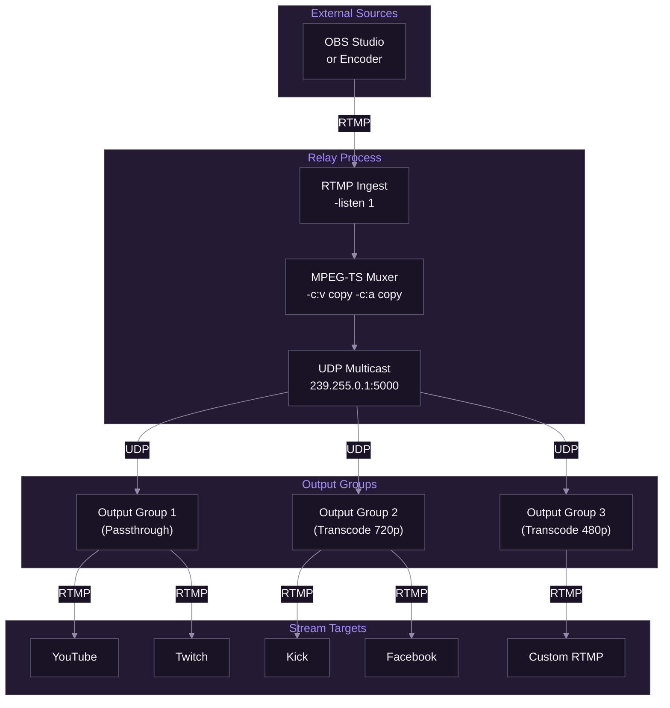
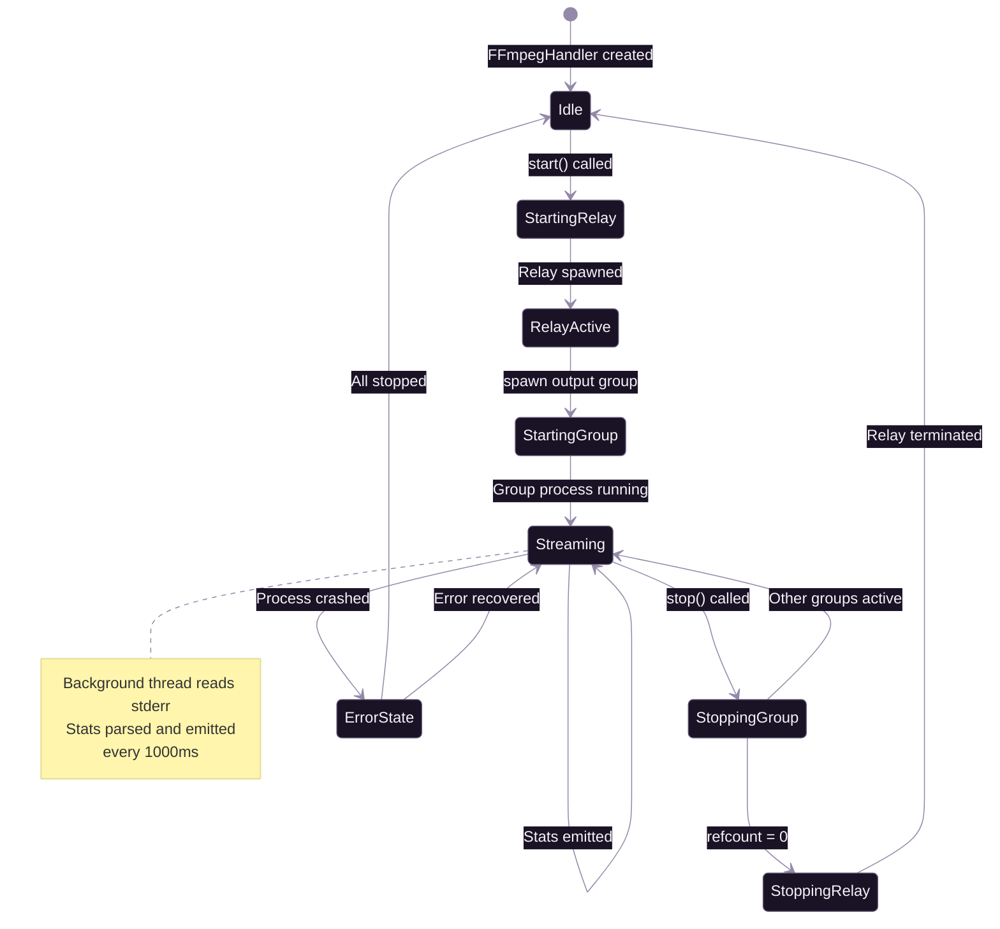
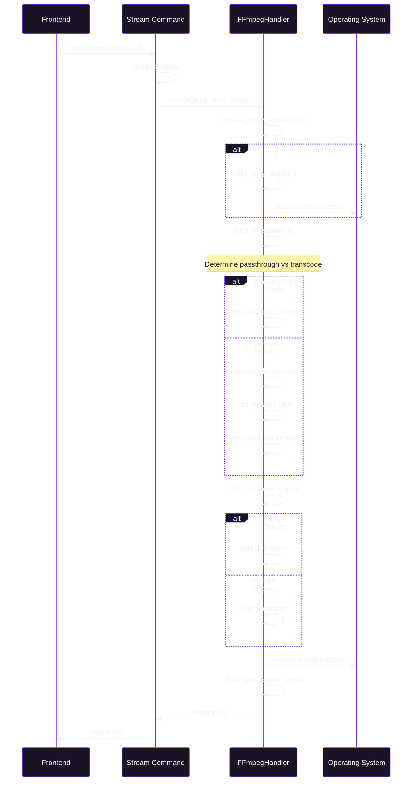
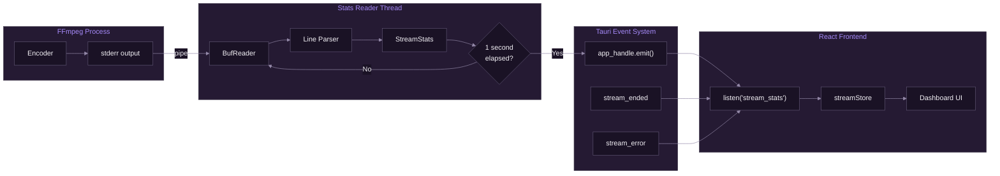

# FFmpeg Integration

[Documentation](../README.md) > [Streaming](./README.md) > FFmpeg Integration

---

FFmpeg serves as the core media processing engine in SpiritStream, handling all stream encoding, transcoding, and delivery operations. This document covers the relay-based multi-destination streaming system, process lifecycle management, command construction, and real-time statistics monitoring.

---

## Introduction

The FFmpeg integration architecture must address several key challenges:

- Supporting simultaneous output to multiple destinations with potentially different encoding requirements
- Maintaining reliability during extended streaming sessions
- Providing real-time feedback on stream health
- Enabling dynamic control over individual targets without disrupting other streams

**This document covers:**

1. The UDP multicast relay architecture enabling shared ingest
2. Process lifecycle management with reference counting
3. FFmpeg command construction algorithms
4. Real-time statistics extraction and event emission
5. Error handling and recovery patterns

---

## Relay Architecture

### Design Rationale

SpiritStream employs a shared relay architecture rather than direct input-to-output connections. This design enables:

- **Independent Output Groups**: Each output group runs as a separate FFmpeg process, allowing individual groups to be started, stopped, or restarted without affecting others
- **Single Ingest Point**: The relay accepts one incoming RTMP stream and multicasts it via UDP, eliminating redundant network connections
- **Dynamic Target Management**: Individual stream targets can be enabled or disabled by restarting only their parent output group

### Multicast Configuration

The relay uses UDP multicast for inter-process communication:

```rust
// Relay output to multicast group
const RELAY_UDP_OUT: &'static str = "udp://239.255.0.1:5000?ttl=1&pkt_size=1316";

// Output group input from multicast
const RELAY_UDP_IN: &'static str =
    "udp://@239.255.0.1:5000?reuse=1&fifo_size=20000&overrun_nonfatal=1";
```

| Parameter | Value | Purpose |
|-----------|-------|---------|
| `ttl` | 1 | Limits multicast to local machine |
| `pkt_size` | 1316 | MPEG-TS packet alignment |
| `reuse` | 1 | Allows multiple readers |
| `fifo_size` | 20000 | Buffer for burst tolerance |
| `overrun_nonfatal` | 1 | Continues on buffer overflow |

### Architecture Diagram



*FFmpeg relay architecture showing shared ingest with UDP multicast distribution to independent output groups.*

### Relay Process Management

The relay process is managed with atomic reference counting:

```rust
pub struct FFmpegHandler {
    relay: Arc<Mutex<Option<RelayProcess>>>,
    relay_refcount: Arc<AtomicUsize>,
    // ...
}
```

1. **Relay Startup**: First output group start triggers relay creation
2. **Reference Counting**: Each active group increments the counter
3. **Relay Shutdown**: Counter reaching zero terminates the relay

---

## Process Lifecycle Management

### State Machine



*Process lifecycle state machine showing relay and output group management with error handling transitions.*

### Process Information Tracking

Each active stream is tracked with metadata:

```rust
struct ProcessInfo {
    child: Child,           // OS process handle
    start_time: Instant,    // For uptime calculation
    group_id: String,       // Output group identifier
}
```

The handler maintains thread-safe collections:

| Field | Type | Purpose |
|-------|------|---------|
| `processes` | `Arc<Mutex<HashMap<String, ProcessInfo>>>` | Active output groups |
| `stopping_groups` | `Arc<Mutex<HashSet<String>>>` | Groups being stopped |
| `disabled_targets` | `Arc<Mutex<HashSet<String>>>` | Toggled-off targets |

### Graceful Termination

The `stop_child` method implements graceful shutdown:

```rust
fn stop_child(&self, child: &mut Child) {
    // 1. Send 'q' keystroke to FFmpeg stdin
    if let Some(stdin) = child.stdin.as_mut() {
        let _ = stdin.write_all(b"q\n");
        let _ = stdin.flush();
    }

    // 2. Wait up to 2 seconds for graceful exit
    let start = Instant::now();
    while start.elapsed() < Duration::from_secs(2) {
        if let Ok(Some(_)) = child.try_wait() {
            return;
        }
        thread::sleep(Duration::from_millis(100));
    }

    // 3. Force kill if unresponsive
    let _ = child.kill();
    let _ = child.wait();
}
```

This approach:
1. Allows FFmpeg to finalize output files properly
2. Ensures FLV container trailers are written
3. Prevents data corruption on RTMP connections

---

## Command Construction

### Build Process Flow



*Command construction sequence showing input validation, relay management, and conditional argument building based on encoding mode.*

### Passthrough vs Transcoding

The handler determines mode based on codec settings:

```rust
let use_stream_copy = group.video.codec.eq_ignore_ascii_case("copy")
    && group.audio.codec.eq_ignore_ascii_case("copy");

if use_stream_copy {
    args.push("-c:v".to_string()); args.push("copy".to_string());
    args.push("-c:a".to_string()); args.push("copy".to_string());
} else {
    // Full encoding pipeline with resolution, bitrate, etc.
}
```

| Mode | CPU Usage | Latency | Use Case |
|------|-----------|---------|----------|
| Passthrough | Minimal | ~100ms | Same quality to all targets |
| Transcode | High | ~500ms+ | Different qualities per target |

### Hardware Acceleration

Preset mapping supports multiple hardware encoders:

| Encoder | Preset Parameter | Quality Value |
|---------|-----------------|---------------|
| libx264 | `-preset` | ultrafast to veryslow |
| NVENC | `-preset` | ultrafast to veryslow |
| QuickSync | `-preset` | ultrafast to veryslow |
| AMF | `-quality`, `-usage` | speed/balanced/quality |

```rust
// AMF encoder uses different parameters
if encoder.contains("amf") {
    match preset.as_str() {
        "quality" => amf_quality = Some("quality"),
        "low_latency" => {
            amf_quality = Some("speed");
            amf_usage = Some("lowlatency");
        }
        // ...
    }
}
```

### Multi-Output Tee Muxer

For multiple targets, FFmpeg's tee muxer enables single-encode multi-output:

```rust
if outputs.len() > 1 {
    let tee_outputs = outputs
        .iter()
        .map(|output| format!("[f={}:onfail=ignore]{output}", group.container.format))
        .collect::<Vec<_>>()
        .join("|");
    args.push("-f".to_string());
    args.push("tee".to_string());
    args.push(tee_outputs);
}
```

The `onfail=ignore` parameter ensures one target failure doesn't terminate others.

### Stream Key Resolution

Stream keys support environment variable syntax for security:

```rust
fn resolve_stream_key(key: &str) -> String {
    if key.starts_with("${") && key.ends_with("}") && key.len() > 3 {
        let var_name = &key[2..key.len()-1];
        match std::env::var(var_name) {
            Ok(value) => value,
            Err(_) => key.to_string()
        }
    } else {
        key.to_string()
    }
}
```

Example configuration:
```json
{
  "streamKey": "${TWITCH_STREAM_KEY}"
}
```

---

## Real-Time Statistics

### Statistics Data Model

```rust
pub struct StreamStats {
    pub group_id: String,      // Output group identifier
    pub frame: u64,            // Current frame number
    pub fps: f64,              // Frames per second
    pub bitrate: f64,          // Current bitrate (kbps)
    pub speed: f64,            // Encoding speed (1.0x = real-time)
    pub size: u64,             // Total bytes written
    pub time: f64,             // Elapsed time (seconds)
    pub dropped_frames: u64,   // Number of dropped frames
    pub dup_frames: u64,       // Number of duplicate frames
}
```

### Event Flow



*Real-time statistics flow from FFmpeg stderr through parsing, throttled emission, and frontend consumption via Tauri events.*

### Parsing Algorithm

FFmpeg outputs progress lines in this format:
```
frame= 1234 fps= 60 q=28.0 size=   12345kB time=00:01:23.45 bitrate=1234.5kbits/s speed=1.0x
```

The parser extracts values using key-based search:

```rust
fn extract_value(line: &str, key: &str) -> Option<String> {
    let start = line.find(key)?;
    let value_start = start + key.len();
    let rest = &line[value_start..];
    let end = rest.find(|c: char| c.is_whitespace()).unwrap_or(rest.len());
    Some(rest[..end].trim().to_string())
}
```

### Emission Throttling

Statistics are emitted at most once per second to prevent frontend overload:

```rust
let emit_interval = Duration::from_millis(1000);
let mut last_emit = Instant::now();

if last_emit.elapsed() >= emit_interval {
    let _ = app_handle.emit("stream_stats", stats.clone());
    last_emit = Instant::now();
}
```

---

## Error Handling

### Error Categories

| Category | Detection | Response |
|----------|-----------|----------|
| Spawn Failure | `Command::spawn()` error | Return error to frontend |
| Runtime Crash | Non-zero exit code | Emit `stream_error` event |
| Input Loss | FFmpeg exit code 0 | Emit `stream_ended` event |
| Lock Poisoning | Mutex error | Log and recover |

### Crash Detection

The stats reader thread monitors process health:

```rust
let error_message = match exit_status {
    Some(status) if status.success() => None, // Clean exit
    Some(status) => {
        let code = status.code().unwrap_or(-1);
        Some(format!("FFmpeg exited with code {code}"))
    }
    None => Some("FFmpeg process terminated unexpectedly".to_string())
};

if let Some(error) = error_message {
    let _ = app_handle.emit("stream_error", serde_json::json!({
        "groupId": group_id,
        "error": error
    }));
}
```

### Security: Stream Key Redaction

All logging sanitizes RTMP URLs to prevent credential exposure:

```rust
fn sanitize_arg(&self, arg: &str) -> String {
    if !(arg.contains("rtmp://") || arg.contains("rtmps://")) {
        return arg.to_string();
    }
    // Redact stream key portion using platform-specific patterns
    self.platform_registry.redact_url(&Platform::Custom, url)
}
```

Log output example:
```
[INFO] Starting FFmpeg group main: ffmpeg -i udp://... -f flv rtmp://live.twitch.tv/app/****
```

---

## Tauri Commands Reference

### Stream Control Commands

| Command | Parameters | Return | Description |
|---------|------------|--------|-------------|
| `start_stream` | `group: OutputGroup, incoming_url: String` | `u32` (PID) | Start streaming |
| `stop_stream` | `group_id: String` | `()` | Stop specific group |
| `stop_all_streams` | None | `()` | Stop all groups |
| `get_active_stream_count` | None | `usize` | Count active groups |
| `is_group_streaming` | `group_id: String` | `bool` | Check group status |
| `get_active_group_ids` | None | `Vec<String>` | List active groups |

### Target Control Commands

| Command | Parameters | Return | Description |
|---------|------------|--------|-------------|
| `toggle_stream_target` | `target_id, enabled, group, url` | `u32` | Toggle target and restart |
| `is_target_disabled` | `target_id: String` | `bool` | Check target status |

### FFmpeg Management Commands

| Command | Parameters | Return | Description |
|---------|------------|--------|-------------|
| `download_ffmpeg` | None | `String` (path) | Download FFmpeg |
| `cancel_ffmpeg_download` | None | `()` | Cancel download |
| `get_bundled_ffmpeg_path` | None | `Option<String>` | Get FFmpeg location |
| `check_ffmpeg_update` | `installed_version: Option<String>` | `FFmpegVersionInfo` | Check for updates |

---

## Summary

SpiritStream's FFmpeg integration provides a robust foundation for multi-destination streaming through its relay-based architecture:

- The UDP multicast relay enables independent output group management while maintaining efficient resource usage
- Process lifecycle management with atomic reference counting ensures reliable startup and shutdown sequences
- The command construction system supports both passthrough and transcoding modes with hardware acceleration
- Real-time statistics monitoring provides continuous feedback on stream health
- Security considerations including stream key redaction and environment variable resolution protect user credentials

---

## Example: Complete Relay Command

```bash
ffmpeg \
  -listen 1 \
  -i rtmp://localhost:1935/live/stream \
  -c:v copy \
  -c:a copy \
  -f mpegts \
  "udp://239.255.0.1:5000?ttl=1&pkt_size=1316"
```

## Example: Output Group Command (Passthrough)

```bash
ffmpeg \
  -fflags nobuffer \
  -flags low_delay \
  -i "udp://@239.255.0.1:5000?reuse=1&fifo_size=20000&overrun_nonfatal=1" \
  -c:v copy \
  -c:a copy \
  -tag:v 7 \
  -tag:a 10 \
  -bsf:a aac_adtstoasc \
  -map 0:v \
  -map 0:a \
  -progress pipe:2 \
  -stats \
  -f tee \
  "[f=flv:onfail=ignore]rtmp://a.rtmp.youtube.com/live2/****|[f=flv:onfail=ignore]rtmp://live.twitch.tv/app/****"
```

## Example: Output Group Command (Transcoding)

```bash
ffmpeg \
  -fflags nobuffer \
  -flags low_delay \
  -i "udp://@239.255.0.1:5000?reuse=1&fifo_size=20000&overrun_nonfatal=1" \
  -c:v libx264 \
  -s 1920x1080 \
  -b:v 6000k \
  -r 60 \
  -c:a aac \
  -b:a 160k \
  -ac 2 \
  -ar 48000 \
  -preset veryfast \
  -profile:v high \
  -g 120 \
  -keyint_min 120 \
  -sc_threshold 0 \
  -force_key_frames "expr:gte(t,n_forced*2)" \
  -map 0:v \
  -map 0:a \
  -progress pipe:2 \
  -stats \
  -f flv \
  "rtmp://live.twitch.tv/app/****"
```

---

**Related:** [System Overview](../01-architecture/01-system-overview.md) | [Services Layer](../02-backend/02-services-layer.md) | [RTMP Fundamentals](./02-rtmp-fundamentals.md) | [Commands API](../05-api-reference/01-commands-api.md)
