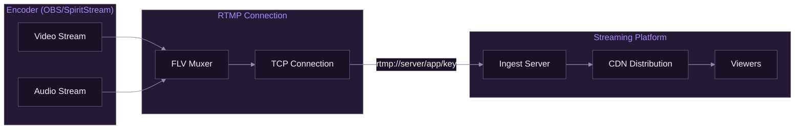
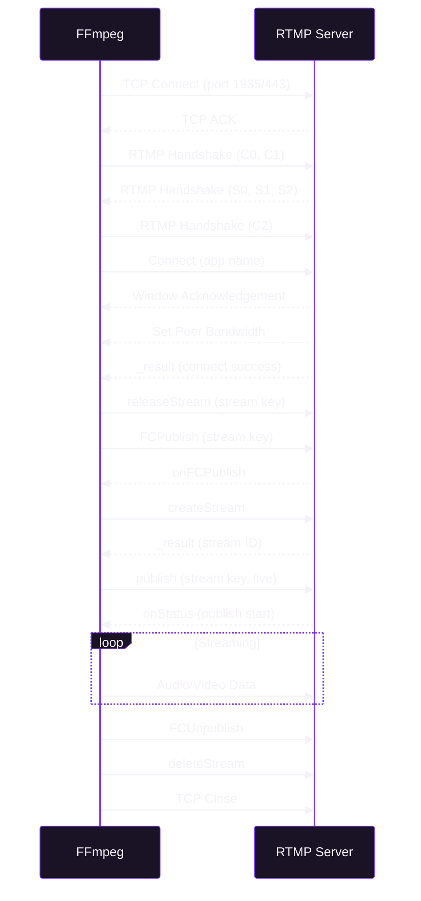

# RTMP Fundamentals

[Documentation](../README.md) > [Streaming](./README.md) > RTMP Fundamentals

---

This document explains the Real-Time Messaging Protocol (RTMP) used by SpiritStream for live streaming. It covers protocol basics, connection handling, and platform-specific requirements.

---

## Protocol Overview

RTMP (Real-Time Messaging Protocol) is the standard protocol for live video streaming to platforms like Twitch, YouTube, and Facebook.

### Key Characteristics

| Feature | Value |
|---------|-------|
| Default Port | 1935 |
| Transport | TCP |
| Latency | 2-5 seconds typical |
| Encryption | RTMPS (TLS) available |



*RTMP stream flow from encoder to viewers.*

---

## URL Structure

### RTMP URL Format

```
rtmp://[server][:port]/[application]/[stream_key]
```

| Component | Description | Example |
|-----------|-------------|---------|
| Server | Hostname or IP | `live.twitch.tv` |
| Port | TCP port (default: 1935) | `:1935` |
| Application | Server application | `app`, `live2` |
| Stream Key | Authentication token | `live_abc123...` |

### Examples

```bash
# Twitch
rtmp://live.twitch.tv/app/live_abc123def456

# YouTube
rtmp://a.rtmp.youtube.com/live2/xxxx-xxxx-xxxx-xxxx

# Kick (RTMPS)
rtmps://fa723fc1b171.global-contribute.live-video.net/app/sk_us_abc123

# Facebook (RTMPS)
rtmps://live-api-s.facebook.com:443/rtmp/FB-123456789-0
```

---

## RTMP vs RTMPS

### Security Comparison

| Protocol | Encryption | Port | Use Case |
|----------|------------|------|----------|
| RTMP | None | 1935 | Local testing, legacy |
| RTMPS | TLS 1.2+ | 443 | Production streaming |

### Platform Requirements

| Platform | Required Protocol |
|----------|-------------------|
| Twitch | RTMP or RTMPS |
| YouTube | RTMP or RTMPS |
| Kick | RTMPS only |
| Facebook | RTMPS only |

---

## Connection Lifecycle



*RTMP connection handshake and streaming sequence.*

---

## FLV Container

RTMP streams use the FLV (Flash Video) container format:

### FLV Structure

| Component | Description |
|-----------|-------------|
| Header | File signature and flags |
| Metadata | Stream information (resolution, fps) |
| Video Tags | H.264/HEVC encoded video |
| Audio Tags | AAC encoded audio |

### Tag Types

| Type | ID | Description |
|------|-----|-------------|
| Audio | 8 | Audio data packet |
| Video | 9 | Video data packet |
| Script | 18 | Metadata/commands |

---

## Stream Key Security

### Best Practices

1. **Never expose stream keys** in logs or UI
2. **Use environment variables** for storage
3. **Regenerate keys** if compromised
4. **Use RTMPS** for encrypted transmission

### SpiritStream Key Handling

```rust
// Keys are redacted in logs
fn sanitize_url(url: &str) -> String {
    // rtmp://live.twitch.tv/app/live_abc123
    // becomes
    // rtmp://live.twitch.tv/app/****
}

// Environment variable support
let key = "${TWITCH_STREAM_KEY}";  // Resolved at runtime
```

---

## Platform-Specific Details

### Twitch

| Setting | Value |
|---------|-------|
| Primary Server | `rtmp://live.twitch.tv/app` |
| Regional Servers | `rtmp://live-{region}.twitch.tv/app` |
| Key Format | `live_xxxxxxxxx_xxxxxxxxxxxx` |
| Max Bitrate | 6000 kbps (non-partner) |
| Keyframe Interval | 2 seconds required |

**Regional servers:**
- `live-iad` - US East
- `live-lax` - US West
- `live-fra` - Europe
- `live-syd` - Australia

### YouTube

| Setting | Value |
|---------|-------|
| Primary Server | `rtmp://a.rtmp.youtube.com/live2` |
| Backup Server | `rtmp://b.rtmp.youtube.com/live2` |
| Key Format | `xxxx-xxxx-xxxx-xxxx-xxxx` |
| Max Bitrate | 51000 kbps (4K) |
| Keyframe Interval | 2-4 seconds |

### Kick

| Setting | Value |
|---------|-------|
| Server | `rtmps://fa723fc1b171.global-contribute.live-video.net/app` |
| Protocol | RTMPS only |
| Key Format | `sk_{region}_xxxxx` |
| Keyframe Interval | 2 seconds |

### Facebook

| Setting | Value |
|---------|-------|
| Server | `rtmps://live-api-s.facebook.com:443/rtmp` |
| Protocol | RTMPS only |
| Key Format | `FB-{page_id}-{token}` |
| Key Expiration | Expires after each stream |

---

## Bandwidth Requirements

### Bitrate Recommendations

| Quality | Video | Audio | Total |
|---------|-------|-------|-------|
| 720p30 | 2500 kbps | 128 kbps | ~2.7 Mbps |
| 720p60 | 4000 kbps | 160 kbps | ~4.2 Mbps |
| 1080p30 | 4500 kbps | 160 kbps | ~4.7 Mbps |
| 1080p60 | 6000 kbps | 160 kbps | ~6.2 Mbps |

### Upload Speed Requirements

| Streams | Total Bitrate | Min Upload |
|---------|---------------|------------|
| 1 | 6 Mbps | 10 Mbps |
| 2 | 12 Mbps | 18 Mbps |
| 3 | 18 Mbps | 25 Mbps |
| 4 | 24 Mbps | 35 Mbps |

**Rule of thumb:** Upload speed should be 1.5x your total streaming bitrate.

---

## Common Issues

### Connection Failures

| Error | Cause | Solution |
|-------|-------|----------|
| Connection refused | Wrong server/port | Check URL |
| Authentication failed | Invalid stream key | Regenerate key |
| Connection timeout | Network issue | Check firewall |
| SSL handshake failed | RTMPS issue | Check TLS support |

### Stream Quality Issues

| Issue | Cause | Solution |
|-------|-------|----------|
| Buffering | Bitrate too high | Reduce bitrate |
| Pixelation | Bitrate too low | Increase bitrate |
| Dropped frames | CPU/network overload | Reduce quality |
| Audio desync | Encoder settings | Check sample rate |

---

## Testing Connections

### Using FFmpeg

```bash
# Test RTMP connection
ffmpeg -re -f lavfi -i testsrc=duration=10:size=1920x1080:rate=30 \
  -f lavfi -i sine=frequency=440:duration=10 \
  -c:v libx264 -preset ultrafast -b:v 2500k \
  -c:a aac -b:a 128k \
  -f flv "rtmp://live.twitch.tv/app/your_key"

# Test RTMPS connection
ffmpeg -re -f lavfi -i testsrc=duration=10 \
  -c:v libx264 -f flv \
  "rtmps://live-api-s.facebook.com:443/rtmp/your_key"
```

### Connection Verification

```bash
# Check if RTMP port is open
nc -zv live.twitch.tv 1935

# Check RTMPS port
openssl s_client -connect live-api-s.facebook.com:443
```

---

## FFmpeg RTMP Options

### Input Options

```bash
-listen 1              # Listen for incoming connections
-timeout 30            # Connection timeout (seconds)
-rtmp_live live        # Enable live streaming mode
```

### Output Options

```bash
-f flv                 # FLV container format
-rtmp_playpath key     # Stream key
-rtmp_app app          # Application name
-rtmp_flashver FMLE/3.0  # Flash version string
```

### Example Command

```bash
ffmpeg -i input.mp4 \
  -c:v libx264 -preset veryfast -b:v 6000k \
  -c:a aac -b:a 160k \
  -f flv \
  -flvflags no_duration_filesize \
  "rtmp://live.twitch.tv/app/stream_key"
```

---

## SpiritStream RTMP Handling

### Ingest Server

SpiritStream runs a local RTMP server to receive streams from OBS:

```rust
// Listen on localhost:1935
-listen 1 -i rtmp://localhost:1935/live/stream
```

### Multi-Output

The tee muxer sends to multiple destinations:

```bash
-f tee "[f=flv:onfail=ignore]rtmp://a|[f=flv:onfail=ignore]rtmp://b"
```

The `onfail=ignore` ensures one failed destination doesn't stop others.

---

**Related:** [FFmpeg Integration](./01-ffmpeg-integration.md) | [Multi-Destination](./03-multi-destination.md) | [Encoding Reference](./04-encoding-reference.md)
