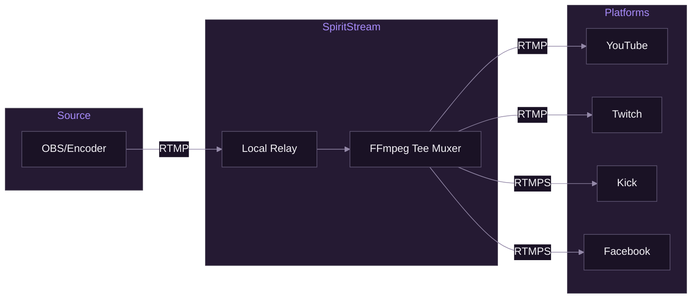

# Multi-Destination Streaming

[Documentation](../README.md) > [Streaming](./README.md) > Multi-Destination Streaming

---

This document explains how SpiritStream enables streaming to multiple platforms simultaneously using FFmpeg's tee muxer.

---

## Overview

Multi-destination streaming allows you to broadcast a single input stream to multiple RTMP destinations (YouTube, Twitch, Kick, etc.) without re-encoding for each target.



*Single input stream distributed to multiple platforms.*

---

## Architecture

### Output Groups

An Output Group bundles encoding settings with one or more stream targets:

```
Profile
├── Output Group 1 (1080p60 @ 6000kbps)
│   ├── YouTube
│   ├── Twitch
│   └── Kick
└── Output Group 2 (720p30 @ 2500kbps)
    └── Facebook
```

Each output group runs a separate FFmpeg process, allowing different quality settings per group.

### Data Model

```typescript
interface OutputGroup {
  id: string;
  name: string;
  video: VideoSettings;
  audio: AudioSettings;
  container: ContainerSettings;
  streamTargets: StreamTarget[];
}

interface StreamTarget {
  id: string;
  platform: 'youtube' | 'twitch' | 'kick' | 'facebook' | 'custom';
  name: string;
  url: string;        // RTMP server URL
  streamKey: string;  // Stream key/token
}
```

---

## FFmpeg Tee Muxer

### How It Works

The tee muxer duplicates encoded output to multiple destinations without re-encoding:

```
Input → Decode → Encode → Tee → Output 1
                          ├──→ Output 2
                          └──→ Output 3
```

### Basic Tee Syntax

```bash
ffmpeg -i input \
  -c:v libx264 -c:a aac \
  -f tee "[f=flv]rtmp://server1|[f=flv]rtmp://server2"
```

### Tee Options

| Option | Description |
|--------|-------------|
| `f=flv` | Output format (FLV for RTMP) |
| `onfail=ignore` | Continue if one destination fails |
| `use_fifo=1` | Buffer output (reduces drops) |
| `fifo_options=...` | FIFO buffer configuration |

---

## SpiritStream Implementation

### Building the Tee Command

The tee command construction accounts for different platforms' stream key placement strategies. Some platforms (like Twitch) append the key to the URL path, while others (like Restream) embed the key using a `{stream_key}` template in the URL.

```rust
// services/ffmpeg_handler.rs
fn build_tee_output(targets: &[StreamTarget]) -> String {
    targets
        .iter()
        .map(|target| {
            // Get platform config from registry for URL building strategy
            let config = get_platform_config(target.service);
            let url = config.build_url_with_key(&target.url, &target.stream_key);
            format!("[f=flv:onfail=ignore]{}", url)
        })
        .collect::<Vec<_>>()
        .join("|")
}

// Platform registry handles two placement strategies:
// - StreamKeyPlacement::Append: rtmp://server/app/ + key
// - StreamKeyPlacement::InUrlTemplate: replace {stream_key} in URL
fn build_url_with_key(config: &PlatformConfig, url: &str, key: &str) -> String {
    match config.placement {
        StreamKeyPlacement::Append => format!("{}/{}", url.trim_end_matches('/'), key),
        StreamKeyPlacement::InUrlTemplate => url.replace("{stream_key}", key),
    }
}

fn build_ffmpeg_args(group: &OutputGroup, incoming_url: &str) -> Vec<String> {
    let mut args = vec![
        "-i".to_string(), incoming_url.to_string(),
    ];

    // Video encoding
    if group.video.codec == "copy" {
        args.extend(["-c:v".to_string(), "copy".to_string()]);
    } else {
        args.extend([
            "-c:v".to_string(), group.video.codec.clone(),
            "-s".to_string(), format!("{}x{}", group.video.width, group.video.height),
            "-b:v".to_string(), format!("{}k", group.video.bitrate),
            "-r".to_string(), group.video.fps.to_string(),
        ]);

        if let Some(preset) = &group.video.preset {
            args.extend(["-preset".to_string(), preset.clone()]);
        }
    }

    // Audio encoding
    if group.audio.codec == "copy" {
        args.extend(["-c:a".to_string(), "copy".to_string()]);
    } else {
        args.extend([
            "-c:a".to_string(), group.audio.codec.clone(),
            "-b:a".to_string(), format!("{}k", group.audio.bitrate),
            "-ar".to_string(), group.audio.sample_rate.to_string(),
        ]);
    }

    // Tee output
    let tee_output = build_tee_output(&group.stream_targets);
    args.extend(["-f".to_string(), "tee".to_string(), tee_output]);

    args
}
```

### Generated Command Example

For an output group with YouTube and Twitch targets:

```bash
ffmpeg -listen 1 -i rtmp://localhost:1935/live/stream \
  -c:v libx264 -preset veryfast -s 1920x1080 -b:v 6000k -r 60 \
  -g 120 -keyint_min 120 \
  -c:a aac -b:a 160k -ar 48000 \
  -f tee \
  "[f=flv:onfail=ignore]rtmp://a.rtmp.youtube.com/live2/xxxx-xxxx|[f=flv:onfail=ignore]rtmp://live.twitch.tv/app/live_xxxxx"
```

---

## Failure Handling

### onfail Options

| Value | Behavior |
|-------|----------|
| `abort` | Stop all outputs if one fails (default) |
| `ignore` | Continue other outputs if one fails |

### Why Use `onfail=ignore`

With `onfail=ignore`, if Twitch goes down, YouTube continues streaming:

```bash
# One target fails, others continue
[f=flv:onfail=ignore]rtmp://youtube|[f=flv:onfail=ignore]rtmp://twitch
```

### Monitoring Failures

```rust
// Parse FFmpeg stderr for connection errors
fn parse_error(line: &str) -> Option<StreamError> {
    if line.contains("Connection refused") {
        Some(StreamError::ConnectionRefused)
    } else if line.contains("Connection timed out") {
        Some(StreamError::Timeout)
    } else if line.contains("Authentication failed") {
        Some(StreamError::AuthFailed)
    } else {
        None
    }
}
```

---

## FIFO Buffering

### Preventing Dropped Frames

Use FIFO buffers to handle network fluctuations:

```bash
-f tee \
"[f=flv:onfail=ignore:use_fifo=1:fifo_options=queue_size=60]rtmp://server1|..."
```

### FIFO Options

| Option | Default | Description |
|--------|---------|-------------|
| `queue_size` | 60 | Packets to buffer |
| `format_opts` | - | Additional format options |
| `recover_any_error` | 0 | Retry on any error |
| `drop_pkts_on_overflow` | 0 | Drop vs block on full |

---

## Bandwidth Calculation

### Per-Target Bandwidth

Each target receives the same encoded stream:

```
Single Output = Video Bitrate + Audio Bitrate + Overhead
              = 6000 kbps + 160 kbps + ~5%
              ≈ 6.5 Mbps per target
```

### Total Upload Requirement

```
Total Upload = (Bitrate × Number of Targets) × 1.2 safety margin

Example: 3 targets at 6000 kbps
= (6000 × 3) × 1.2
= 21,600 kbps
≈ 22 Mbps required upload
```

### Bandwidth Table

| Targets | @ 3000 kbps | @ 6000 kbps | @ 8000 kbps |
|---------|-------------|-------------|-------------|
| 2 | 8 Mbps | 15 Mbps | 20 Mbps |
| 3 | 12 Mbps | 22 Mbps | 29 Mbps |
| 4 | 15 Mbps | 29 Mbps | 38 Mbps |
| 5 | 18 Mbps | 36 Mbps | 48 Mbps |

---

## Multiple Output Groups

### Use Cases

1. **Different Quality Tiers**
   - Group 1: 1080p60 for YouTube/Twitch
   - Group 2: 720p30 for mobile-focused platforms

2. **Platform Requirements**
   - Group 1: 6000 kbps for partner platforms
   - Group 2: 3000 kbps for platforms with bitrate limits

3. **Regional Distribution**
   - Group 1: US servers
   - Group 2: EU servers

### Resource Implications

Each output group runs a separate FFmpeg process:

```
CPU Usage ≈ Encoding Cost × Number of Groups
RAM Usage ≈ Buffer Size × Number of Groups
Upload ≈ Sum of All Target Bitrates
```

### Passthrough Optimization

To minimize CPU when input matches output:

```typescript
const videoSettings: VideoSettings = {
  codec: 'copy',  // No re-encoding
  // Other settings ignored when copy
};
```

---

## Platform-Specific Considerations

SpiritStream supports 80+ streaming platforms via the platform registry loaded from `data/streaming-platforms.json`. Platform-specific settings (default URLs, key placement, etc.) are handled automatically—you don't need to know the details for common platforms.

### Common Platforms

| Platform | Default Server | Key Placement | Notes |
|----------|----------------|---------------|-------|
| YouTube | `rtmp://a.rtmp.youtube.com/live2` | Append | Up to 51 Mbps (4K), keyframe 2-4s |
| Twitch | `rtmp://live.twitch.tv/app` | Append | Max 6000 kbps for non-partners, keyframe 2s |
| Kick | `rtmps://..../app` | Append | RTMPS only (TLS encrypted) |
| Facebook | `rtmps://live-api-s.facebook.com:443/rtmp` | Append | RTMPS only, keys expire per-stream |
| Restream | URL template with `{stream_key}` | InUrlTemplate | Multi-platform relay service |

### Example Targets

```typescript
// YouTube target
const youtubeTarget: StreamTarget = {
  id: 'uuid-here',
  service: 'youtube',  // Note: 'service' not 'platform'
  name: 'My YouTube Channel',
  url: 'rtmp://a.rtmp.youtube.com/live2',
  streamKey: 'xxxx-xxxx-xxxx-xxxx',
};

// Twitch target
const twitchTarget: StreamTarget = {
  id: 'uuid-here',
  service: 'twitch',
  name: 'My Twitch Channel',
  url: 'rtmp://live.twitch.tv/app',
  streamKey: 'live_xxxxxxxx_xxxxxxxx',
};
```

### Adding New Platforms

The platform registry supports adding new platforms without code changes. See [Platform Registry](./05-platform-registry.md) for:
- How to add a new platform to `data/streaming-platforms.json`
- StreamKeyPlacement strategies explained
- URL normalization and stream key masking

---

## UI Integration

### Stream Manager View

```typescript
// components/stream/OutputGroupCard.tsx
function OutputGroupCard({ group, profile }: Props) {
  const { startStream, stopStream, isStreaming } = useStreamStore();

  const handleStart = async () => {
    await startStream(group, profile.incomingUrl);
  };

  return (
    <Card>
      <CardHeader>
        <h3>{group.name}</h3>
        <StreamStatus status={isStreaming(group.id) ? 'live' : 'offline'} />
      </CardHeader>
      <CardBody>
        <p>{group.streamTargets.length} targets</p>
        <p>{group.video.width}x{group.video.height} @ {group.video.bitrate}kbps</p>
      </CardBody>
      <CardFooter>
        <Button onClick={handleStart} disabled={isStreaming(group.id)}>
          Start
        </Button>
      </CardFooter>
    </Card>
  );
}
```

### Per-Target Toggle

```typescript
// Toggle individual targets without restarting
function TargetToggle({ target, groupId }: Props) {
  const { toggleTarget, isTargetEnabled } = useStreamStore();

  return (
    <Switch
      checked={isTargetEnabled(target.id)}
      onChange={(enabled) => toggleTarget(groupId, target.id, enabled)}
    />
  );
}
```

---

## Troubleshooting

### Common Issues

| Issue | Cause | Solution |
|-------|-------|----------|
| All streams fail | Network issue | Check internet connection |
| One stream fails | Invalid key/URL | Verify target settings |
| High dropped frames | Insufficient upload | Reduce bitrate or targets |
| Stuttering | CPU overload | Use hardware encoding or passthrough |

### Debug Command

Test tee output manually:

```bash
ffmpeg -re -f lavfi -i testsrc=duration=30:size=1920x1080:rate=30 \
  -f lavfi -i sine=frequency=440:duration=30 \
  -c:v libx264 -preset ultrafast -b:v 2500k \
  -c:a aac -b:a 128k \
  -f tee \
  "[f=flv:onfail=ignore]rtmp://server1/key1|[f=flv:onfail=ignore]rtmp://server2/key2"
```

---

**Related:** [FFmpeg Integration](./01-ffmpeg-integration.md) | [RTMP Fundamentals](./02-rtmp-fundamentals.md) | [Encoding Reference](./04-encoding-reference.md)

