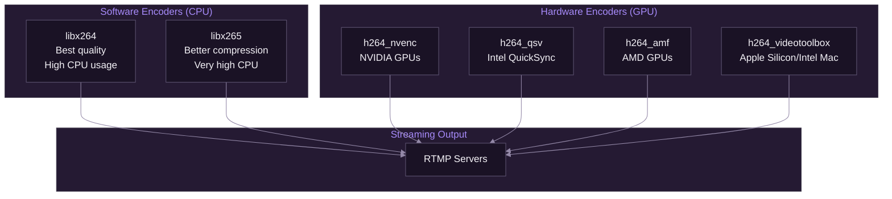

# Encoding Reference

[Documentation](../README.md) > [Streaming](./README.md) > Encoding Reference

---

This reference provides comprehensive documentation of video and audio encoding options supported by SpiritStream. It covers hardware and software encoders, presets, profiles, and recommended settings for different streaming scenarios.

---

## Choosing an Encoder

The right encoder depends on your hardware and priorities:

**Use hardware encoding (NVENC/QSV/AMF/VideoToolbox) when:**
- You have a compatible GPU and want minimal CPU impact
- You're gaming while streaming (CPU already under load)
- You need real-time encoding without frame drops
- Quality is "good enough" (hardware encoders are ~10-15% less efficient than x264 medium)

**Use software encoding (libx264) when:**
- You have a powerful CPU with headroom (8+ cores, <50% utilization)
- Maximum quality matters more than CPU usage
- You're encoding recordings, not live streams
- You don't have a GPU with hardware encoding support

**Use copy mode when:**
- Your input is already encoded appropriately (OBS → SpiritStream relay)
- You're relaying without transcoding
- You want zero CPU/GPU overhead

---

## Video Encoders

### Overview



*SpiritStream supports multiple encoder backends based on available hardware.*

---

### Software Encoders

#### libx264 (CPU)

The reference H.264 encoder providing the best quality-per-bit ratio at the cost of CPU usage. If your CPU can handle it, libx264 produces better visual quality than hardware encoders at the same bitrate—but the difference matters less at higher bitrates (6000+ kbps).

**When to use libx264:** Streaming from a dedicated encoding machine, non-gaming content where CPU headroom exists, or when you need absolute best quality and have CPU to spare.

| Parameter | Options | Default |
|-----------|---------|---------|
| Preset | ultrafast, superfast, veryfast, faster, fast, medium, slow, slower, veryslow | veryfast |
| Profile | baseline, main, high, high10, high422, high444 | high |
| Tune | film, animation, grain, stillimage, fastdecode, zerolatency | (none) |

**Preset Quality vs Speed:**

| Preset | Quality | CPU Usage | Recommended For |
|--------|---------|-----------|-----------------|
| ultrafast | Lowest | ~15% | Testing only |
| superfast | Low | ~25% | Low-end CPUs |
| veryfast | Good | ~35% | Live streaming |
| faster | Better | ~45% | Powerful CPUs |
| fast | High | ~55% | Non-gaming streams |
| medium | Very High | ~70% | Recording |
| slow | Excellent | ~85% | Offline encoding |

**Recommended settings for live streaming:**

```bash
-c:v libx264 -preset veryfast -profile:v high -tune zerolatency
```

#### libx265 (HEVC)

Better compression than H.264 but requires more processing power. Not supported by all streaming platforms.

| Parameter | Options |
|-----------|---------|
| Preset | ultrafast to placebo |
| Tune | psnr, ssim, grain, fastdecode, zerolatency |

**Note:** Twitch and YouTube support HEVC ingestion, but viewer compatibility varies.

---

### Hardware Encoders

Hardware encoders use dedicated silicon on your GPU, freeing the CPU for games or other tasks. The quality gap with software encoding has narrowed significantly—modern NVENC (Turing/Ampere) and Apple VideoToolbox produce excellent results.

#### NVIDIA NVENC

The most widely used hardware encoder. Modern NVENC (RTX 20 series and newer) produces quality nearly matching libx264 medium preset while using minimal system resources. Older GPUs (GTX 10 series) have slightly lower quality but are still excellent for streaming.

**When to use NVENC:** You have an NVIDIA GPU and want to game while streaming, or need consistent low-latency encoding. This is the default choice for most streamers with NVIDIA hardware.

| Parameter | Options | Description |
|-----------|---------|-------------|
| `-preset` | default, slow, medium, fast, hp, hq, bd, ll, llhq, llhp, lossless, losslesshp, p1-p7 | Quality/speed tradeoff |
| `-rc` | constqp, vbr, cbr, vbr_minqp, ll_2pass_quality, ll_2pass_size, vbr_2pass | Rate control mode |
| `-profile` | baseline, main, high, high444p | H.264 profile |
| `-tier` | main, high | Encoding tier |
| `-b_ref_mode` | disabled, each, middle | B-frame reference mode |
| `-spatial_aq` | 0, 1 | Spatial adaptive quantization |
| `-temporal_aq` | 0, 1 | Temporal adaptive quantization |

**Preset mapping (newer naming):**

| Preset | Quality | Performance |
|--------|---------|-------------|
| p1 | Fastest | Lowest quality |
| p4 | Balanced | Recommended |
| p7 | Slowest | Highest quality |

**Recommended settings:**

```bash
-c:v h264_nvenc -preset p4 -rc cbr -b:v 6000k -profile:v high
```

#### Intel QuickSync (QSV)

Intel's hardware encoder built into their integrated GPUs. Quality has improved significantly in recent generations (11th gen+). A good choice if you have an Intel CPU without a dedicated GPU, or want to use your iGPU for encoding while gaming on a discrete GPU.

**When to use QSV:** You have an Intel CPU with integrated graphics and no NVIDIA GPU, or you want to offload encoding to the iGPU while gaming on a discrete AMD/NVIDIA card.

| Parameter | Options | Description |
|-----------|---------|-------------|
| `-preset` | veryfast, faster, fast, medium, slow, slower, veryslow | Quality/speed |
| `-profile` | baseline, main, high | H.264 profile |
| `-look_ahead` | 0, 1 | Enable lookahead |
| `-look_ahead_depth` | 0-100 | Lookahead frames |

**Recommended settings:**

```bash
-c:v h264_qsv -preset faster -profile:v high -look_ahead 1
```

#### AMD AMF

AMD's hardware encoder for Radeon GPUs. Historically behind NVENC in quality, but RDNA2/RDNA3 GPUs have closed the gap substantially. If you have an AMD GPU, AMF is your best hardware encoding option.

**When to use AMF:** You have an AMD GPU and want hardware encoding. Quality is competitive with NVENC on modern AMD cards.

| Parameter | Options | Description |
|-----------|---------|-------------|
| `-quality` | speed, balanced, quality | Quality level |
| `-usage` | transcoding, ultralowlatency, lowlatency, webcam | Usage scenario |
| `-rc` | cqp, cbr, vbr_peak, vbr_latency | Rate control |
| `-profile` | main, high, constrained_baseline, constrained_high | H.264 profile |

**Recommended settings:**

```bash
-c:v h264_amf -quality balanced -usage lowlatency -rc cbr -b:v 6000k
```

#### Apple VideoToolbox

Apple's media framework for macOS encoding. On Apple Silicon Macs (M1/M2/M3), VideoToolbox uses the dedicated media engine and produces excellent quality with minimal power consumption. On Intel Macs, it may use software fallback depending on the task.

**When to use VideoToolbox:** You're on macOS. It's the only hardware encoder option and works extremely well, especially on Apple Silicon.

| Parameter | Options | Description |
|-----------|---------|-------------|
| `-profile` | baseline, main, high | H.264 profile |
| `-level` | auto, 3.0-5.2 | H.264 level |
| `-allow_sw` | 0, 1 | Allow software fallback |
| `-realtime` | 0, 1 | Prioritize realtime encoding |

**Recommended settings:**

```bash
-c:v h264_videotoolbox -profile:v high -realtime 1
```

---

## Audio Encoders

### AAC

The standard audio codec for RTMP streaming.

| Encoder | Description | Quality |
|---------|-------------|---------|
| `aac` | FFmpeg native AAC | Good |
| `libfdk_aac` | Fraunhofer FDK AAC | Excellent (if available) |

**Parameters:**

| Parameter | Options | Description |
|-----------|---------|-------------|
| `-b:a` | 96k-320k | Audio bitrate |
| `-ar` | 44100, 48000 | Sample rate |
| `-ac` | 1, 2 | Channel count (mono/stereo) |
| `-profile:a` | aac_low, aac_he, aac_he_v2 | AAC profile |

**Recommended settings:**

```bash
-c:a aac -b:a 160k -ar 48000 -ac 2
```

### Opus

Better quality than AAC at lower bitrates, but limited platform support.

```bash
-c:a libopus -b:a 128k -ar 48000
```

---

## Resolution and Scaling

### Common Resolutions

| Name | Dimensions | Aspect Ratio | Min Bitrate |
|------|------------|--------------|-------------|
| 4K UHD | 3840x2160 | 16:9 | 20,000 kbps |
| 2K QHD | 2560x1440 | 16:9 | 9,000 kbps |
| 1080p FHD | 1920x1080 | 16:9 | 4,500 kbps |
| 720p HD | 1280x720 | 16:9 | 2,500 kbps |
| 480p SD | 854x480 | 16:9 | 1,000 kbps |

### Scaling Filters

When transcoding to a different resolution:

```bash
# Lanczos (highest quality, slower)
-vf "scale=1920:1080:flags=lanczos"

# Bicubic (good balance)
-vf "scale=1920:1080:flags=bicubic"

# Bilinear (fastest)
-vf "scale=1920:1080:flags=bilinear"
```

---

## Frame Rate

### Common Frame Rates

| FPS | Use Case | Notes |
|-----|----------|-------|
| 60 | Gaming, fast motion | Higher bitrate needed |
| 30 | General streaming | Most compatible |
| 24 | Cinematic content | Film-like appearance |

### Frame Rate Conversion

```bash
# Convert to 30fps
-r 30

# Convert with frame blending (smoother)
-vf "fps=30,minterpolate=fps=30:mi_mode=blend"
```

---

## Bitrate Configuration

Bitrate is the most significant quality factor after resolution. Higher bitrate = more data = better quality, but your upload speed and platform limits constrain your options.

**Choosing a bitrate:**
- Check your upload speed: Use 50-75% of your stable upload (not peak) for safety margin
- Check platform limits: Twitch caps at 6000kbps for non-partners, YouTube allows higher
- Match content: Fast motion (gaming) needs more bitrate than static content (podcasts)
- Consider viewers: Some viewers have slow connections—ultra-high bitrate may buffer for them

### Rate Control Modes

Rate control determines how the encoder allocates bits across frames. For live streaming, **CBR is strongly recommended**—it provides consistent network usage and platform compatibility.

| Mode | Description | Best For |
|------|-------------|----------|
| CBR | Constant bitrate—every second uses the same bits | Live streaming (required by most platforms) |
| VBR | Variable bitrate—complex scenes get more bits | Recording, VODs |
| CRF/CQP | Constant quality—bitrate varies widely | Offline encoding, archival |

### CBR (Constant Bitrate)

```bash
-b:v 6000k -minrate 6000k -maxrate 6000k -bufsize 12000k
```

### VBR (Variable Bitrate)

```bash
-b:v 6000k -minrate 3000k -maxrate 9000k -bufsize 12000k
```

### CRF (Constant Rate Factor)

```bash
-crf 23  # 0=lossless, 51=worst, 23=default
```

---

## Keyframe Configuration

### Importance

Keyframes (I-frames) enable:
- Seeking to specific points
- Platform transcoding
- Viewer quality switching

### Settings

| Platform | Required Interval |
|----------|------------------|
| Twitch | 2 seconds |
| YouTube | 2-4 seconds |
| Kick | 2 seconds |
| Facebook | 2 seconds |

**Configuration:**

```bash
-g 120         # Keyframe every 120 frames (2 sec at 60fps)
-keyint_min 120
-sc_threshold 0  # Disable scene change detection
-force_key_frames "expr:gte(t,n_forced*2)"  # Force every 2 seconds
```

---

## Platform-Specific Recommendations

### Twitch

```bash
# Video
-c:v h264_nvenc -preset p4 -profile:v high
-b:v 6000k -maxrate 6000k -bufsize 12000k
-g 120 -keyint_min 120

# Audio
-c:a aac -b:a 160k -ar 48000 -ac 2
```

### YouTube

```bash
# Video
-c:v h264_nvenc -preset p4 -profile:v high
-b:v 8000k -maxrate 12000k -bufsize 16000k
-g 120 -keyint_min 120

# Audio
-c:a aac -b:a 192k -ar 48000 -ac 2
```

### Kick

```bash
# Video
-c:v h264_nvenc -preset p4 -profile:v high
-b:v 6000k -maxrate 6000k -bufsize 12000k
-g 120 -keyint_min 120

# Audio
-c:a aac -b:a 160k -ar 48000 -ac 2
```

---

## Quality Presets in SpiritStream

SpiritStream provides simplified quality presets:

| Preset | Video Bitrate | Audio Bitrate | Resolution | FPS |
|--------|---------------|---------------|------------|-----|
| Low | 2500 kbps | 128 kbps | 720p | 30 |
| Medium | 4500 kbps | 160 kbps | 1080p | 30 |
| High | 6000 kbps | 160 kbps | 1080p | 60 |
| Ultra | 8000 kbps | 192 kbps | 1080p | 60 |
| Custom | User-defined | User-defined | User-defined | User-defined |

---

## Troubleshooting

### Encoder Not Available

| Error | Cause | Solution |
|-------|-------|----------|
| "Unknown encoder" | Encoder not compiled in FFmpeg | Use different encoder or rebuild FFmpeg |
| "No NVENC capable devices" | No NVIDIA GPU or driver issue | Update drivers or use CPU encoder |
| "QSV requires Intel GPU" | No Intel iGPU available | Use different encoder |

### Quality Issues

| Issue | Cause | Solution |
|-------|-------|----------|
| Pixelation/blocking | Bitrate too low | Increase bitrate or reduce resolution |
| Blurry text | Resolution scaling | Use native resolution or sharpen filter |
| Stuttering | CPU/GPU overload | Use faster preset or hardware encoder |
| Color banding | 8-bit limitation | Increase bitrate |

### Performance Issues

| Issue | Cause | Solution |
|-------|-------|----------|
| High CPU usage | Software encoder | Switch to hardware encoder |
| GPU utilization high | Hardware encoder load | Use lower preset |
| Dropped frames | System overload | Reduce quality settings |

---

## Quick Reference

### Encoder Detection (FFmpeg)

```bash
# List all encoders
ffmpeg -encoders

# Check NVENC support
ffmpeg -encoders | grep nvenc

# Check QSV support
ffmpeg -encoders | grep qsv

# Check AMF support
ffmpeg -encoders | grep amf
```

### Common FFmpeg Commands

```bash
# Stream to RTMP with NVENC
ffmpeg -i input.mp4 \
  -c:v h264_nvenc -preset p4 -b:v 6000k \
  -c:a aac -b:a 160k \
  -f flv rtmp://server/app/key

# Passthrough (copy)
ffmpeg -i input.mp4 \
  -c:v copy -c:a copy \
  -f flv rtmp://server/app/key
```

---

**Related:** [FFmpeg Integration](./01-ffmpeg-integration.md) | [RTMP Fundamentals](./02-rtmp-fundamentals.md) | [Multi-Destination](./03-multi-destination.md) | [Custom Encoding Tutorial](../06-tutorials/04-custom-encoding.md)
