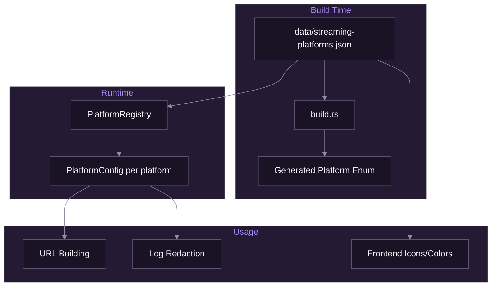

# Platform Registry

[Documentation](../README.md) > [Streaming](./README.md) > Platform Registry

---

This document describes SpiritStream's platform registry system, which provides configuration for 80+ streaming platforms without requiring code changes.

## Overview

SpiritStream uses a JSON-driven platform registry loaded from `data/streaming-platforms.json`. This approach offers several advantages:

- **No code changes required** to add new platforms
- **Consistent behavior** across frontend and backend
- **Automatic stream key masking** in logs based on platform URL patterns
- **URL normalization** for platforms with specific path requirements

The registry is sourced from [OBS's rtmp-services](https://github.com/obsproject/obs-studio/tree/master/plugins/rtmp-services) (GPL-2.0 licensed) with SpiritStream-specific enhancements for UI display and security.

---

## How It Works



1. **Build time**: `build.rs` reads the JSON and generates a Rust `Platform` enum with all platform variants
2. **Runtime**: `PlatformRegistry` loads platform configs (default URLs, key placement strategy, etc.)
3. **Usage**: Frontend displays platform icons/colors; backend handles URL construction and log masking

---

## Supported Platforms

SpiritStream supports 80+ platforms out of the box. Common platforms include:

| Platform | Abbreviation | Default URL | Key Placement |
|----------|--------------|-------------|---------------|
| YouTube | YT | `rtmps://a.rtmps.youtube.com:443/live2` | Append |
| Twitch | TW | `rtmp://live-hkg.twitch.tv/app` | Append |
| Kick | K | `rtmps://...global-contribute.live-video.net/app` | Append |
| Facebook | FB | `rtmps://rtmp-api.facebook.com:443/rtmp/` | Append |
| LinkedIn | LI | `rtmps://...global-contribute.live-video.net/app` | Append |
| TikTok | TT | `rtmps://live.tiktok.com/rtmp/` | Append |
| Restream | RS | Uses `{stream_key}` template | InUrlTemplate |
| Custom | - | User-provided | Append |

For the complete list, see `data/streaming-platforms.json`.

---

## Stream Key Placement

Different platforms embed stream keys in URLs differently. SpiritStream handles two strategies:

### Append (Most Common)

The stream key is appended to the URL path:

```
Base URL:    rtmp://live.twitch.tv/app
Stream Key:  live_abc123_xyz
Final URL:   rtmp://live.twitch.tv/app/live_abc123_xyz
```

Used by: YouTube, Twitch, Kick, Facebook, and most platforms.

### InUrlTemplate

The URL contains a `{stream_key}` placeholder that gets replaced:

```
Template:    rtmp://restream.io/{stream_key}/live
Stream Key:  abc123
Final URL:   rtmp://restream.io/abc123/live
```

Used by: Restream and some custom relay services.

---

## Adding a New Platform

To add support for a new streaming platform:

### 1. Add to JSON Registry

Edit `data/streaming-platforms.json`:

```json
{
  "name": "Rumble",
  "displayName": "Rumble",
  "defaultUrl": "rtmp://rmbl.to/app",
  "streamKeyPlacement": "append",
  "abbreviation": "R",
  "color": "#85C742"
}
```

### 2. Rebuild

```bash
cargo build --manifest-path src-tauri/Cargo.toml
```

The `Platform::Rumble` enum variant is automatically generated.

### 3. Test

1. Create a new stream target in the UI
2. Select your new platform from the dropdown
3. Verify the default URL is populated
4. Check logs to confirm stream key is masked

### JSON Schema

| Field | Required | Description |
|-------|----------|-------------|
| `name` | Yes | Unique identifier (used as enum variant) |
| `displayName` | Yes | Human-readable name for UI |
| `defaultUrl` | Yes | Default RTMP(S) server URL |
| `streamKeyPlacement` | Yes | `"append"` or `"in_url_template"` |
| `abbreviation` | No | 1-3 letter abbreviation for compact UI |
| `color` | No | Hex color for platform icon background |
| `faviconPath` | No | Path to platform icon SVG |

---

## Security

### Automatic Stream Key Masking

Stream keys are automatically redacted in logs based on the platform's URL structure:

```
Logged URL: rtmp://live.twitch.tv/app/***
Actual URL: rtmp://live.twitch.tv/app/live_abc123_xyz
```

The masking uses the `stream_key_position` field from the platform config, which identifies which URL path segment contains the key.

### Encrypted Storage

Stream keys are encrypted at rest using AES-256-GCM when profiles are password-protected. See [Encryption Implementation](../02-backend/05-encryption-implementation.md) for details.

---

## Troubleshooting

### Platform Not Appearing in Dropdown

1. Check that the platform is in `data/streaming-platforms.json`
2. Rebuild the application (`cargo build`)
3. Verify the `name` field is unique

### Stream Key Visible in Logs

1. Verify `streamKeyPlacement` is set correctly
2. Check that the URL structure matches what the platform expects
3. For custom platforms, ensure the URL follows the expected pattern

### URL Normalization Issues

Some platforms require specific path segments. If streams fail:

1. Check the platform's RTMP documentation
2. Verify the `defaultUrl` includes all required path segments
3. For Kick, ensure `/app` is in the path

---

**Related:** [Multi-Destination Streaming](./03-multi-destination.md) | [Platform Registry Backend](../02-backend/06-platform-registry.md) | [Models Reference](../02-backend/03-models-reference.md)

