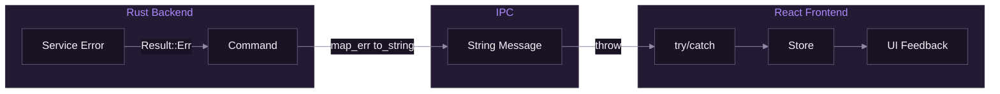

# Error Handling

[Documentation](../README.md) > [API Reference](./README.md) > Error Handling

---

This document covers error handling patterns in SpiritStream across the Rust backend and React frontend.

---

## Overview

Error handling flows from Rust services through Tauri commands to the React frontend:



---

## Backend Error Handling

### Custom Error Types

```rust
// services/errors.rs
use thiserror::Error;

#[derive(Debug, Error)]
pub enum ProfileError {
    #[error("Profile not found: {0}")]
    NotFound(String),

    #[error("Password required for encrypted profile")]
    PasswordRequired,

    #[error("Decryption failed: invalid password")]
    DecryptionFailed,

    #[error("Profile name already exists: {0}")]
    NameExists(String),

    #[error("Invalid profile data: {0}")]
    InvalidData(String),

    #[error("IO error: {0}")]
    Io(#[from] std::io::Error),

    #[error("JSON error: {0}")]
    Json(#[from] serde_json::Error),
}
```

### Stream Errors

```rust
#[derive(Debug, Error)]
pub enum StreamError {
    #[error("FFmpeg not found")]
    FFmpegNotFound,

    #[error("Stream already running: {0}")]
    AlreadyRunning(String),

    #[error("Failed to start stream: {0}")]
    StartFailed(String),

    #[error("No stream targets configured")]
    NoTargets,

    #[error("Invalid RTMP URL: {0}")]
    InvalidUrl(String),

    #[error("Process error: {0}")]
    Process(#[from] std::io::Error),
}
```

### Converting to String

For IPC, errors must be strings:

```rust
// Implement From for String
impl From<ProfileError> for String {
    fn from(err: ProfileError) -> String {
        err.to_string()
    }
}

// In commands
#[tauri::command]
pub async fn load_profile(
    name: String,
    state: State<'_, ProfileManager>,
) -> Result<Profile, String> {
    state.load(&name, None)
        .await
        .map_err(|e| e.to_string())  // Convert to String
}
```

---

## Service Error Propagation

### Using the ? Operator

```rust
impl ProfileManager {
    pub async fn load(&self, name: &str) -> Result<Profile, ProfileError> {
        let path = self.get_path(name)?;  // Propagates PathError
        let content = fs::read_to_string(&path).await?;  // Propagates IoError
        let profile: Profile = serde_json::from_str(&content)?;  // Propagates JsonError
        Ok(profile)
    }
}
```

### Error Context

Add context with `map_err`:

```rust
pub async fn load(&self, name: &str) -> Result<Profile, ProfileError> {
    let path = self.profiles_dir.join(format!("{}.json", name));

    let content = fs::read_to_string(&path)
        .await
        .map_err(|e| {
            if e.kind() == std::io::ErrorKind::NotFound {
                ProfileError::NotFound(name.to_string())
            } else {
                ProfileError::Io(e)
            }
        })?;

    serde_json::from_str(&content)
        .map_err(|e| ProfileError::InvalidData(e.to_string()))
}
```

---

## Frontend Error Handling

### Try-Catch Pattern

```typescript
// In store actions
loadProfile: async (name, password) => {
  set({ loading: true, error: null });

  try {
    const profile = await invoke<Profile>('load_profile', { name, password });
    set({ current: profile, loading: false });
  } catch (error) {
    set({ error: String(error), loading: false });
    throw error;  // Re-throw for caller handling
  }
}
```

### Component Error Handling

```typescript
function ProfileLoader({ name }: { name: string }) {
  const { loadProfile, error, loading } = useProfileStore();

  const handleLoad = async () => {
    try {
      await loadProfile(name);
    } catch (error) {
      // Specific error handling
      if (String(error).includes('Password required')) {
        showPasswordDialog();
      } else {
        toast.error(`Failed to load profile: ${error}`);
      }
    }
  };

  return (
    <Button onClick={handleLoad} disabled={loading}>
      {loading ? 'Loading...' : 'Load Profile'}
    </Button>
  );
}
```

---

## Error Types by Category

### Profile Errors

| Error | Cause | User Message |
|-------|-------|--------------|
| `NotFound` | Profile doesn't exist | "Profile not found" |
| `PasswordRequired` | Encrypted profile, no password | "This profile is encrypted" |
| `DecryptionFailed` | Wrong password | "Invalid password" |
| `NameExists` | Duplicate name | "A profile with this name exists" |

### Stream Errors

| Error | Cause | User Message |
|-------|-------|--------------|
| `FFmpegNotFound` | FFmpeg not installed | "FFmpeg not found. Please install." |
| `AlreadyRunning` | Stream already active | "Stream is already running" |
| `NoTargets` | No destinations | "Add at least one target" |
| `ConnectionRefused` | Server unavailable | "Could not connect to server" |

### System Errors

| Error | Cause | User Message |
|-------|-------|--------------|
| `IoError` | File system issue | "File operation failed" |
| `PermissionDenied` | Access denied | "Permission denied" |
| `NetworkError` | Network issue | "Network error occurred" |

---

## UI Error Display

### Toast Notifications

```typescript
import { toast } from 'sonner';

// Success
toast.success('Profile saved');

// Error
toast.error('Failed to save profile', {
  description: error.message,
});

// Warning
toast.warning('Stream key will expire soon');
```

### Inline Errors

```typescript
function ProfileForm() {
  const [error, setError] = useState<string | null>(null);

  return (
    <form>
      {error && (
        <Alert variant="error">
          {error}
        </Alert>
      )}
      <Input
        label="Name"
        error={validationErrors.name}
      />
    </form>
  );
}
```

### Error Boundaries

```typescript
// components/ErrorBoundary.tsx
class ErrorBoundary extends Component<Props, State> {
  state = { hasError: false, error: null };

  static getDerivedStateFromError(error: Error) {
    return { hasError: true, error };
  }

  componentDidCatch(error: Error, errorInfo: ErrorInfo) {
    console.error('Error caught:', error, errorInfo);
  }

  render() {
    if (this.state.hasError) {
      return (
        <div className="p-6 text-center">
          <h2>Something went wrong</h2>
          <Button onClick={() => window.location.reload()}>
            Reload App
          </Button>
        </div>
      );
    }

    return this.props.children;
  }
}
```

---

## Error Recovery

### Retry Logic

```typescript
async function withRetry<T>(
  fn: () => Promise<T>,
  maxRetries = 3,
  delay = 1000
): Promise<T> {
  let lastError: Error;

  for (let i = 0; i < maxRetries; i++) {
    try {
      return await fn();
    } catch (error) {
      lastError = error as Error;
      if (i < maxRetries - 1) {
        await new Promise(r => setTimeout(r, delay * (i + 1)));
      }
    }
  }

  throw lastError!;
}

// Usage
const profile = await withRetry(() => api.profile.load(name));
```

### Password Re-prompt

```typescript
async function loadProfileWithPassword(name: string): Promise<Profile> {
  try {
    return await api.profile.load(name);
  } catch (error) {
    if (String(error).includes('Password required')) {
      const password = await promptPassword();
      if (password) {
        return await api.profile.load(name, password);
      }
    }
    throw error;
  }
}
```

---

## Logging Errors

### Backend Logging

```rust
use log::{error, warn, info};

pub async fn start_stream(
    group: &OutputGroup,
    incoming_url: &str,
) -> Result<u32, StreamError> {
    info!("Starting stream for group: {}", group.id);

    match self.spawn_ffmpeg(group, incoming_url) {
        Ok(pid) => {
            info!("Stream started with PID: {}", pid);
            Ok(pid)
        }
        Err(e) => {
            error!("Failed to start stream: {}", e);
            Err(e)
        }
    }
}
```

### Frontend Logging

```typescript
function logError(context: string, error: unknown) {
  console.error(`[${context}]`, error);

  // Optional: Send to backend log
  invoke('log_error', {
    context,
    message: String(error),
    timestamp: new Date().toISOString(),
  }).catch(() => {}); // Don't throw from logger
}
```

---

## Validation Errors

### Backend Validation

```rust
impl Profile {
    pub fn validate(&self) -> Result<(), ProfileError> {
        if self.name.is_empty() {
            return Err(ProfileError::InvalidData("Name is required".into()));
        }

        if self.name.len() > 64 {
            return Err(ProfileError::InvalidData("Name too long".into()));
        }

        if !self.incoming_url.starts_with("rtmp://") {
            return Err(ProfileError::InvalidData("Invalid RTMP URL".into()));
        }

        Ok(())
    }
}
```

### Frontend Validation

```typescript
interface ValidationErrors {
  [key: string]: string | undefined;
}

function validateProfile(data: ProfileFormData): ValidationErrors {
  const errors: ValidationErrors = {};

  if (!data.name) {
    errors.name = 'Name is required';
  } else if (data.name.length > 64) {
    errors.name = 'Name must be 64 characters or less';
  }

  if (!data.incomingUrl.startsWith('rtmp://')) {
    errors.incomingUrl = 'Must be a valid RTMP URL';
  }

  return errors;
}
```

---

## Best Practices

### Backend

1. Use custom error types with `thiserror`
2. Add context to errors with `map_err`
3. Log errors at appropriate levels
4. Never expose internal paths or stack traces
5. Use meaningful error messages

### Frontend

1. Always wrap `invoke` in try-catch
2. Store errors in state for UI display
3. Show user-friendly messages
4. Provide recovery options when possible
5. Log errors for debugging

---

**Related:** [Commands API](./01-commands-api.md) | [Types Reference](./03-types-reference.md) | [Tauri Commands](../02-backend/04-tauri-commands.md)

