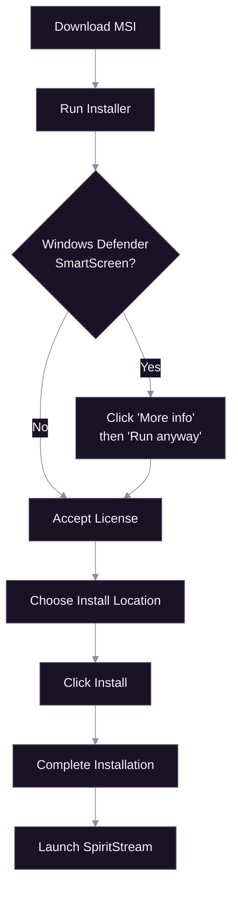
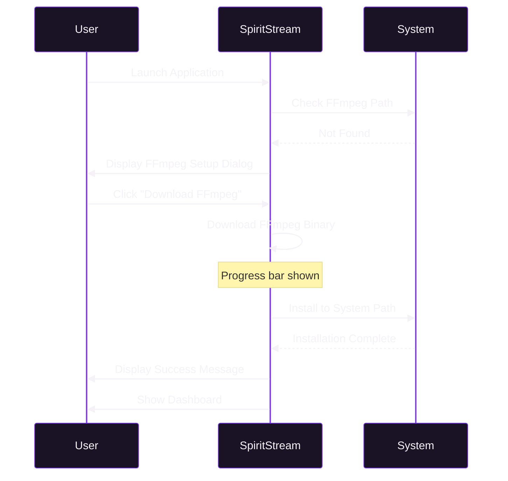

# Getting Started

[Documentation](../README.md) > [Tutorials](./README.md) > Getting Started

---

This tutorial walks you through installing, configuring, and running SpiritStream on Windows, macOS, and Linux. No prior streaming experience required.

---

## What is SpiritStream?

SpiritStream is an application for streaming to multiple destinations simultaneously. Unlike traditional streaming software that connects directly to a single platform, SpiritStream acts as an RTMP relay server—accepting your stream from encoding software like OBS Studio and redistributing it to YouTube, Twitch, Kick, Facebook, and custom RTMP servers.

SpiritStream can be deployed in multiple ways:
- **Desktop App** — Download and install for local streaming with GPU acceleration (this tutorial)
- **Docker** — Self-host on your own server for remote access
- **Cloud** — Managed service (coming soon)

For Docker deployment, see the [Distribution Strategy](../07-deployment/03-distribution-strategy.md) documentation.

## Who Should Read This

- Content creators new to multi-platform streaming
- Users transitioning from single-destination streaming
- Developers evaluating SpiritStream for integration
- System administrators deploying streaming solutions

## What You'll Learn

By the end of this tutorial, you will be able to:
1. Install SpiritStream on your operating system
2. Configure FFmpeg for stream processing
3. Navigate the application interface
4. Create your first streaming profile
5. Verify your installation is working correctly

---

## System Requirements

### Hardware

| Component | Minimum | Recommended |
|-----------|---------|-------------|
| Processor | Dual-core 2 GHz | Quad-core 3 GHz+ |
| Memory | 4 GB RAM | 8 GB RAM |
| Storage | 100 MB free | 500 MB free |
| Network | 10 Mbps upload | 20+ Mbps upload |

**Hardware Encoding:** For hardware-accelerated transcoding:
- **NVIDIA**: GTX 600 series or newer (NVENC)
- **AMD**: RX 400 series or newer (AMF)
- **Intel**: 6th generation Core or newer (QuickSync)

### Software

| Platform | OS Version | Additional Requirements |
|----------|------------|------------------------|
| Windows | Windows 10 (1903+) | WebView2 Runtime |
| macOS | macOS 11 (Big Sur)+ | Xcode Command Line Tools |
| Linux | Ubuntu 20.04+ | WebKitGTK 4.1 |

### Network

SpiritStream requires:
- Outbound connections to RTMP servers (port 1935 or 443 for RTMPS)
- Local RTMP ingest capability (default port 1935)
- Internet access for FFmpeg download (first run only)

---

## Installation

### Downloading SpiritStream

1. Navigate to the releases page:
   ```
   https://github.com/ScopeCreep-zip/SpiritStream/releases
   ```

2. Download the appropriate installer for your platform:
   - **Windows**: `SpiritStream_x.x.x_x64-setup.msi`
   - **macOS**: `SpiritStream_x.x.x_x64.dmg`
   - **Linux**: `SpiritStream_x.x.x_amd64.AppImage`

### Windows



*Windows installation flow with SmartScreen handling.*

**Steps:**

1. Locate the downloaded `.msi` file
2. Double-click to run the installer
3. If Windows Defender SmartScreen appears:
   - Click "More info"
   - Click "Run anyway"
4. Follow the installation wizard:
   - Accept the license agreement
   - Choose installation directory (default: `C:\Program Files\SpiritStream`)
   - Click "Install"
5. Wait for installation to complete
6. Click "Finish" to launch SpiritStream

### macOS

1. Locate the downloaded `.dmg` file
2. Double-click to mount the disk image
3. Drag "SpiritStream" to the Applications folder
4. Eject the disk image
5. Open Finder and navigate to Applications
6. Right-click SpiritStream and select "Open"
7. If prompted about unidentified developer:
   - Click "Open" in the dialog
   - This is only required on first launch

**Gatekeeper Note:** macOS Gatekeeper may prevent the app from opening. To resolve:
```bash
xattr -cr /Applications/SpiritStream.app
```

### Linux

**AppImage Method (Recommended):**

1. Make the AppImage executable:
   ```bash
   chmod +x SpiritStream_*.AppImage
   ```

2. Run the application:
   ```bash
   ./SpiritStream_*.AppImage
   ```

**Desktop Integration:**

To add SpiritStream to your application menu:

```bash
# Move to a permanent location
mkdir -p ~/.local/bin
mv SpiritStream_*.AppImage ~/.local/bin/SpiritStream.AppImage

# Create desktop entry
cat > ~/.local/share/applications/spiritstream.desktop << EOF
[Desktop Entry]
Name=SpiritStream
Exec=$HOME/.local/bin/SpiritStream.AppImage
Icon=spiritstream
Type=Application
Categories=AudioVideo;Recorder;
EOF
```

---

## First Run Configuration

### FFmpeg Setup

On first launch, SpiritStream will prompt you to install FFmpeg if it's not detected.



*FFmpeg auto-download on first run.*

**Automatic Download:**

1. When prompted, click "Download FFmpeg"
2. Wait for the download to complete (approximately 50-80 MB)
3. SpiritStream will verify the installation
4. A success message confirms FFmpeg is ready

**Manual Installation (Alternative):**

If automatic download fails:

*Windows:*
```powershell
winget install FFmpeg.FFmpeg
```

*macOS:*
```bash
brew install ffmpeg
```

*Linux:*
```bash
# Ubuntu/Debian
sudo apt install ffmpeg

# Fedora
sudo dnf install ffmpeg

# Arch
sudo pacman -S ffmpeg
```

### Application Interface

Upon successful launch, you'll see the main application interface:

```
+------------------+----------------------------------------+
|     SIDEBAR      |              MAIN AREA                 |
+------------------+----------------------------------------+
|                  |                                        |
|   [Logo]         |   HEADER: Dashboard     [Start Stream] |
|   SpiritStream   |                                        |
|                  |   +------+ +------+ +------+ +------+  |
|   MAIN           |   |Active| |Bitrate| |Dropped| |Uptime|  |
|   - Dashboard    |   |  0   | |0 kbps | |  0   | |00:00 |  |
|   - Profiles     |   +------+ +------+ +------+ +------+  |
|   - Stream Mgr   |                                        |
|                  |   +-----------------------------------+ |
|   CONFIG         |   |  Active Profile                  | |
|   - Encoder      |   |  No profile selected             | |
|   - Outputs      |   +-----------------------------------+ |
|   - Targets      |                                        |
|                  |   +-----------------------------------+ |
|   SYSTEM         |   |  Stream Targets                  | |
|   - Logs         |   |  Configure targets in Profiles   | |
|   - Settings     |   +-----------------------------------+ |
|                  |                                        |
|   [Theme Toggle] |                                        |
+------------------+----------------------------------------+
```

**Navigation Sections:**

| Section | Purpose |
|---------|---------|
| Dashboard | Overview of streaming status and quick actions |
| Profiles | Create and manage streaming configurations |
| Stream Manager | Control active streams |
| Encoder | Configure video/audio encoding settings |
| Outputs | Manage output groups with different qualities |
| Targets | Configure streaming destinations (YouTube, Twitch, etc.) |
| Logs | View application logs for troubleshooting |
| Settings | Application preferences and FFmpeg configuration |

---

## Creating Your First Profile

### Understanding Profiles

A profile in SpiritStream contains:
- **Incoming URL**: Where your encoder (e.g., OBS) sends its stream
- **Output Groups**: Encoding configurations for different qualities
- **Stream Targets**: Destination platforms with their stream keys

### Step-by-Step Profile Creation

1. **Navigate to Profiles**
   - Click "Profiles" in the sidebar
   - Click "New Profile" button

2. **Enter Profile Name**
   - Choose a descriptive name (e.g., "Gaming Stream HD")

3. **Add Stream Targets**
   - Click "Add Target"
   - Select platform (YouTube, Twitch, Kick, Facebook, or Custom)
   - Enter your stream key (found in your platform's dashboard)
   - Repeat for each destination

4. **Configure Output Group**
   - For beginners, use "Passthrough" mode (default)
   - This forwards your stream without re-encoding
   - Maximum efficiency with minimal CPU usage

5. **Save Profile**
   - Click "Save Profile"
   - Your profile appears in the Profiles list

### Finding Your Stream Keys

| Platform | Location |
|----------|----------|
| YouTube | YouTube Studio → Go Live → Stream settings |
| Twitch | Dashboard → Settings → Stream → Primary Stream key |
| Kick | Dashboard → Settings → Stream Key |
| Facebook | Creator Studio → Go Live → Stream settings |

**Security Note:** Stream keys are sensitive credentials. SpiritStream encrypts them at rest using AES-256-GCM encryption.

---

## Verifying Your Installation

### Quick Test Checklist

1. **FFmpeg Check**
   - Go to Settings → FFmpeg Configuration
   - Verify FFmpeg Version is displayed (e.g., "7.0.1")

2. **Profile Load**
   - Create a test profile
   - Verify it appears in the Profiles list
   - Click to select it as active

3. **Log Verification**
   - Navigate to Logs
   - Look for startup messages without errors
   - Expected: `[INFO] Application started successfully`

### Test Stream (Optional)

To verify end-to-end functionality without going live:

1. Use a private/unlisted stream on YouTube
2. Configure OBS to point to SpiritStream:
   - Server: `rtmp://localhost:1935/live`
   - Stream Key: `test`
3. Start streaming in OBS
4. Click "Start Stream" in SpiritStream
5. Verify on YouTube that the stream is received

---

## Troubleshooting

### Common Issues

| Issue | Cause | Solution |
|-------|-------|----------|
| "FFmpeg not found" | FFmpeg not installed or path incorrect | Use Settings → Download FFmpeg |
| Stream won't start | No targets configured | Add at least one stream target |
| Connection refused | Firewall blocking port 1935 | Allow SpiritStream through firewall |
| "Invalid stream key" | Expired or incorrect key | Regenerate key on platform |

### Platform-Specific Issues

**Windows:**
- If antivirus quarantines FFmpeg: Add exception for SpiritStream folder
- If port 1935 in use: Check for other streaming software

**macOS:**
- If app won't open: Run `xattr -cr /Applications/SpiritStream.app`
- If Microphone/Camera permission requested: This is for future features

**Linux:**
- If AppImage won't run: Install FUSE: `sudo apt install fuse libfuse2`
- If no audio: Ensure PulseAudio or PipeWire is running

### Getting Help

1. **Check Logs**: Navigate to Logs for detailed error messages
2. **GitHub Issues**: Report bugs at https://github.com/ScopeCreep-zip/SpiritStream/issues
3. **Documentation**: Refer to [GLOSSARY](../GLOSSARY.md) for term definitions

---

## Next Steps

After completing this tutorial, continue with:

1. **[First Stream](./02-first-stream.md)**: Detailed walkthrough of your first broadcast
2. **[Multi-Platform](./03-multi-platform.md)**: Stream to YouTube + Twitch + Kick simultaneously
3. **[Custom Encoding](./04-custom-encoding.md)**: Configure quality-per-platform settings

---

## Quick Reference

### Default RTMP Servers

| Platform | Server URL |
|----------|------------|
| YouTube | `rtmp://a.rtmp.youtube.com/live2` |
| Twitch | `rtmp://live.twitch.tv/app` |
| Kick | `rtmps://fa723fc1b171.global-contribute.live-video.net/app` |
| Facebook | `rtmps://live-api-s.facebook.com:443/rtmp` |

### Keyboard Shortcuts

| Shortcut | Action |
|----------|--------|
| `Ctrl/Cmd + N` | New Profile |
| `Ctrl/Cmd + S` | Save Profile |
| `Ctrl/Cmd + ,` | Open Settings |
| `Ctrl/Cmd + L` | Toggle Theme |

---

**Related:** [First Stream](./02-first-stream.md) | [System Overview](../01-architecture/01-system-overview.md) | [Glossary](../GLOSSARY.md)
