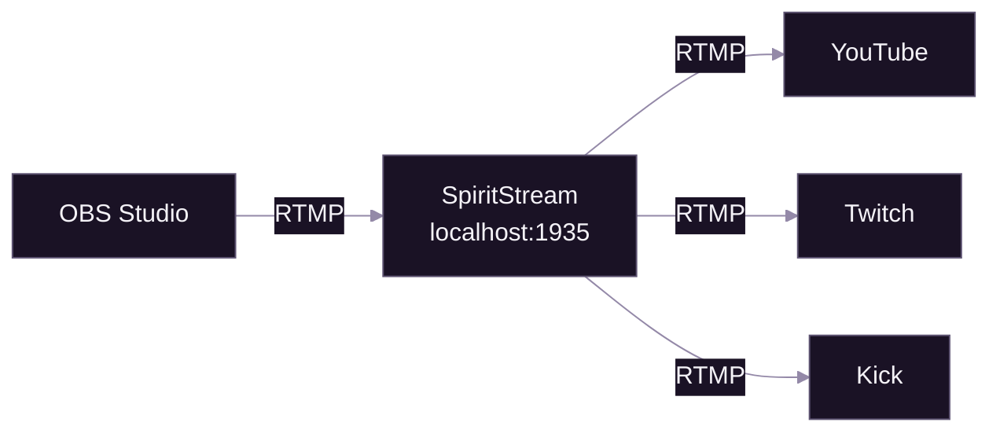
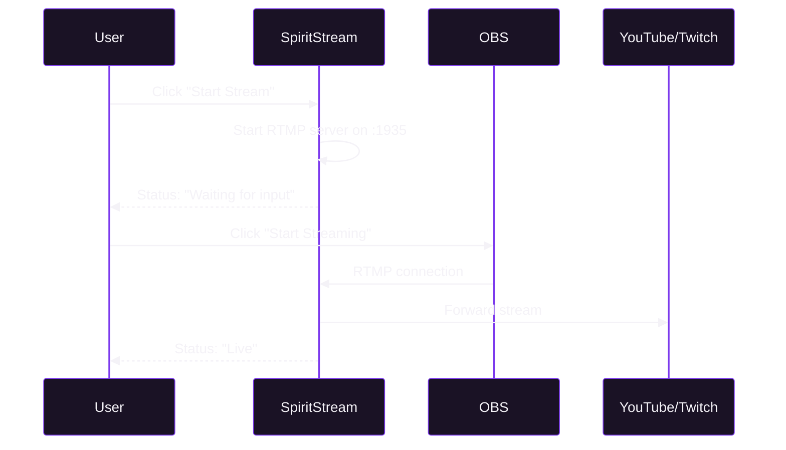

# First Stream

[Documentation](../README.md) > [Tutorials](./README.md) > First Stream

---

This tutorial walks you through your first live broadcast using SpiritStream and OBS Studio. You'll learn how to connect your encoder, start streaming, and monitor your stream health.

---

## Prerequisites

Before starting, ensure you have:

- SpiritStream installed and FFmpeg configured ([Getting Started](./01-getting-started.md))
- OBS Studio (or similar RTMP encoder) installed
- A streaming profile created with at least one target
- Your stream key from your chosen platform

## What You'll Learn

By the end of this tutorial, you will be able to:

1. Configure OBS Studio to send video to SpiritStream
2. Start and stop streams properly
3. Monitor stream statistics in real-time
4. Troubleshoot common streaming issues

---

## Stream Architecture

Understanding how data flows helps troubleshoot issues:

*OBS sends to SpiritStream, which distributes to all configured platforms.*

---

## Step 1: Configure OBS Studio

### Open OBS Settings

1. Launch OBS Studio
2. Go to **Settings** (File → Settings on Windows/Linux, OBS → Preferences on macOS)
3. Select the **Stream** tab

### Set Custom Server

Configure OBS to send to SpiritStream instead of directly to a platform:

| Setting | Value |
|---------|-------|
| Service | **Custom...** |
| Server | `rtmp://localhost:1935/live` |
| Stream Key | `stream` (or any key you prefer) |

**Note:** The stream key here is just for the local connection between OBS and SpiritStream. Your actual platform stream keys are configured in SpiritStream profiles.

### Recommended OBS Output Settings

For best results with SpiritStream:

| Setting | Recommended Value |
|---------|-------------------|
| Output Mode | Advanced |
| Encoder | x264 or NVENC (hardware) |
| Rate Control | CBR |
| Bitrate | 4500-6000 kbps for 1080p |
| Keyframe Interval | 2 seconds |
| Profile | high |

---

## Step 2: Prepare SpiritStream

### Select Your Profile

1. Open SpiritStream
2. Navigate to **Profiles** in the sidebar
3. Click on your streaming profile to select it
4. Verify the profile shows as "Active" on the Dashboard

### Verify Stream Targets

Before starting, confirm your targets are configured:

1. Go to **Stream Targets** in the sidebar
2. Check that each platform shows the correct server URL
3. Ensure stream keys are entered (shown as masked dots)

---

## Step 3: Start Streaming

The order matters—start SpiritStream first, then OBS.

### Start SpiritStream

1. Go to the **Dashboard** or **Stream Manager**
2. Click the **Start Stream** button
3. Wait for the status to show "Waiting for input..."

*Startup sequence for streaming.*

### Start OBS

1. In OBS, click **Start Streaming**
2. OBS should connect within seconds
3. SpiritStream status changes to "Live"

---

## Step 4: Monitor Your Stream

### Dashboard Statistics

The Dashboard shows real-time metrics:

| Stat | Description | Healthy Range |
|------|-------------|---------------|
| **Active Streams** | Number of live output targets | Your target count |
| **Total Bitrate** | Combined bitrate to all platforms | Sum of configured bitrates |
| **Dropped Frames** | Frames lost due to network/CPU | 0 (any drops indicate issues) |
| **Uptime** | Time since stream started | N/A |

### Stream Target Status

Each target card shows:

- **Status indicator**: Green (live), Yellow (connecting), Red (error)
- **Bitrate**: Current output bitrate
- **FPS**: Frames per second being sent

### Logs

For detailed diagnostics, check **Logs** in the sidebar. Look for:

- `[INFO] Stream started` — Normal startup
- `[WARN] Dropped frames` — Network or CPU issue
- `[ERROR] Connection failed` — Platform rejected connection

---

## Step 5: Stop Streaming

Always stop in the correct order to avoid issues.

### Stop OBS First

1. In OBS, click **Stop Streaming**
2. Wait for OBS to confirm the stream has stopped

### Stop SpiritStream

1. In SpiritStream, click **Stop Stream**
2. All target statuses return to "Offline"

**Why this order?** Stopping SpiritStream first while OBS is still sending can cause OBS to show errors and may result in incomplete stream endings on platforms.

---

## Troubleshooting

### No Video Reaching Platforms

| Symptom | Cause | Solution |
|---------|-------|----------|
| OBS shows "Disconnected" | SpiritStream not running | Start SpiritStream first |
| SpiritStream shows "Waiting" | OBS not streaming | Start streaming in OBS |
| Platform shows offline | Invalid stream key | Verify key in Stream Targets |

### Audio Issues

| Symptom | Cause | Solution |
|---------|-------|----------|
| No audio on stream | OBS audio not configured | Check OBS Audio settings |
| Audio out of sync | Encoder settings | Set audio to AAC, 128-320 kbps |
| Crackling audio | Bitrate too low | Increase audio bitrate to 160+ kbps |

### Connection Refused

If OBS shows "Failed to connect to server":

1. **Check SpiritStream is running** — The RTMP server only starts when you click Start Stream
2. **Verify the URL** — Must be exactly `rtmp://localhost:1935/live`
3. **Check port availability** — Another application may be using port 1935
4. **Firewall** — Ensure SpiritStream is allowed through your firewall

### High CPU Usage

| Cause | Solution |
|-------|----------|
| Software encoding (x264) | Switch to hardware encoder (NVENC/QuickSync) |
| High preset in OBS | Use "veryfast" or "faster" preset |
| Re-encoding in SpiritStream | Use "Passthrough" mode if quality matches |

---

## Quick Reference

### Default URLs

| Service | Server URL |
|---------|------------|
| SpiritStream Ingest | `rtmp://localhost:1935/live` |
| YouTube | `rtmp://a.rtmp.youtube.com/live2` |
| Twitch | `rtmp://live.twitch.tv/app` |
| Kick | `rtmps://fa723fc1b171.global-contribute.live-video.net/app` |

### Startup Checklist

- [ ] SpiritStream installed and FFmpeg working
- [ ] Profile created with stream targets
- [ ] Stream keys entered for each platform
- [ ] OBS configured with custom server
- [ ] SpiritStream started first
- [ ] OBS streaming to localhost

---

## Next Steps

Now that you've completed your first stream:

1. **[Multi-Platform](./03-multi-platform.md)** — Stream to multiple platforms simultaneously
2. **[Custom Encoding](./04-custom-encoding.md)** — Optimize quality per platform

---

**Related:** [Getting Started](./01-getting-started.md) | [Multi-Platform](./03-multi-platform.md) | [FFmpeg Integration](../04-streaming/01-ffmpeg-integration.md)
