# Multi-Platform Streaming

[Documentation](../README.md) > [Tutorials](./README.md) > Multi-Platform

---

This tutorial teaches you how to stream simultaneously to YouTube, Twitch, Kick, and other platforms. You'll learn to configure multiple stream targets, manage different quality requirements, and monitor all streams at once.

---

## Prerequisites

Before starting, ensure you have:

- Completed [First Stream](./02-first-stream.md) tutorial
- Accounts on the platforms you want to stream to
- Sufficient upload bandwidth (each 1080p stream needs ~6 Mbps)

## What You'll Learn

By the end of this tutorial, you will be able to:

1. Obtain stream keys from YouTube, Twitch, and Kick
2. Configure multiple stream targets in a single profile
3. Understand output groups for different quality settings
4. Start and monitor simultaneous streams
5. Handle platform-specific requirements

---

## Understanding Multi-Destination Streaming


*Single input stream distributed to multiple platforms with optional quality variations.*

### Key Concepts

| Term | Description |
|------|-------------|
| **Stream Target** | A single platform destination (URL + stream key) |
| **Output Group** | A collection of targets sharing the same encoding settings |
| **Passthrough** | Forwarding the stream without re-encoding (lowest CPU usage) |
| **Re-encoding** | Converting to different quality (requires more CPU/GPU) |

---

## Step 1: Get Your Stream Keys

### YouTube

1. Go to [YouTube Studio](https://studio.youtube.com)
2. Click **Create** → **Go live**
3. Select **Stream** tab
4. Copy the **Stream key** (click eye icon to reveal)

| YouTube Setting | Value |
|-----------------|-------|
| Server URL | `rtmp://a.rtmp.youtube.com/live2` |
| Stream Key | Your key from YouTube Studio |

**Tip:** YouTube keys don't expire but can be reset if compromised.

### Twitch

1. Go to [Twitch Dashboard](https://dashboard.twitch.tv)
2. Navigate to **Settings** → **Stream**
3. Click **Copy** next to Primary Stream Key

| Twitch Setting | Value |
|----------------|-------|
| Server URL | `rtmp://live.twitch.tv/app` |
| Stream Key | Your key from Twitch Dashboard |

**Tip:** Use `rtmp://live-{location}.twitch.tv/app` for lower latency (e.g., `live-iad` for US East).

### Kick

1. Go to [Kick Dashboard](https://kick.com/dashboard/settings/stream)
2. Navigate to **Stream Key & URL**
3. Click to reveal and copy both values

| Kick Setting | Value |
|--------------|-------|
| Server URL | `rtmps://fa723fc1b171.global-contribute.live-video.net/app` |
| Stream Key | Your key from Kick Dashboard |

**Note:** Kick uses RTMPS (encrypted) by default.

### Facebook

1. Go to [Facebook Live Producer](https://www.facebook.com/live/producer)
2. Select where to post (Profile, Page, or Group)
3. Copy the **Stream key** from the setup panel

| Facebook Setting | Value |
|------------------|-------|
| Server URL | `rtmps://live-api-s.facebook.com:443/rtmp` |
| Stream Key | Your key from Live Producer |

**Note:** Facebook keys expire after each stream.

---

## Step 2: Configure Stream Targets

### Add Targets in SpiritStream

1. Open SpiritStream
2. Go to **Stream Targets** in the sidebar
3. Click **Add Target**

For each platform, enter:

```
Platform: [Select from dropdown]
Name: [Descriptive name, e.g., "YouTube Gaming"]
Server URL: [From table above]
Stream Key: [Your copied key]
```

### Organize Targets by Output Group

If all platforms should receive the same quality:

1. Go to **Profiles** → Select your profile
2. Ensure all targets are in the same Output Group

If platforms need different qualities (e.g., Kick requires lower bitrate):

1. Go to **Output Groups**
2. Create separate groups for different quality requirements
3. Assign targets to appropriate groups

---

## Step 3: Configure Output Groups

### Single Quality (Simplest)

For most streamers, one output group works well:

| Setting | Recommended |
|---------|-------------|
| Mode | Passthrough |
| Targets | All platforms |

**Passthrough** forwards your OBS stream exactly as-is, using minimal CPU.

### Multiple Qualities (Advanced)

Create separate output groups when:

- A platform has bitrate limits (some have 6000 kbps max)
- You want higher quality for some platforms
- Your internet can't support full quality to all targets

**Example Configuration:**

| Output Group | Resolution | Bitrate | Targets |
|--------------|------------|---------|---------|
| High Quality | 1080p60 | 6000 kbps | YouTube, Twitch |
| Standard | 720p30 | 3000 kbps | Kick, Facebook |

---

## Step 4: Start Multi-Platform Stream

### Pre-Stream Checklist

- [ ] All stream keys entered and verified
- [ ] Output groups configured
- [ ] Profile selected as active
- [ ] OBS configured to send to `rtmp://localhost:1935/live`

### Start Streaming

1. **SpiritStream**: Click **Start Stream**
   - All targets show "Connecting" then "Live"
2. **OBS**: Click **Start Streaming**
   - Watch SpiritStream dashboard for stats

### Monitor All Streams

The Dashboard shows each target's status:

```mermaid
%%{init: {'theme': 'base', 'themeVariables': {
  'primaryColor': '#3D3649',
  'primaryTextColor': '#F4F2F7',
  'primaryBorderColor': '#7C3AED',
  'lineColor': '#9489A8',
  'secondaryColor': '#251A33',
  'tertiaryColor': '#1A1225',
  'background': '#0F0A14',
  'mainBkg': '#1A1225',
  'nodeBorder': '#5E5472',
  'clusterBkg': '#251A33',
  'clusterBorder': '#3D3649',
  'titleColor': '#A78BFA',
  'edgeLabelBackground': '#1A1225',
  'textColor': '#F4F2F7'
}}}%%
flowchart LR
    subgraph Dashboard["SpiritStream Dashboard"]
        YT["YouTube<br/>🟢 Live<br/>6000 kbps"]
        TW["Twitch<br/>🟢 Live<br/>6000 kbps"]
        KK["Kick<br/>🟢 Live<br/>6000 kbps"]
    end
```



*Each target displays independent status and statistics.*

---

## Platform-Specific Tips

### YouTube

| Consideration | Recommendation |
|---------------|----------------|
| Latency | Use "Ultra low-latency" in YouTube Studio for interaction |
| DVR | Enable if viewers should rewind |
| Resolution | Supports up to 4K, but 1080p60 is most common |
| Bitrate | 4500-9000 kbps for 1080p60 |

### Twitch

| Consideration | Recommendation |
|---------------|----------------|
| Transcoding | Partners/Affiliates get automatic quality options |
| Bitrate Cap | Non-partners should stay under 6000 kbps |
| Ingest Server | Use closest geographic server |
| VODs | Configure in dashboard if you want archives |

### Kick

| Consideration | Recommendation |
|---------------|----------------|
| Protocol | Uses RTMPS (secure) |
| Bitrate | Check current limits in Kick documentation |
| Requirements | May have stricter encoding requirements |

### Facebook

| Consideration | Recommendation |
|---------------|----------------|
| Key Expiration | Keys expire—regenerate before each stream |
| Privacy | Choose audience (Public, Friends, specific groups) |
| Crossposting | Can share to multiple Pages simultaneously |

---

## Bandwidth Requirements

Calculate your needed upload speed:

| Platforms | Quality | Total Bitrate | Recommended Upload |
|-----------|---------|---------------|-------------------|
| 2 | 1080p60 @ 6 Mbps each | 12 Mbps | 20+ Mbps |
| 3 | 1080p60 @ 6 Mbps each | 18 Mbps | 30+ Mbps |
| 4 | 1080p60 @ 6 Mbps each | 24 Mbps | 40+ Mbps |
| 3 | Mixed (6+6+3 Mbps) | 15 Mbps | 25+ Mbps |

**Rule of thumb:** Your upload speed should be 1.5x your total streaming bitrate for stability.

---

## Troubleshooting

### One Platform Fails, Others Work

| Cause | Solution |
|-------|----------|
| Invalid stream key | Regenerate key on that platform |
| Platform outage | Check platform status page |
| Bitrate too high | Lower bitrate for that output group |
| RTMPS required | Ensure URL uses `rtmps://` for Kick/Facebook |

### All Platforms Fail

| Cause | Solution |
|-------|----------|
| OBS not connected | Check OBS is streaming to localhost |
| SpiritStream not running | Start SpiritStream before OBS |
| FFmpeg error | Check Logs for FFmpeg messages |

### Dropped Frames on Some Platforms

| Cause | Solution |
|-------|----------|
| Insufficient bandwidth | Lower bitrate or reduce platform count |
| Geographic distance | Use closer ingest servers |
| Peak internet usage | Stream during off-peak hours |

---

## Best Practices

### Do

- Test each platform individually before going multi-platform
- Monitor all streams during the first few minutes
- Keep Logs open to catch issues early
- Have backup stream keys ready

### Don't

- Stream to more platforms than your bandwidth supports
- Use identical titles/descriptions (customize per platform)
- Forget to end streams on all platforms
- Share stream keys or leave them visible on screen

---

## Next Steps

Now that you're streaming to multiple platforms:

1. **[Custom Encoding](./04-custom-encoding.md)** — Optimize quality settings per platform
2. **[RTMP Fundamentals](../04-streaming/02-rtmp-fundamentals.md)** — Understand the protocol

---

**Related:** [First Stream](./02-first-stream.md) | [Custom Encoding](./04-custom-encoding.md) | [Multi-Destination](../04-streaming/03-multi-destination.md)
