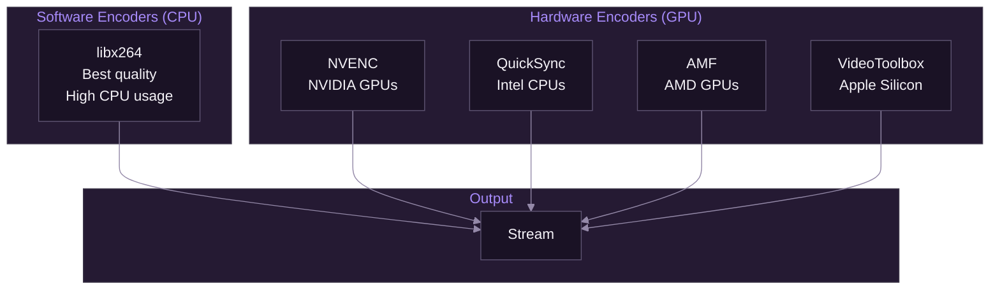
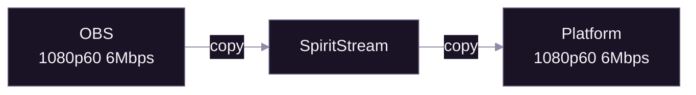
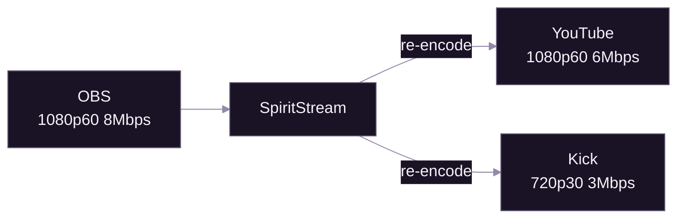

# Custom Encoding

[Documentation](../README.md) > [Tutorials](./README.md) > Custom Encoding

---

This advanced tutorial covers encoder selection, quality optimization, and creating custom encoding profiles for different use cases. You'll learn to balance quality, performance, and bandwidth for gaming, webcam, and screen sharing scenarios.

---

## Prerequisites

Before starting, ensure you have:

- Completed [Multi-Platform](./03-multi-platform.md) tutorial
- Understanding of basic streaming concepts (bitrate, resolution, FPS)
- Knowledge of your hardware capabilities (CPU, GPU)

## What You'll Learn

By the end of this tutorial, you will be able to:

1. Choose between hardware and software encoders
2. Configure resolution, bitrate, and FPS tradeoffs
3. Understand encoder presets and profiles
4. Create optimized configurations for different content types
5. Use passthrough vs re-encoding effectively

---

## Encoder Types

### Overview



*Choose based on your hardware and quality requirements.*

### Comparison

| Encoder | Hardware | Quality | CPU Impact | Best For |
|---------|----------|---------|------------|----------|
| **libx264** | CPU | Excellent | Very High | Maximum quality, non-gaming |
| **h264_nvenc** | NVIDIA GPU | Very Good | Minimal | Gaming, all-around |
| **h264_qsv** | Intel iGPU | Good | Low | Laptops, secondary encoder |
| **h264_amf** | AMD GPU | Good | Minimal | AMD gaming systems |
| **h264_videotoolbox** | Apple | Very Good | Low | macOS systems |

### Hardware Detection

SpiritStream automatically detects available encoders. Check **Settings** → **FFmpeg Configuration** to see what's available on your system.

---

## Quality Settings

### Resolution

| Resolution | Pixels | Use Case | Min Bitrate |
|------------|--------|----------|-------------|
| 1080p (1920x1080) | 2M | Standard HD streaming | 4500 kbps |
| 720p (1280x720) | 921K | Bandwidth-limited, mobile viewers | 2500 kbps |
| 1440p (2560x1440) | 3.7M | High-end content | 9000 kbps |
| 4K (3840x2160) | 8.3M | Premium content (YouTube only) | 20000 kbps |

### Frame Rate

| FPS | Use Case | Bitrate Impact |
|-----|----------|----------------|
| 60 | Gaming, fast motion | +50% vs 30 FPS |
| 30 | Webcam, talking head | Baseline |
| 24 | Cinematic content | -20% vs 30 FPS |

### Bitrate Guidelines

For H.264 with good motion handling:

| Resolution | 30 FPS | 60 FPS |
|------------|--------|--------|
| 720p | 2500-4000 kbps | 3500-5000 kbps |
| 1080p | 4500-6000 kbps | 6000-8000 kbps |
| 1440p | 9000-12000 kbps | 12000-18000 kbps |

**Platform Limits:**

| Platform | Max Bitrate |
|----------|-------------|
| Twitch (non-partner) | 6000 kbps |
| Twitch (partner) | 8500 kbps |
| YouTube | 51000 kbps (4K) |
| Kick | Check current docs |

---

## Encoder Presets

### Software Encoder (x264) Presets

Presets control the quality-to-speed tradeoff:

| Preset | Speed | Quality | CPU Usage | When to Use |
|--------|-------|---------|-----------|-------------|
| ultrafast | Fastest | Lowest | ~20% | Testing only |
| superfast | Very Fast | Low | ~30% | Low-end CPUs |
| veryfast | Fast | Medium | ~40% | **Recommended for streaming** |
| faster | Medium | Good | ~50% | Powerful CPUs |
| fast | Slower | Very Good | ~60% | Non-gaming streams |
| medium | Slow | Excellent | ~80% | Recording, not live |
| slow | Very Slow | Best | ~100% | Offline encoding only |

**Recommendation:** Use `veryfast` for live streaming. Slower presets don't significantly improve perceived quality at streaming bitrates.

### Hardware Encoder Quality

Hardware encoders use different preset names:

**NVENC:**

| Preset | Quality | Use Case |
|--------|---------|----------|
| p1 (performance) | Lower | Maximum FPS priority |
| p4 (default) | Balanced | **Recommended** |
| p7 (quality) | Higher | Non-gaming content |

**QuickSync:**

| Preset | Quality | Use Case |
|--------|---------|----------|
| veryfast | Lower | Low-power devices |
| balanced | Medium | **Recommended** |
| quality | Higher | When power isn't limited |

---

## Rate Control

### CBR (Constant Bitrate)

```
Output: ████████████████████████ (constant)
```

- Bitrate stays fixed regardless of scene complexity
- **Best for live streaming** — predictable bandwidth
- May waste bits on simple scenes

### VBR (Variable Bitrate)

```
Output: ████░░████████░░░░████████████ (varies)
```

- Bitrate adjusts based on content
- Better quality per bit
- Can cause buffering if peaks exceed bandwidth

**Recommendation:** Use **CBR** for live streaming to all platforms.

---

## Passthrough vs Re-encoding

### Passthrough Mode

When your OBS output matches platform requirements:



**Advantages:**
- Zero additional CPU/GPU usage
- No quality loss
- Lowest latency

**When to use:**
- All platforms accept your OBS quality
- You don't need different qualities per platform

### Re-encoding Mode

When platforms need different qualities:



**When to use:**
- Platforms have different bitrate limits
- You want higher quality to YouTube, lower to others
- Your OBS output exceeds platform limits

---

## Use Case Configurations

### Gaming (High Motion)

Fast-paced games with lots of movement need higher bitrates and frame rates.

| Setting | Value | Reason |
|---------|-------|--------|
| Resolution | 1080p | Balance of quality and bandwidth |
| FPS | 60 | Smooth motion |
| Encoder | NVENC/AMF | Minimal game impact |
| Bitrate | 6000 kbps | Handles fast motion |
| Preset | p4 (NVENC) | Balanced quality |
| Keyframe | 2 seconds | Platform requirement |

**OBS Settings:**
```
Encoder: NVIDIA NVENC H.264
Rate Control: CBR
Bitrate: 6000 Kbps
Keyframe Interval: 2
Preset: Quality
Profile: high
```

### Webcam/Talking Head

Low motion content doesn't need high bitrates.

| Setting | Value | Reason |
|---------|-------|--------|
| Resolution | 1080p | Sharp face detail |
| FPS | 30 | Sufficient for talking |
| Encoder | x264 or NVENC | Either works well |
| Bitrate | 4000 kbps | Plenty for low motion |
| Preset | veryfast | Low CPU usage |

### Screen Sharing/Tutorials

Text and UI elements need sharp encoding.

| Setting | Value | Reason |
|---------|-------|--------|
| Resolution | 1080p or 1440p | Text clarity |
| FPS | 30 | Sufficient for UI |
| Encoder | x264 | Better text quality |
| Bitrate | 4500-6000 kbps | Sharp text rendering |
| Preset | faster | Better quality for static content |

**Tip:** For screen content, higher resolution matters more than frame rate.

### Mixed Content (Gaming + Webcam)

When you have game capture and a facecam:

| Setting | Value |
|---------|-------|
| Resolution | 1080p60 |
| Encoder | NVENC |
| Bitrate | 6000 kbps |
| Preset | p4 |

Prioritize game requirements since it's the primary content.

---

## Audio Encoding

Don't forget audio quality:

| Setting | Music/High Quality | Voice Only |
|---------|-------------------|------------|
| Codec | AAC | AAC |
| Bitrate | 192-320 kbps | 128-160 kbps |
| Sample Rate | 48 kHz | 44.1-48 kHz |
| Channels | Stereo | Stereo or Mono |

**Note:** Most platforms require AAC audio. MP3 is not supported for RTMP streaming.

---

## Output Group Examples

### Single Quality to All Platforms

```
Output Group: "Main"
├── Mode: Passthrough
├── Targets:
│   ├── YouTube
│   ├── Twitch
│   └── Kick
```

### Quality Tiers

```
Output Group: "High Quality"
├── Resolution: 1080p60
├── Bitrate: 6000 kbps
├── Encoder: h264_nvenc
├── Targets:
│   ├── YouTube
│   └── Twitch

Output Group: "Standard"
├── Resolution: 720p30
├── Bitrate: 3000 kbps
├── Encoder: h264_nvenc
├── Targets:
│   └── Kick
```

---

## Performance Optimization

### Reducing CPU Usage

1. **Use hardware encoding** — NVENC, QuickSync, or AMF
2. **Use passthrough** — When quality matches requirements
3. **Lower preset** — Use faster presets (veryfast, ultrafast)
4. **Reduce resolution** — 720p uses less than 1080p

### Reducing GPU Usage (for Gaming)

1. **Use QuickSync** — If available, uses iGPU instead of gaming GPU
2. **Lower NVENC preset** — p1 (performance) over p7 (quality)
3. **Reduce output count** — Fewer output groups = less encoding

### Reducing Bandwidth

1. **Lower bitrate** — Most noticeable impact
2. **Lower resolution** — 720p vs 1080p
3. **Lower frame rate** — 30 FPS vs 60 FPS
4. **Fewer platforms** — Each platform needs full bitrate

---

## Troubleshooting

### Pixelation/Artifacts

| Cause | Solution |
|-------|----------|
| Bitrate too low | Increase bitrate |
| Too much motion | Increase bitrate or lower resolution |
| Wrong preset | Use slower preset (if CPU allows) |

### Stuttering/Frame Drops

| Cause | Solution |
|-------|----------|
| CPU overloaded | Switch to hardware encoder |
| Preset too slow | Use faster preset |
| Too many output groups | Consolidate or use passthrough |

### Blurry Text (Screen Share)

| Cause | Solution |
|-------|----------|
| Resolution scaling | Use native resolution |
| Bitrate too low | Increase to 5000+ kbps |
| Wrong encoder | x264 handles text better than NVENC |

---

## Quick Reference

### Recommended Starting Points

| Content Type | Resolution | FPS | Bitrate | Encoder |
|--------------|------------|-----|---------|---------|
| Gaming | 1080p | 60 | 6000 | NVENC |
| Webcam | 1080p | 30 | 4000 | x264/NVENC |
| Screen Share | 1080p | 30 | 5000 | x264 |
| 4K Gaming | 1440p | 60 | 12000 | NVENC |

### FFmpeg Codec Identifiers

| Encoder | FFmpeg Name |
|---------|-------------|
| Software H.264 | `libx264` |
| NVIDIA | `h264_nvenc` |
| Intel QuickSync | `h264_qsv` |
| AMD | `h264_amf` |
| Apple | `h264_videotoolbox` |

---

## Next Steps

Now that you understand encoding:

1. **[Encoding Reference](../04-streaming/04-encoding-reference.md)** — Complete codec documentation
2. **[FFmpeg Integration](../04-streaming/01-ffmpeg-integration.md)** — How SpiritStream uses FFmpeg

---

**Related:** [Multi-Platform](./03-multi-platform.md) | [Encoding Reference](../04-streaming/04-encoding-reference.md) | [FFmpeg Integration](../04-streaming/01-ffmpeg-integration.md)

