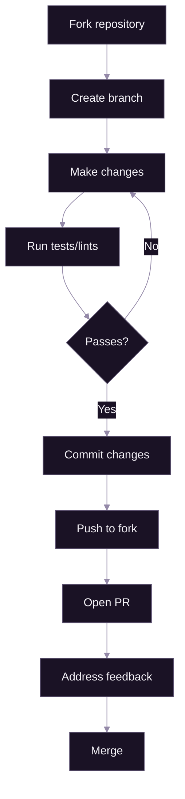

# Contributing

[Documentation](../README.md) > [Tutorials](./README.md) > Contributing

---

This guide covers setting up a development environment, understanding the codebase structure, and contributing code to SpiritStream. Whether you're fixing a bug or adding a feature, this document will help you get started.

---

## Prerequisites

Before contributing, you should have:

- Familiarity with Git and GitHub workflows
- Basic knowledge of TypeScript and React
- Basic knowledge of Rust (for backend changes)
- A GitHub account

## What You'll Learn

By the end of this guide, you will be able to:

1. Set up the complete development environment
2. Navigate the project structure
3. Run SpiritStream in development mode
4. Follow code style guidelines
5. Submit pull requests

---

## Development Environment Setup

### Required Tools

Install the following before starting:

| Tool | Version | Purpose |
|------|---------|---------|
| **Node.js** | 18+ | Frontend build and tooling |
| **Rust** | 1.77+ | Backend compilation |
| **Tauri CLI** | 2.x | Desktop app framework |
| **Git** | Latest | Version control |

### Install Rust

```bash
# macOS/Linux
curl --proto '=https' --tlsv1.2 -sSf https://sh.rustup.rs | sh

# Windows (download installer from rustup.rs)
# Or use winget:
winget install Rustlang.Rust.GNU
```

Verify installation:

```bash
rustc --version
cargo --version
```

### Install Node.js

Use a version manager for easier updates:

```bash
# Using nvm (macOS/Linux)
curl -o- https://raw.githubusercontent.com/nvm-sh/nvm/v0.39.0/install.sh | bash
nvm install 20
nvm use 20

# Using fnm (cross-platform)
cargo install fnm
fnm install 20
fnm use 20

# Or download directly from nodejs.org
```

### Install Tauri CLI

```bash
cargo install tauri-cli
```

### Clone the Repository

```bash
git clone https://github.com/ScopeCreep-zip/SpiritStream.git
cd SpiritStream
```

### Install pnpm

```bash
# Install pnpm globally
npm install -g pnpm
```

### Install Dependencies

```bash
# Install all workspace dependencies
pnpm install

# Rust dependencies are handled automatically by Cargo
```

---

## Project Structure

```
SpiritStream/
├── apps/
│   ├── web/                       # React frontend (standalone)
│   │   ├── src/
│   │   │   ├── components/        # React components
│   │   │   │   ├── ui/           # Base UI components
│   │   │   │   ├── layout/       # Layout components
│   │   │   │   ├── stream/       # Streaming controls
│   │   │   │   └── modals/       # Modal dialogs
│   │   │   ├── hooks/            # Custom React hooks
│   │   │   ├── stores/           # Zustand state stores
│   │   │   ├── lib/              # Utilities and API wrapper
│   │   │   │   └── backend/      # Backend abstraction (Tauri/HTTP)
│   │   │   ├── types/            # TypeScript definitions
│   │   │   ├── locales/          # i18n translation files
│   │   │   ├── styles/           # CSS and design tokens
│   │   │   └── views/            # Page views
│   │   ├── package.json          # @spiritstream/web
│   │   └── vite.config.ts
│   │
│   └── desktop/                   # Tauri wrapper (minimal)
│       ├── package.json          # @spiritstream/desktop
│       └── src-tauri/
│           ├── src/main.rs       # Launcher (spawns server)
│           ├── Cargo.toml        # Minimal deps (launcher only)
│           └── tauri.conf.json   # Sidecar configuration
│
├── server/                        # Standalone Rust backend
│   ├── src/
│   │   ├── main.rs               # Axum HTTP server
│   │   ├── commands/             # Business logic
│   │   ├── services/             # Service layer
│   │   └── models/               # Domain models
│   └── Cargo.toml
│
├── docs/                          # Documentation
├── docker/                        # Docker configuration
├── pnpm-workspace.yaml           # Workspace config
├── turbo.json                    # Build orchestration
└── package.json                  # Root workspace
```

### Key Files

| File | Purpose |
|------|---------|
| `server/src/main.rs` | HTTP server entry point |
| `apps/web/src/App.tsx` | React root component |
| `apps/web/src/stores/` | Application state management |
| `apps/web/src/lib/backend/` | Backend abstraction layer |
| `apps/desktop/src-tauri/src/main.rs` | Desktop launcher |
| `apps/desktop/src-tauri/tauri.conf.json` | App configuration, permissions |

---

## Running in Development

### Development Modes

| Mode | Command | Use Case |
|------|---------|----------|
| Desktop | `pnpm dev` | Full desktop app with embedded server |
| Web Only | `pnpm dev:web` | Frontend development (no backend) |
| Server Only | `pnpm backend:dev` | Backend API development |
| HTTP Client | `VITE_BACKEND_MODE=http pnpm dev:web` | Test browser-based remote access |

### Start Desktop Development

```bash
pnpm dev
```

This command:

1. Builds the standalone server
2. Starts the Tauri launcher
3. Spawns the server as a sidecar process
4. Opens the application window with frontend hot reload

### Development URLs

| Service | URL |
|---------|-----|
| Frontend Dev Server | http://localhost:5173 |
| Backend API Server | http://localhost:8008 |
| Tauri DevTools | Right-click → Inspect |

### Hot Reload

- **Frontend changes** — Automatically reloaded
- **Server changes** — Requires `pnpm backend:build` then restart
- **Tauri config changes** — Requires restart

---

## Code Style

### TypeScript/React

**Formatting:** We use Prettier with the project's `.prettierrc`:

```bash
pnpm format        # Format all files
pnpm format:check  # Check without modifying
```

**Linting:** ESLint catches common issues:

```bash
pnpm lint          # Check for issues
pnpm lint:fix      # Auto-fix where possible
```

**Conventions:**

```typescript
// Components: PascalCase, one per file
export function ProfileCard({ profile }: ProfileCardProps) {
  // ...
}

// Hooks: camelCase with 'use' prefix
export function useStreamStats() {
  // ...
}

// Types: PascalCase, interfaces for objects
interface ProfileCardProps {
  profile: Profile;
  onSelect?: (id: string) => void;
}

// Constants: UPPER_SNAKE_CASE
const MAX_RETRY_COUNT = 3;
```

### Rust

**Formatting:** Use rustfmt:

```bash
# Server
cargo fmt --manifest-path server/Cargo.toml
cargo fmt --manifest-path server/Cargo.toml -- --check

# Desktop launcher
cargo fmt --manifest-path apps/desktop/src-tauri/Cargo.toml
```

**Linting:** Clippy catches common issues:

```bash
# Server
cargo clippy --manifest-path server/Cargo.toml

# Desktop launcher
cargo clippy --manifest-path apps/desktop/src-tauri/Cargo.toml
```

**Conventions:**

```rust
// Structs: PascalCase
pub struct ProfileManager {
    profiles_dir: PathBuf,
}

// Functions: snake_case
pub async fn load_profile(name: &str) -> Result<Profile, String> {
    // ...
}

// Constants: UPPER_SNAKE_CASE
const MAX_RETRIES: u32 = 3;

// Tauri commands: snake_case, async
#[tauri::command]
pub async fn get_all_profiles() -> Result<Vec<String>, String> {
    // ...
}
```

### Commits

Follow conventional commit format:

```
type(scope): description

[optional body]

[optional footer]
```

**Types:**

| Type | Use For |
|------|---------|
| `feat` | New feature |
| `fix` | Bug fix |
| `docs` | Documentation changes |
| `style` | Code formatting (no logic change) |
| `refactor` | Code restructuring |
| `test` | Adding/modifying tests |
| `chore` | Maintenance tasks |

**Examples:**

```bash
git commit -m "feat(streaming): add multi-bitrate output groups"
git commit -m "fix(profiles): handle encrypted profile load errors"
git commit -m "docs(tutorials): add first-stream guide"
```

---

## Making Changes

### Branch Naming

```
feature/description     # New features
fix/description        # Bug fixes
docs/description       # Documentation
refactor/description   # Code restructuring
```

**Examples:**

```bash
git checkout -b feature/hardware-encoder-detection
git checkout -b fix/stream-key-masking
git checkout -b docs/contributing-guide
```

### Development Workflow



### Adding a New Feature

1. **Create a branch:**
   ```bash
   git checkout -b feature/my-feature
   ```

2. **Make changes** following the code style guidelines

3. **Test your changes:**
   ```bash
   pnpm dev                                  # Manual testing
   pnpm lint                                 # Frontend linting
   cargo clippy --manifest-path server/Cargo.toml  # Backend linting
   ```

4. **Commit with conventional format:**
   ```bash
   git add .
   git commit -m "feat(scope): add my feature"
   ```

5. **Push and create PR:**
   ```bash
   git push origin feature/my-feature
   ```

---

## Pull Request Guidelines

### PR Title

Use the same format as commits:

```
feat(streaming): add multi-bitrate output groups
```

### PR Description

Include:

```markdown
## Summary
Brief description of changes.

## Changes
- Change 1
- Change 2

## Testing
How you tested the changes.

## Screenshots (if UI changes)
[Include screenshots]
```

### Review Checklist

Before requesting review:

- [ ] Code follows style guidelines
- [ ] `pnpm lint` passes
- [ ] `cargo clippy` passes
- [ ] Manual testing completed
- [ ] Documentation updated (if needed)
- [ ] No console errors in development

---

## Testing

### Manual Testing

Most testing is currently manual:

1. Run `pnpm dev`
2. Test affected features
3. Check browser console for errors
4. Check server logs for backend issues

### Type Checking

```bash
# Frontend
pnpm typecheck

# Backend
cargo check --manifest-path server/Cargo.toml
cargo check --manifest-path apps/desktop/src-tauri/Cargo.toml
```

### Building for Production

Test that production builds work:

```bash
pnpm build:desktop
```

---

## Common Tasks

### Adding a Server Command

1. **Define the command** in `server/src/commands/`:

   ```rust
   pub async fn my_command(param: String) -> Result<String, String> {
       // Implementation
       Ok("result".to_string())
   }
   ```

2. **Register the HTTP route** in `server/src/main.rs`:

   ```rust
   .route("/api/invoke/my_command", post(handle_my_command))
   ```

3. **Call from frontend** via the backend abstraction:

   ```typescript
   // The backend abstraction handles Tauri IPC or HTTP automatically
   import { api } from '@/lib/backend';

   const result = await api.system.myCommand({ param: 'value' });
   ```

### Adding a React Component

1. **Create the component** in appropriate directory:

   ```typescript
   // apps/web/src/components/ui/MyComponent.tsx
   interface MyComponentProps {
     value: string;
   }

   export function MyComponent({ value }: MyComponentProps) {
     return <div className="...">{value}</div>;
   }
   ```

2. **Export from index** (if in a grouped folder):

   ```typescript
   // apps/web/src/components/ui/index.ts
   export * from './MyComponent';
   ```

### Adding a Zustand Store

```typescript
// apps/web/src/stores/myStore.ts
import { create } from 'zustand';

interface MyState {
  value: string;
  setValue: (value: string) => void;
}

export const useMyStore = create<MyState>((set) => ({
  value: '',
  setValue: (value) => set({ value }),
}));
```

---

## Getting Help

### Resources

| Resource | Link |
|----------|------|
| Tauri Documentation | https://tauri.app/v1/guides/ |
| React Documentation | https://react.dev |
| Rust Book | https://doc.rust-lang.org/book/ |
| Zustand Documentation | https://zustand-demo.pmnd.rs/ |

### Asking Questions

- **Bug reports:** Open a GitHub Issue with reproduction steps
- **Feature requests:** Open a GitHub Discussion first
- **Questions:** Check existing issues/discussions first

---

## License

By contributing to SpiritStream, you agree that your contributions will be licensed under the project's license.

---

**Related:** [System Overview](../01-architecture/01-system-overview.md) | [React Architecture](../03-frontend/01-react-architecture.md) | [Services Layer](../02-backend/02-services-layer.md)
